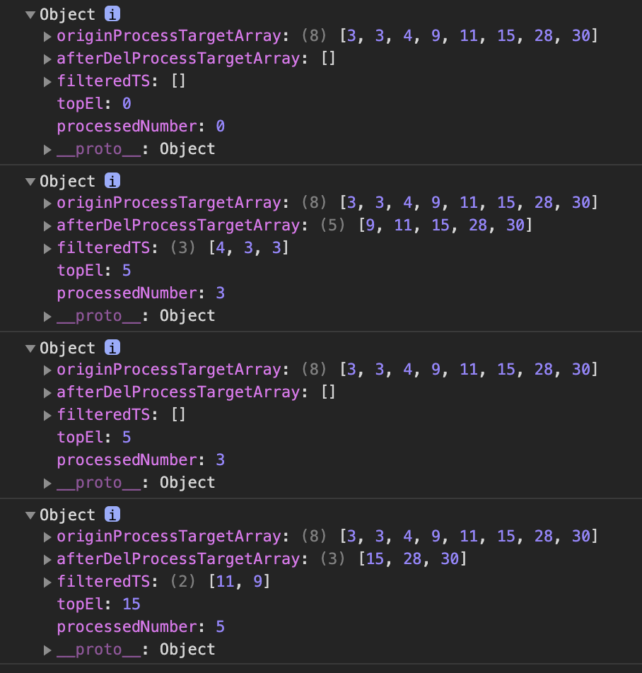

# CONDITION
  * 서버는 최대 5개 요청을 처리 할 수 있다. 
  * topEl: 각 요소의 숫자 이하 중요도를 처리 할 수 있다. 
  * processTarget: 서버가 처리할 대상

# STRATEGY
  * STRATEGY 0. iterator STRATEGY 2, 2.1 till topEl ARRAY
  * STRATEGY 1.0 FILTER procesTarget array is filtered by low number of each topEl array element number  
  * STRATEGY 1.1 SLICE server can process reqeust number (5)
  * STRATEGY 2.0 DELETE processTarget array elements from ARRAY element of STRATEGY 1.1(variable: filteredTS)  
              ( [!] NOT ACCEPT dulicated delete => POINT3, 4 )
  * STRATEGY 2.1 COUNT processed timstamp

# POINT
  > 아래 코드에 위치 주석 참고 

  ## POINT1
  * splice에 의해서 첫번째 outer for문에 돌아갔을 때 배열(filteredTS) 값이 바뀐다. 

  ## POINT2
  * 아래 console에서 topEl요소별로 processTarget값이 나오는것이 아니라
      topEl요소 배열이 모든 process처리 후의 값이 찍히게 되서 "slice로 shallow clone"을 이용

  ## POINT3
  * 위단계에서 splice로 삭제 했기 때문에 array 요소가 하나 줄어 들어 줄어든 요소 순서부터 시작하기 위해서 감소 연산자를 사용했다.(for동작에서 j++가 동작하기 때문에 )
  * eg) 배열을 순회하는 j가 2번째 요소를 제거하면 배열 2번째 요소 뒤에 있는 요소들이 앞으로 당겨진다. == 3번째 요소가 2번재요소가 된다.  
  이렇게 되면 j는 순회를 2번째 요소부터 해줘야 한다.

  ## POINT4
  * checkDupl flag variable  
  : filteredTS요소를 processTarget 배열에서 제거할때 같은 요소 값을 지우지 않기 위한 flag성 variable  
  : eg) filteredTS 요소 1을 제거할때 processTarget에 1이 1개 이상이더라도 1개만 제거


# CODE
``` js
    var processTarget = [3,3,4,9,11,15,28,30];
    // var processTarget = [3,3,3,3,3,3,3,4,9,11,15,28,30]; // 3*7
    var topEl = [0,5,5,15];
    
    var originProcessTargetArray = processTarget.slice(0);
    var filteredTS = [];
    var processedNumber = 0;
    //STRATEGY 0
    topEl.forEach( v => {
      //STRATEGY 1.0, 1.1
      filteredTS = processTarget.filter( v2 => v2 < v ).sort((a, b) => b-a).slice(0, 5);
      //count process number
      processedNumber += filteredTS.length;
      
      //STRATEGY 2.0, 2.1
      var afterDelProcessTargetArray = [];
      for (var i=0; i < filteredTS.length; i++){
        var checkDupl = false;
        for (var j=0; j < processTarget.length; j++){
          if(!checkDupl && filteredTS[i] === processTarget[j]){
            //POINT1
            processTarget.splice(j,1);

            //POINT2
            afterDelProcessTargetArray = processTarget.slice(0);            

            //POINT3
            j--;  
            checkDupl = !checkDupl;
          }
        }
      }

      //* afterDelProcessTargetArray: topEl 요소 별로 processTarget Array
      //* filteredTS: topEl 요소 별로 server가 처리할 value
      console.log({originProcessTargetArray, afterDelProcessTargetArray, filteredTS, topEl: v, processedNumber});
    });
```

# 결과


