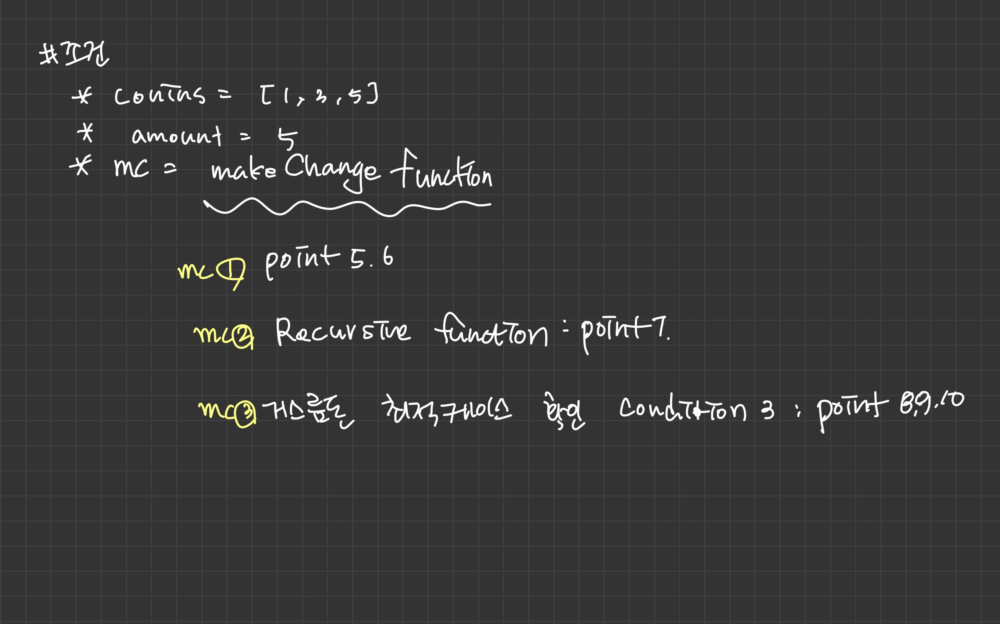
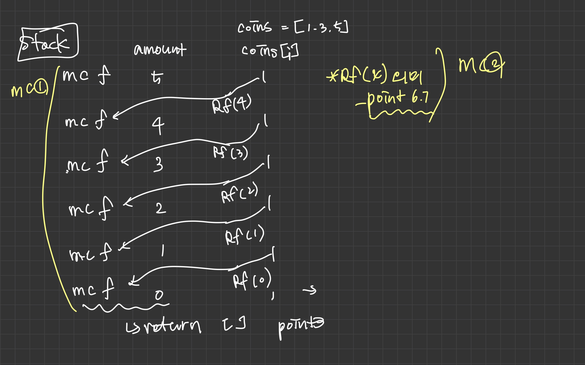
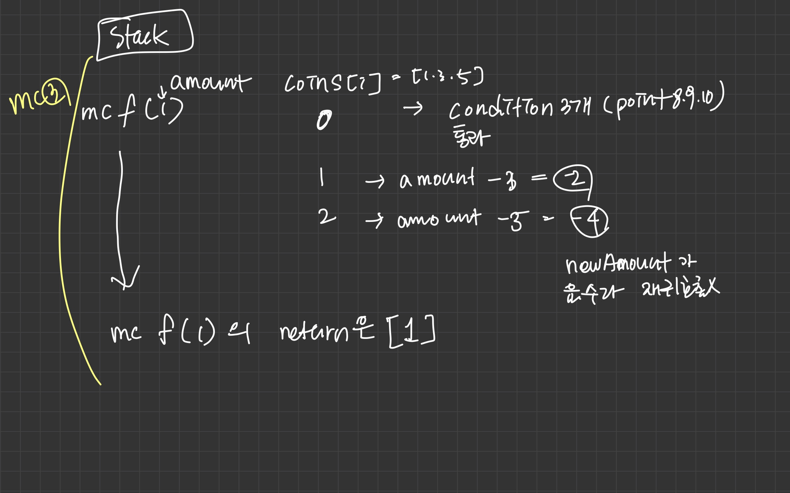
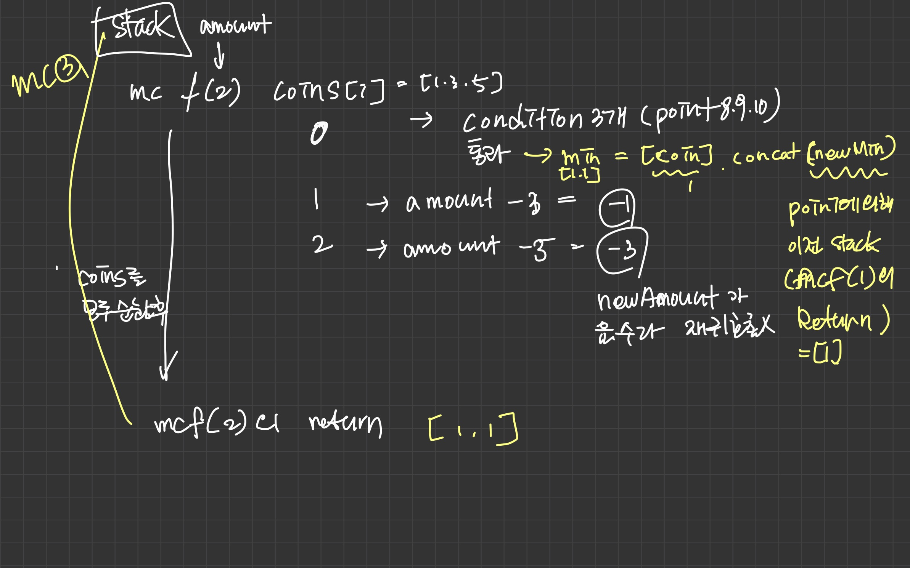
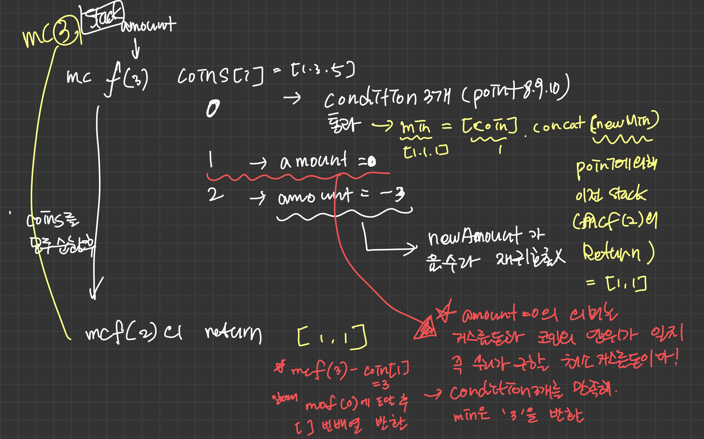

# 리뷰 
* 동적 프로그래밍(POINT5,6,7), 거스름돈 최적 케이스 조건3(POINT8,9,10)을 고민하는데 시간이 소요 됐으며 동적 프로그래밍 보다 최적케이스조건중 POINT9번을 생각하는데 더 시간 소요 됐다.

# 문제 
* 주어진 금액을 돈전 d1, d2, d3... dn으로 바꿔줄 때 필요한 동전의 최소 개수
* 예
    - 1, 5, 10, 25센트 동전이 있고 36센트를 바꿀때 최소 동전 개수는 25, 10, 1 센트이다.
        
# 해결 방법 
* 모든 x < n에 대한 해를 찾아야한다.
* 더 적은 금액의 동전에 대한 해를 바탕으로 최적해를 찾아간다.

# POINT
> 거스름돈 amount
> 동전: coins  
> newAmount = amount - coins[i];  
> newMin = me.makeChange(newAmount);  
> min = 

* POINT1: 동전을 배열로 받는다
* POINT2: 중복 계산을 막기위해서 makeChange로 들어온 amount 단위별로 caching 해 놓는다. 
* POINT3: 거스름돈 금액이 음수면 빈배열 반환
* POINT4: 캐시있는 금색이면 캐시된 값 반환

* 동적 프로그래밍 핵심
    * POINT5: iterator coins - 동전 금액을 기준으로 문제를 풀기 위해서 동전 금액 기준으로 순회한다. 
    * POINT6: newAmount - 거스름돈에서 각 동전을 뺀다./ POINT7에서 재귀호출 때문에 교환 가능한 최소 금액까지 도달한다.(동전 최소 금액이 1이면 거스름돈이 1까지 도달한다는 의미)
    * POINT7: `재귀호출`: newAmount >= 0이면 newAmount값에 대해서 다시 재귀 호출을 해서 결과를 newMin 변수에 담는다.

* 거스름돈 최적 케이스 조건 3
    * POINT8: newAmount가 유효여부 확인( 교환 가능한 최소금액이 최소 금액 까지 도달한건가? -> POINT6 확인 
    * POINT9: 최적의 newMin(동전의 최소 개수)이 도출 됐는지
    * POINT10: newMin과 newAmount 모두 유효한 값인지

* POINT11: POINT8,9,10 모두 충족한다면 그것은 이전보다 더 나은 결과를 얻었다는 반증(예 - 5센트 거스름돈이 1센트 5개보다 5센트 동전 개가 더 바람직)
* POINT12: 최종 겨로가 반환

# CODE
```js
function MinCoinChange(coins){
    var conins = coins; //POINT1
    var cache = {};     //POINT2

    this.makeChange = function(amount){
        var me = this;
        if(!amount){    //POINT3
            return [];  
        }

        if(cache[amount]){  //POINT4
            return cache[amount];
        }

        var min = [], newMin, newAmount;

        for (var i=0; i<coins.length; i++){ //POINT5
            var coin = coins[i];
            newAmount = amount - coin;      //POINT6
            if (newAmount >= 0){
                newMin = me.makeChange(newAmount);  //POINT7
            }

            if( newAmount >= 0                                  //POINT8
                && (newMin.length < min.length-1 || !min.length)//POINT9
                && (newMin.length || !newAmount)){              //POINT10
                min = [coin].concat(newMin);                    //POINT11
                console.log(`new Min: ${min} for ${amount}`);   
            }
        }
        return (cache[amount] = min);                           //POINT12
    }
}

var minCoinChange = new MinCoinChange([1,5,10,25]);
console.log(minCoinChange.makeChange(36));  //[1, 10, 25]
```


# 손으로 풀어본 알고리즘
* 반복문 안에 재귀 호출과 재귀호출 전, 후 처리할 알고리즘이 있는 경우 어떻게 동작하는지 중점으로 분석해봤다.

* 설명1
    * coins = [1,3,5], amount = 5 일때 amount 3일때 최소 거스름돈은?



* 설명2
    * 기준 makeChange(mc)는 point5,6을 수행후 '재귀호출' 이후에 나머지 부분(point8,9,10)부분을 수행
    * makeChange는 주어진 coins 만큼 반복


* 설명3
    * point6,7에 의해서 재귀호출에 의해서 amount가 1이된 경우에 makeChange에 amount가 1인경우 나머지 coin을 순회하면서 amount가 1일때 가장 적합한 거스름돈을 찾는다.
    * return으로 [1]을 반환하면서 다음 스택 newMin 변수에 넘긴다.(POINT7 참고)


* 설명4
    * point6,7에 의해서 재귀호출에 의해서 amount가 2이된 경우에 makeChange에 amount가 1인경우 나머지 coin을 순회하면서 amount가 1일때 가장 적합한 거스름돈을 찾는다.
    * 이전 stack에서 [1]을 반환 받았고 현재 coin이 1일때 amount2일때 최소 거스름돈이다.


* 설명5
    * 설명3,4와 같이 설명4 stack에서 return value [1,1]이 newMin으로 설정되고 coin이 1인 경우에 point8,9,10 조건을 만족해 [1,1,1]이 min에 대입 된다. 
    * coins 순회에서 1번째 값이 3인 경우 amount - coins[1] = 3 - 3 = 0 이다. 
    이 의미는 거스름돈 3센트를 3센트 하나로 거슬러줄 수 있다는 의미이다. 그래서 조건 point8,9,10 조건을 만족해서 min이 [3]으로 교체 된다.
        - makeChange function(3) -> coin[1]은 3 -> newAmount = amount - coins[1] = 0 일때 makeChange(0) return value로 [](빈배열)을 반환 받는다.
