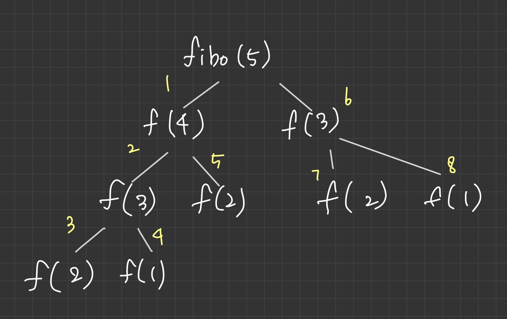

# 문제 
* 문제 배열의 숫자들을 숫자별로 내림차순으로 정렬한다. 
        
# 해결 방법 
* num이 1,2일때 '베이스 케이스'
* fib(n) = fib(n-1) + fib(n-2);


# CODE - 재귀호출 방법
```js
function fibonacci(num){
    if(num===1 || num === 2){
        return 1;
    }
    return fibonacci(num-1) + fibonacci(num-2);
}

finonacci(5); //5
```

# CODE - 재귀호출 아닌 방식
```js
function fib(num){
    var n1 = 1,
    n2 = 1,
    n = 1;
    for(var i = 3; i<=num; i++){
        n = n1 + n2;
        n1 = n2;
        n2 = n;
    }
    return n;
}

fib(5); //5

```

# fibonacci graph

