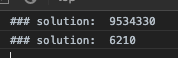

# 문제 
* 문제 배열의 숫자들을 숫자별로 내림차순으로 정렬한다. 
        
# 해결 방법 
* 배열의 숫자를 문자형으로 바꾸고 자리를 바꿔가며 문자를 조합하고 숫자형으로 다시 변환한뒤 숫자 크기를 비교한다

# STEP
* STEP1: 배열의 숫자형을 문자형으로 변환
* STEP2: 문자형변환후 배열 요소를 자리를 바꿔가며 숫자 크기를 비교(문자열x)

# CODE
```js
var a = [3, 30, 34, 5, 9];
var b = [6, 10, 2];

function solution(numbers) {
    var answer = numbers.map(v => v + '')
        .sort((a, b) => (b + a)* 1 - (a + b)*1)
        .join('');

    return answer[0] === '0' ? '0' : answer
}
```

# 결과

