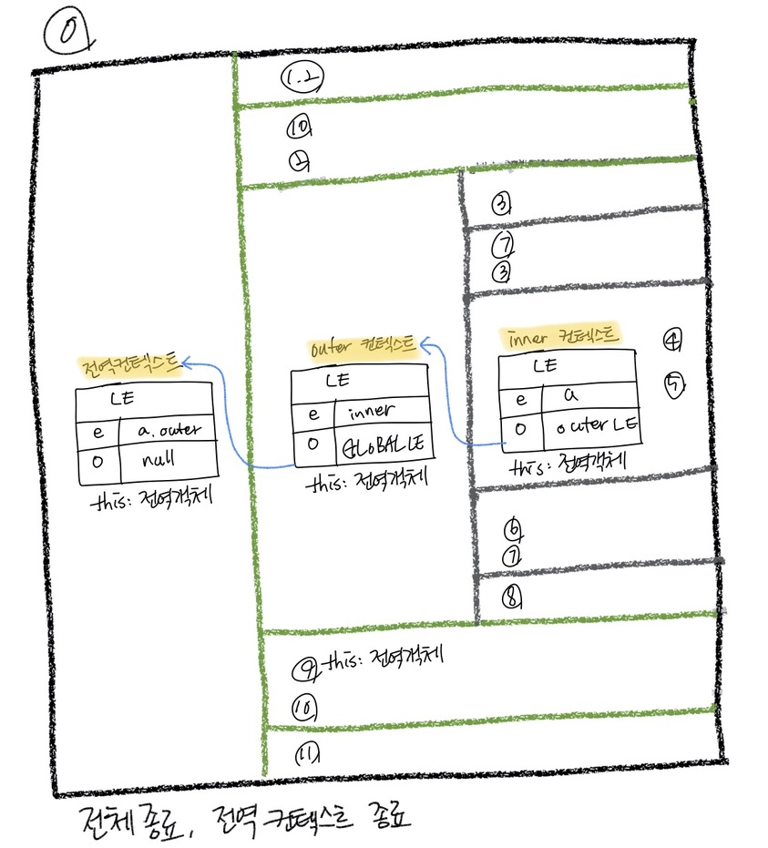

개발을 하다보면 this의 범위가 함수, function, bind, call, apply별로 달라지는 걸볼 수 있는데 왜 이런지에 대해서 다뤄보려고 한다.


```js
02 실행 컨텍스트 
	2-1 실행 컨텍스트란? 
	2-2 VariableEnvironment
	2-3 LexicalEnvironment
		2-3-1 environmentRecord와 hoisting
            호이스팅 규칙  
            함수 선언문과 함수 표현식
      
		2-3-2 scope, scope chain, outerEnvironmentReference
            스코프 체인
            전역변수와 지역변수

	2-4 this
```


# 02 실행 컨텍스트 
> * 실행컨텍스트(execution context)는 실행할 코드에 제공할 환경 정보들을 모아놓은 객체  
> * 자바스크립트의 동적 언어로서의 성격을 가장 잘 파악할 수 있는 개념  
> * 어떤 실행 컨텍스트가 활성화되는 시점에 선언된 변수를 위로 끌어 올리고(=호이스팅), 외부환경정보를 구성, this값을 설정  하는 동작 수행    
-> 이로인해 다른언어에서는 발견할 수 없는 특이한 현상들이 발생

# 2-1 실행 컨텍스트란? 
> 실행할 코드에 제공할 환경 정보들을 모아놓은 객체

* 코드 실행시 실행 컨텍스트
    - '동일한 환경'에 있느 코드들을 실행할 때 필요한 환경 정보들을 모아 컨텍스트를 구성하고 
    - 이를 콜 스택에 쌓아올렸다가
    - 가장 위에 쌓여있는 컨텍스트와 관련 잇는 코드들을 실행하는 식으로 전체 코드의 환경과 순서를 보장

* '동일한 환경'(하나의 실행 컨텍스트)을 구성할 수 있는 방법
    - 전역공간, evan()함수, 함수 등이 있음
    - eval을 제외하면 우리가 흔히 실행 컨텍스트를 구성하는 방법은 함수를 실행하는 것

* javascript engine 역할
  - 어떤 실행 컨텍스트가 활성화될 때 자바스크립트 엔진은 해당 컨텍스트에 관련된 코드들을 실행하는 데 '필요한 환경정보들'을 수집해서 실행 컨텍스트 객체에 저장
  - 이 객체는 javascript engine이 활용할 목적으로 생성(개발자가 코드를 통해 확인할 수 x)  
  - 담기는 정보 세가지  
    : 목차 2-2, 2-3, 2-4에서 각각 더 자세하게 설명하도록 한다. 
  ```txt
    VariableEnvironment : 현재 컨텍스트 내의 식별자들에 대한 정보 + 외부 환경 정보. 
                            : 선언 시점의 LexicalEnvironment의 스냅샷 
                            : 변경 사항은 반영되지 않음
    LexicalEnvironment  : 처음에는 VariableEnvironment와 같지만 변경사항이 실시간으로 반영
    ThisBinding         : this 식별자가 바라봐야 할 객체
  ```

* 활성화된 실행 컨텍스트의 수집정보

``` 
  * inner 
      Variableenvironment : environmentRecord(snapshot)/ outerEnvironmentReferenece(snapshot)
      LexicalEnvironment  : environmentRecord/ outerenvironmentReferenece
      ThisBindding
  * outer
  * 전역 컨텍스트
```
  
# 2-2 VariableEnvironment
* LexicalEnvironment와 같지만 최초 실행 시의 스탭 샷을 유지한다는점이 다름
* 실행 컨텍스트를 생성할 때 VariableEnvironment에 정보를 먼저 담은 다음,  
  이를 그대로 복사해서 Lexical environment를 만들어  LexicalEnvironment를 주로 활용하게 된다.
* Variableenvironment, LexicalEnvironment의 내부는 **environmentRecord와 outerEnvironmentReference**로 구성
  - 초기화 과정 중에는 사실상 완전히 동일, 이후 코드 진행에 따라 서로 달라짐
  - 자세한 내용은 LexicalEnvironment를 통해 설명

# 2-3 LexicalEnvironment
* 컨텍스트를 구성하는 환경 정보들을 사전에서 접하는 느낌으로 모아 놓은 것 

## 2-3-1 environmentRecord와 hoisting
* js engine은 컨텍스트 내부 전체를 처음부터 쭉 훑어나가며 순서대로 수집 = "호이스팅 개념"  
(= 식별자들을 최상단으로 끌어올려놓은 다음 실제코드를 실행-실제로 끌어 올리는 것이 아님, 편의상 끌어올린것으로 간주-)
  - 실행 컨텍스트가 관여할 코드들은 실행되기 전의 상태
  - 코드가 실행되기 전임에도 불구하고 js engine은 이미 해당 환경에 속한 코드의 변수명들으 모두 알고 있게 된다.
                                                                
### 호이스팅 규칙
* environmentRecord에는 매개변수의 이름, 함수선언, 변수명 등이 담긴다
* 예시
  * 함수 선언문으로 선언한 함수는 hoisting 대상
  * 함수 표현식은 hosisting 대상 x

  ```js
  function a(){
      console.log(b);   //ƒ b() {}
      var b; 
      console.log(b);   //ƒ b() {}
      function b() {};  //함수 선언문
      console.log(b);   //ƒ b() {}

      console.log(c);   //undefined
      var c = function() {}
  }
  ```


### 함수 선언문과 함수 표현식
* 함수를 정의하는 세가지 방식
  * 함수 선언문: 반드시 함수명이 정의 돼 있어야 함/ hoisiting이 됨
  * 함수 표현식: 함수명이 없어도 됨           / hoisiting이 안 됨
  * 기명 함수 표현식: 함수명을 정의한 함수 표현식

```js
function a() {} //함수 선언문
a();

//상대적으로 긴 코드 속에서 함수 표현식이 안전한다.
var b = function() {} //(익명) 함수 표현식
b();

var c = function d() {} // 기명 함수 표현식. 변수명: c, 함수명 d
c(); // 실행
d(); // error

```

## 2-3-2 scope, scope chain, outerEnvironmentReference
* scope: 식별자에 대한 유표범위
  * ES5까지의 자바스크립트는 특이하게도 전역 공간을 제외하면 오직 함수에 의해서만 스코프가 생성
* scope chain: 이런 '식별자의 유효범위'를 안에서부터 바깥으로 차례로 검색해나가는 것
* outerEnvironmentReference: 스코프체인을 가능하게 하는 것이 바로 Lexicalenvironment의 두번째 수집자료인 outerEnvironmentReferenece

### scope chain
* outerEnvironmentReferenece는 현재 호출된 함수가 선언될 당시의 LexicalEnvironment를 참조
  - 아래 예시1 scopechain 도식화 참고
* 과거 시점인 '선언될 당시'는 행위가 실제로 일어 날 수 있는 시점이란?  
  - 콜 스택 상에서 어떤 실행 컨텍스트가 활성화된 상태일 때뿐
  - 모든 코드는 실행 컨텍스트가 활성화 상태일 때 실행되기 때문

* scope chain 예1
  1. A함수 내부에 B함수 선언, B함수 내에 C함수 선언
  2. 함수 C의 outerEnvironmentReferenece는 함수 B의 LexicalEnvironment를 참조 
  3. 함수 B의 LexicalEnvironment에 있는 outerEnvironmentReferenece는 ***다시 함수 B가 선언되던 때*** A함수의 LexicalEnvironment를 참조 
  4. 이처럼 outerEnvironmentReferenece는 연결리스트 형태를 띤다.
  5. '선언 시점의 LexicalEnvironment'를 계속 찾아 올라가면 마지막엔 전역 컨텍스트의 LexicalEnvironment가 있을 것'  

* 위 예시로본 특징 
  - 예시 3번에서 본것 처럼 각 outerEnvironmentReferenece는 오직 자신이 선언된 시점의 LexicalEnvironment만 침조하고 있으므로 가장 가까운 요소부터 차례대로만 접근할 수 있고 다른 순서로 접근하는 것은 불가능
  - 이런 구조적 특성 덕분에 여러 스코프에서 동일한 식별자를 선언한 경우에는 **무조건 스코프 체인 상에서 가장 먼저 발견된 식별자에만 접근 가능** 

* scope chain 예1 코드
```js
/*01*/ var a = 1;
/*02*/ var outer = function () {
/*03*/   var inner = function () {
/*04*/     console.log(a);
/*05*/     var a = 3;
/*06*/  };
/*07*/   inner();
/*08*/   console.log(a);
/*09*/ };
/*10*/ ouer();
/*11*/ console.log(a);
```
* scope chaing 예1 코드 도식화
    * 그림을 보면서 라인별로 어떤 동작을 하는지 생각해보자
    ```
      LE: Lexical Envinronment
      e: environmentRecord
      o: outerEnvironmentReference
    ```
    


* **전역 컨텍스트 활성화**
  * 0: LexicalEnvironment, VariableEnvironment, thisBinding

* 전역 컨텍스트 생성/ outer 함수 호출
  * 1,2: a에 1, outer에 함수 할당
  * 10: outer 함수호출, 전역 컨텍스트 비활성화
  * 2: outer실행 컨텍스트 활성화

* outer 컨텍스트 생성/ inner 함수 호출
  * 3: inner에 함수 할당
  * 7: inner 함수 호출, outer 실행 컨텍스트 비활성화
  * 3: inner 실행 컨텍스트 활성화 

* inner 함수 수행
  * 4: inner의 LE에서 a 탐색 -> undefined 출력
  * 5: a에 3할당

* inner 컨텍스트 종료 
  * 6: inner 함수 종료, inner 실행 컨텍스트 제거
  * 7: outer 실행 컨텍스트 재활성화
  * 8: outer의 LE에서 a탐색 -> GLOBAL의 LE에서 a 탐색 -> 1출력

* outer 컨텍스트 종료 
  * 9: outer함수 종료, outer 실행 컨텍스트 제거 
  * 10: 전역 컨텍스트 재활성화 
  * 11: GLOBAL의 LE에서 a탐색 -> 1출력


* outer컨텍스트 

```js
"전역 컨텍스트": {
    environmentRecord: 'a, outer function',
    outerEnvironmentReferenece: null,
    this: window
}

"outer컨텍스트": {
    environmentRecord: ['inner function'], 
    outerEnvironmentReferenece: 'GLOBAL LexicalEnvironment',
    this: window
}

"inner컨텍스트": {
    environmentRecord: ['a'], 
    outerEnvironmentReferenece: 'outer 컨텍스트',
    this: window
}
```

### 전역변수와 지역변수
* 전역변수: 전역 공간에서 선언
* 지역변수: 함수 내부에서 선언

# 2-4 this
* 실행컨텍스트의 thisBinding에 this로 지정된 객체가 저장
* 실행컨텍스 활성 당시 this가 지정되지 않은경우 "전역객체" 저장
* 함수 호출하는 방법에 따라 this가 달라진다.(this에 대해서만 내용을 다룰 예정)


# 참고 
* 코어 자바스크립트 
* 인사이드 자바스크립트
* 자바스크립트 완벽 가이드
* 제로초 블로그
