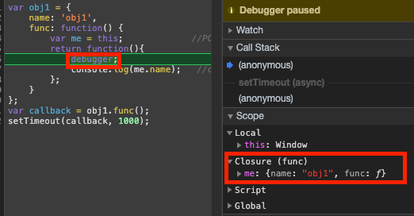

업무중에 setTimeout, 특정 반목문, event callback function 등 특정상황에서 콜백함수 내부에 this를 바인딩해서 사용하는 경우가 있었는데 그 경우를 실행 컨텍스트, 제어권에 따라 달라지는 것을 경험해본적이 있어 아래와 같은 내용을 이해하기 용이 했습니다.

# 1 콜백함수란?
> 다른 코드의 인자로 넘겨주는 함수(제어권도 함께 위임)
> 콜백함수를 넘겨 받는 코드는 이 콜백 함수를 필요에 따라 적절한 시점에 실행


# 2 제어권
> 호출시점, 인자, this 예제를 통해서 알아 보자
## 2-1 호출시점
> setInterval에 callback function은 '호출주체, 제어권'은 setInterval이다.
```js
var count = 0;
var cbFunc = function() {
    conosl.log(count);
    if(++count > 3) clearInterval(timer);
};
var timer = setInterval(cbFunc, 300);
```
## 2-2 인자
> 콜백 함수의 제어권을 넘겨받은 코드는 콜백 함수를 호출할 때 인자에 어떤 값들을 어떤 순서로 넘길 것인지에 대한 제어권을 가진다.

* callback function의 인자 값은 filter에 의해서 정해졌다.
    ```js
    var newArr = [1,2,3,4,5].filter(function(idx, val){
        console.log({'this sceop': this, idx, val});
        return val > 2;
    }, {a:1, b:2});     // {a:1, b:2}코드에 대한 설명은 아래 2-3 this설명에서 알 수 있다.

    console.log(newArr);    //[4,5]

    /*
        this sceop: {a: 1, b: 2}
        idx: 1
        val: 0
        
        this sceop: {a: 1, b: 2}
        idx: 2
        val: 1
        
        this sceop: {a: 1, b: 2}
        idx: 3
        val: 2
        
        this sceop: {a: 1, b: 2}
        idx: 4
        val: 3
        
        this sceop: {a: 1, b: 2}
        idx: 5
        val: 4
    */
    ```

## 2-3 this

* Array.prototype.map - 구현    
    ```js
    Array.prototype.filter = function(callback, thisArg){
        var mappedArr = [];
        for(var i=0; i < this.length; i++){
            var mappedValue = callback.call(thisArg || window, this[i], i , this);  //POINT
        }
    }
    ```
    * 주석 POINT 설명
        * thisArg || window  
            : callback function에서 this의 scope을 명시적으로 바인딩
            : 이 코드에 의해 filter의 두번째 param으로 callback의 this를 정해줄 수 있다.
            : 2-2인자 챕터 코드 참고하기
        * this  
            : filter를 호출 한 array(이 내용은 prototype과 관련해서 더 설명할 수 있겠다.)  
        * this[i]  
            : 이 코드에 의해서 callback function의 첫번째 param array의 i번째 요소
        * i  
            : 이 코드에 의해서 callback function의 두번째 param array의 i번째
    
# 3 콜백 함수는 함수다
* 메서드를 콜백함수로 전달한 경우
    ```js
    var obj = {
        vals: [1,2,3],
        logValues: function(v, i){
            console.log(this, v, i);
        }
    }
    
    obj.logValues(10,20); //{vals: Array(3), logValues: f} 10 20

    [10,20,30].forEach(obj.logValues);
    /*
        Window{...} 10 0
        Window{...} 20 1
        Window{...} 30 2    
    */
    ```
    * forEach의 callback function은 코드에 의해서 호출된 logValues에서 this는 Window를 가르키고 있다.
        - callback function으로 obj 객체에 의해서 this가 결정되지 않고 별도로 this를 명시하는 인자를 지정하지 않았으므로 함수 내부에서의 this는 전역객체를 가르친다.
        
# 4 콜백 함수 내부의 this에 다른 값 바인딩하기
* 콜백 함수 내부의 this에 따른 값을 바인딩하는 방법 (1/3)
    ```js
    var obj1 = {
        name: 'obj1',
        func: function() {
            var me = this;             //POINT
            return function(){
                console.log(me.name);
            };
        }
    };
    var callback = obj1.func();
    setTimeout(callback, 1000);
    ```
    * var me = this;는 closure scope에 등록
    * setTimeout에 의해서 callback function이 호출 될때 me.name은 excute context에서 me.name 변수를 찾는다.
    


* 콜백 함수 내부의 this에 따른 값을 바인딩하는 방법 (2/3)
    * 예제1에서 만들었던 함수 재활용하는 방법 - cb2 확인해보자
    ```js
	var obj1 = {
	    name: 'obj1',
	    func: function() {
		var me = this;              //POINT: closure
		return function(){
		    debugger;
		    console.log(me.name, this);
		};
	    }
	};

	var obj2 = {
	    name: 'obj2',
	    func: obj1.func
	};

	var cb1 = obj1.func().bind({name: 'cb1'});
	setTimeout(cb1, 1000);

	var cb2 = obj2.func().bind({name: 'cb2'});
	setTimeout(cb2, 1500);

	var obj3 = { name: 'obj3' }
	var cb3 = obj1.func.call(obj3);        //POINT: obj1.func = function(){ var me this; return function(p1){ console.log() }}
	setTimeout(cb3, 2000);

        /*
            # 결과
                * cb1: obj1 {name: "cb1"}
                * cb2: obj2 {name: "cb2"}
                * cb3: obj3 Window {...}
        */
    ```

* 콜백 함수 내부의 this에 따른 값을 바인딩하는 방법 (3/3)
    * bind로 this를 명시한 function을 사용
        ```js
        var obj1 = {
                name: 'obj1',
                func: function() {
                    console.log(this.name)
                }
        };
        
        setTimeout(obj1.func.bind(obj1), 1000);

        var obj2 = {name:'obj2'};
        setTimeout(obj1.func.bind(obj2), 1500);

        /*
            # 결과
                * obj1
                * obj2
        */
        ```


# 5 콜백 지옥과 비동기 제어
> 콜백함수를 익명 함수로 전달하는 과정이 반복되어 코드의 들여쓰기 수준이 감당하기 힘들정도로 깊어지는 현상
> 주로 이벤트 처리, 서버통신과 같은 비동기적인 작업을 수행하기 위해서 이런 형태가 등장

* 동기적인 코드
    - 현재 실행중인 코드가 완료된 후에야 다음 코드를 실행하는 방식
* 비동기적인 코드
    - 현재 실행 중인 코드의 완료 여부와 무관하게 즉시 다음 코드로 넘어간다.
    - CPU의 계산에 의해 즉시 처리가 가능한 대부분의 코드는 동기적인 코드 
* 비동기적인 코드가 필요한 경우   
    : 웹의 복잡도가 높아진 만큼 비동기적인 코드의 비중이 예전보다 훨씬 높아졌다.
    - 실행대기(setTimeout)  
        : 사용자의 요청에 의해 특정 시간이 경과되기 전까지 어떤 함수의 실행을 보류
    - 이벤트처리(addEventListener)  
        : 사용자의 직접적인 개입이 있을 때 비로소 어떤 함수를 실행하도록 대기
    - 보류(XMLhttpRequest)  
        : 웹브라우저 자체가 아닌 별도의 대상에 무어가를 요청하고 그에 대한 응답이 왔을때 비로소 어떤 함수를 실행하도록 대기


# 참고 
* 코어 자바스크립트 - 위키북스
* 인사이드 자바스크립트
* 자바스크립트 완벽 가이드
