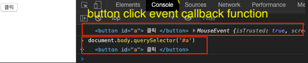

상황에 따라서 달라지는 this를 정리해보려고 한다. 
```js
03 this
	3-1 상황에 따라 달라지는 this
		3-1-1 전역 공간에서의 this
		3-1-2 메서드로서 호출할 때 그 메서드 내부에서의 this
			함수 vs 메서드
			메서드 내부에서의 this
		3-1-3 함수로서 호출할 때 그 함수 내부에서의 this
			함수 내부에서의 this
			메서드의 내부함수에서의 this
			메서드의 내부 함수에서의 this를 우회하는 방법
			this를 바인딩하지 않는 함수
		3-1-4 콜백 함수 호출 시 그 함수 내부에서의 this
		3-1-5 생성자 함수 내부에서의 this
	3-2 명시적으로 this를 바인딩하는 방법
		3-2-1 call 메서드
		3-2-2 apply 메서드
		3-2-3 call/apply 메서드의 활용
			유사배열객체에 배열 메서드를 적용
			생성자 내부에서 다른 생성자 호출
			여러 이수를 묶어 하나의 배열로 전달하고 싶을 때 apply 활용
		3-2-4 bind 메서드
			상위 컨텍스트의 this를 내부함수나 콜백함수에 전달하기
		3-2-5 arrow function의 예외사항
		3-2-6 별도의 인자로 this를 받는 경우(콜백 함수 내에서의 this)
```

# this

* 다른 객제지향 언어와 this의 차이점 
    * 다른 대부분의 객체지향 언어의 this: 클래스로 생성한 인스턴스 객체
        * 클래스에서만 사용할 수 있기 때문에 헷갈리지 않거나 많지 않음
    * 자바스크립트 this: **어디에서나 쓸 수 있음**
        * 상황에 따라 this가 바라보는 대상이 달라짐
        * ***문제를 해결하려면 원인을 알아야 하는데, 정확한 작동방식을 이해하지 못하면 원인을 해결하기 어려움***

* this 확인으로 '함수, 객체(메서드)'의 구분할 수 있는 거의 유일한 방법

# 3-1 상황에 따라 달라지는 this
> this는 기본적으로 실행 컨텍스트가 생성될 때 함께 결정(실행컨텍스트 설명할때 설명됨)  
> 아래 상황별로 this가 5가지 다른 값을 보여주는 내용을 설명

## 3-1-1 전역 공간에서의 this
> 전역 공간에서 this는 전역객체를 가리킨다. 

* 전역 변수와 전역객체
    ```js
    var a = 1;
    console.log(a);         //1
    console.log(window.a);  //1
    console.log(this.a);    //1
    ```
* 위 결과 값이 같은이유는? 
    * 전역변수 선언시 javascrip engine이 전역객체의 프로퍼티로 할당
    * javascript 모든 변수는 특정 객체의 프로퍼티로 등록되고 동작
        * 특정객체: 실행컨텍스트의 LexicalEnvironment
        * 전역컨텍스트의 경우 LexicalEnvironment는 전역객체를 그대로 참조(실행컨텍스트 도식화 그림 참고
* 전역 변수를 접근하는 과정은? -> scope chain
    * a에 접근하고자 하면 스코프 체인에서 a를 검색하다 가장 마지막에 도달하는 '전역 스코프'의 LexcialEnvironment(전역객체)에서 해당 프로퍼티를 a를 발견해서 그 값을 반환하기 때문


---
* 전역변수와 전역객체의 차이점
    * 전역객체의 프로퍼티로 할당한 경우에서는 삭제 o
    * 전역변수로 선언한 경우에는 삭제 x

        ```js
        var b = 2;
        delete b;   //false
        console.log(b, window.b, this.b) //2 2 2

        window.c = 3;
        delete window.c;    //true
        console.log(c, window.c this.c); // Uncaught ReferenceError: c is not defined
        
        ```


## 3-1-2 메서드로서 호출할 때 그 메서드 내부에서의 this
### 함수 vs 메서드
* 함수 호출시 this: 전역객체
* 메서드로 호출시 this: 호출한 메서드
    ```js
    // 함수로서 호출
    var obj = {
    bar: function() {
        var x = (function(){
                    return this
                })();
        return x;
    }
    };

    obj.bar() === window //true


    // 메서드로서 호출
    var obj = {
    bar: function() {
        var x = (() => this)(); // 주의: use arrow funciton
        return x;
    }
    };

    obj.bar() === obj	//true

    ```

## 3-1-3 함수로서 호출할 때 그 함수 내부에서의 this
### 함수 내부에서의 this
* this에는 호출한 주체 정보가 담기는데 어떤 함수를 함수로서 호출시 this 지정 안됨
* 함수로서 호출하는 것은 호출 주체(객체지향 언어에서의 객체)를 명시하지 않않고 개발자가 코드에 직접 관여해서 실행한 것이기 때문에 호출 주체의 정보를 알 수 없다.
* **실행 컨텍스트가 지정되지 않은 경우 this는 전역 객체를 바라본다 -> 따라서 함수에서 this는 전역객체를 가리킨다.** 

### 메서드의 내부함수에서의 this
* 실행순서1,2,3의 return value
    - 실행순서1: {outer: f, outer2: f} === obj1
    - 실행순서2: window{...}
    - 실행순서3: {obj2Property: "obj2Property", innerMethod: ƒ}

* POINT
    - innerFunc에 console.log는 B, C에 의해서 호출이 되는데  
    - B처럼 innerFunc이 함수로 호출될때는 this는 전역 변수를 가르킨다.
    - C처럼 innerfunc이 메서도로 호출될때는 this는 호출한 대상을 가르킨다.
        ```js
        var obj1 = {
            outer: function() {
                console.log(this);  //실행순서 1 by A
                var innerFunc = function(){
                    console.log(this);  //실행순서 2 by B, 3 by C
                }
                innerFunc(); // B

                var obj2 = {
                    innerMethod: innerFunc,
                    obj2Property: 'obj2Property' 
                };
                obj2.innerMethod(); // C
            },

            outer2: function(){

            }
        };

        obj1.outer(); // A
        ```

### 메서드의 내부 함수에서의 this를 우회하는 방법
### this를 바인딩하지 않는 함수
> 아래 예제 주석 참고
* log 결과값
    * [1]: {outer: f}
    * [2]: window {...}
    * [3]: {outer: f}
    * [4]: window {...}
    * [5]: {outer: f}
    ```js
    var obj1 = {
        outer: function() {
            console.log(this);  // [1]
            var innerFunc = function(){
                console.log(this); // [2]
            }
            innerFunc(); 

            var me = this;
            var innerFunc2 = function(){
                console.log(me);    // [3] 메서드의 내부 함수에서의 this를 우회하는 방법
                console.log(this);  // [4]
            }
            innerFunc2(); 

            var innerFunc3 = () => {
                console.log(this);  // [5] this를 바인딩하지 않는 함수
            }
            innerFunc3();

        }
    };

    obj1.outer(); 
    ```


## 3-1-4 콜백 함수 호출 시 그 함수 내부에서의 this
* callback function의 제어권을 가지는 함수(메서드)가 콜백 함수에서의 this를 무엇으로 할지를 결정
* 특별히 정의하지 않은 경우에는 기본적으로 함수와 마찬가지로 전역객체를 바라본다.

    ```js
    setTimeout(function(){
        console.log(this);
    }, 3000);

    [1,2,3].forEach(function(v){
        console.log(this, v);
    })

    document.body.innerHTML += `<button id="a"> 클릭 </button>`
    document.body.querySelector('#a').addEventListener('click', function(e){
        console.log(this, e);
    })

    ```
* event Callback function 참고



* addEventListner function 내부 추측 
    - addEventListner function this가 'document.body.querySelector('#a')' 이기 때문에  
    이 값을 callback function을 call메서드를 이용해 명시적으로 this바인딩 할 수 있겠다.

        ```js
            addEventListener: function(a, callbackFunc){
                ...
                callbackFunc.call(this, event);
                ...
            }
        ```


## 3-1-5 생성자 함수 내부에서의 this

# 3-2 명시적으로 this를 바인딩하는 방법
## 3-2-1 call 메서드
## 3-2-2 apply 메서드
## 3-2-3 call/apply 메서드의 활용
### 유사배열객체에 배열 메서드를 적용
### 생성자 내부에서 다른 생성자 호출
### 여러 이수를 묶어 하나의 배열로 전달하고 싶을 때 apply 활용
## 3-2-4 bind 메서드
### 상위 컨텍스트의 this를 내부함수나 콜백함수에 전달하기

### 3-2-5 arrow function의 예외사항
### 3-2-6 별도의 인자로 this를 받는 경우(콜백 함수 내에서의 this)