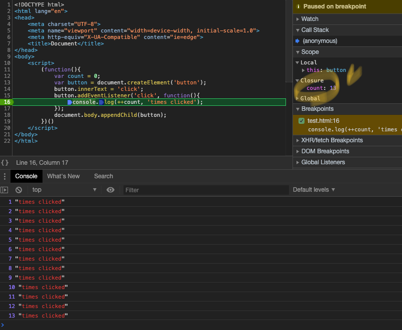

업무를 하다가보면 closure 영역을 나도모르게 많이 사용하고 있다는 걸 정리하면서 생각이 들었다. (위젯 define option, setTimeout, IIFE 에서도...)
그런 closure에 대해서 정리를 해보겠다. 


```js
	1 클로저의 의미 및 원리 이해
	2 클로저와 메모리 관리
	3 클로저 활용사례
		3-1 콜백 함수 내부에서 외부 데이터를 사용하고자 할 때 
		3-2 접근 권한 제어(정보 은닉)
		3-3 부분 적용함수
		3-4 커링함수
```


# 1 클로저의 의미 및 원리 이해


* 클로저란?  
  : 함수형 프로그래밍 언어에서 등장하는 특징
    > 어떤 함수 A에서 선언한 변수 a를 참조하는 내부함수 B를 외부로 전달할 경우 A의 실행 컨텍스트가 종료된 이후에도 변수a가 사라지지 안는 현상
    - mdn 설명
    > A closure is the combination of a function bundled together (enclosed) with references to its surrounding state (the lexical environment).  
    > In other words, a closure gives you access to an outer function’s scope from an inner function. 
    > In JavaScript, closures are created every time a function is created, at function creation time.
    

* 외무 함수의 변수를 참조하는 내부 함수(1)
    ```js
    var outer = function() {
        var c = 1;
        var c1
        var inner = function() {
            console.log(++c);
        }
        inner();
    };
    outer();
    ```
    * inner함수 내부에서는 a를 선언하지 않았기 때문에 environmentRecord에서 값을 찾지 못하므로 outerEnvironmentReference에 지정된 상위 컨텍스트인 outer의 LexicalEnvironment에 접근해서 다시 a를 찾는다. 
    * outer함수의 실행 컨텍스트가 종료되면 LexicalEnvironmentReference에 저장된 식별자들(c, inner)에 대한 참조를 지운다. 
        - 각 주소에 저장돼 있던 값들은 자신을 참조하는 변수가 하나도 없게 되므로 가비지 **컬렉터의 수집 대상**이된다.
    * inner function안에서 closure 영역에 있는 변수는 'c' 하나 뿐이다. c1처럼 변수 선언만 하고 할당하지 않으면 메모리에 올라오지 않는다. 

* 외무 함수의 변수를 참조하는 내부 함수(2): outer 함수의 실행컨텍스트가 종료된 후 inner 함수를 호출하면?  
    ```js
    var outer = function() {
        var c = 1;
        var c1
        var inner = function() {
            console.log(++c);
        }
        inner();
    };
    var excuteInnerFunc = outer();
    consl.log(excuteInnerFunc); // 2
    consl.log(excuteInnerFunc); // 3
    ```
    * inner함수의 실행 컨텍스트의 environmentRecord에는 수집할 정보가 없습니다.
    * outerEnvironmentReferenece에는 inner함수가 선언된 위치의 LexicalEnvironment가 참조복사
    * inner함수는 outer함수 내부에서 선언됐으므로, outer함수의 Lexicalenvironment가 담김
        - 위 단계로 스코프 체이닝에 따라 outer에서 선언한 변수 a에 접근해서 1만큼 증가시킨 후 그 값인 2를 반환
        - inner함수의 실행 컨텍스트가 종료
    * excuteInnerFunc를 두번째 호출하게 되면 위 단계를 걸쳐  2->3으로 증가한다.

    * ***주의할점***
        > inner함수의 실행시점에는 outer함수는 이미 실생 종료된 상태인데 outer함수의 Lexicalenvironment에 어떻게 접근할 수 있는걸까? 
        - 가비지 컬렉터의 동작 방식때문
        - 가비지 컬렉터는 어떤 값을 참조하는 변수가 하나라도 있다면 그 값은 수집 대상에 포함시키지 않습니다.
        - 언젠가 inner함수의 실행컨텍스트가 활성화 되면 outerEnvironmentReferenece가 outer함수의 Lexicalenvironment를 필요로 할 것이므로 수집 대상에서 제외
            - 그래서 inner함수 c 변수에 접근 가능

* return 없이도 클로저가 발생하는 다양한 경우
    ```js
    (function(){
        var a = 0 ;
        var intervalId = null;
        var inner = function() {
            if (++a>9) {
                clearInterval(intervalId);
            }
            console.log(a);
        };
        intervalId = setInterval(inner, 1000);
    })()

    // clouser&eventListener
    (function(){
        var count = 0;
        var button = document.createElement('button');
        button.innerText = 'click';
        button.addEventListener('click', function(){
            console.log(++count, 'times clicked');
        });
        document.body.appendChild(button);
    })()
    ```
    

# 2 클로저와 메모리 관리
* 객체지향, 함수형 모두를 아우르는 중요한 개념
* 클로저는 메모리 소모가가 있지만 이런 특성을 정확히 이해하고 잘 활용하도록 노력해야한다.     

* closure를 GC가 수거하게 하는 방법
    - 3갱예시에 POINT 주석 3개 참고 
    ```js
    //1번째 예시
    var outer = function() {
        var c = 1;
        var c1
        var inner = function() {
            console.log(++c);
        }
        inner();
    };
    outer();
    outer = null;   // POINT: outer실별자의 inner 함수 참조를 끊음
        
    //2번째 예시
    (function(){
        var a = 0 ;
        var intervalId = null;
        var inner = function() {
            if (++a>9) {
                clearInterval(intervalId);
                inner = null;             // POINT: inner식별자의 함수 참조를 끊음  
            }
            console.log(a);
        };
        intervalId = setInterval(inner, 1000);
    })();    

    //3번째 예시
    // clouser&eventListener
    (function(){
        var count = 0;
        var button = document.createElement('button');
        button.innerText = 'click';

        var clickHandler = function(){
            //console.log(++count, 'times clicked');
            if( ++count > 9 ){
                clickHandler = null;  //POINT: clickHandler 식별자 함수 참조를 끊음
            }
        };

        button.addEventListener('click', clickHandler);
        document.body.appendChild(button);
    })()
    ```
# 3 클로저 활용사례
## 3-1 콜백 함수 내부에서 외부 데이터를 사용하고자 할 때 
## 3-2 접근 권한 제어(정보 은닉)
## 3-3 부분 적용함수
## 3-4 커링함수