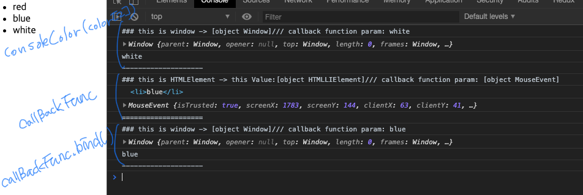

업무를 하다가보면 closure 영역을 나도모르게 많이 사용하고 있다는 걸 정리하면서 생각이 들었다. (위젯 define option, setTimeout, IIFE 에서도...)
그런 closure에 대해서 정리를 해보겠다. 


```js
	1 클로저의 의미 및 원리 이해
	2 클로저와 메모리 관리
	3 클로저 활용사례
		3-1 콜백 함수 내부에서 외부 데이터를 사용하고자 할 때 
		3-2 접근 권한 제어(정보 은닉)
		3-3 부분 적용함수
		3-4 커링함수
```


# 1 클로저의 의미 및 원리 이해


* 클로저란?  
  : 함수형 프로그래밍 언어에서 등장하는 특징
    > 어떤 함수 A에서 선언한 변수 a를 참조하는 내부함수 B를 외부로 전달할 경우 A의 **실행 컨텍스트가 종료된 이후에도 변수a가 사라지지 안는 현상**
    > 내부함수를 외부로 전달하는 방법: 함수를 return하는 경우, callback으로 전달
    - mdn 설명
    > A closure is the combination of a function bundled together (enclosed) with references to its surrounding state (the lexical environment).  
    > In other words, a closure gives you access to an outer function’s scope from an inner function. 
    > In JavaScript, closures are created every time a function is created, at function creation time.
    

* 외무 함수의 변수를 참조하는 내부 함수(1)
    ```js
    var outer = function() {
        var c = 1;
        var c1
        var inner = function() {
            console.log(++c);
        }
        inner();
    };
    outer();
    ```
    * inner함수 내부에서는 a를 선언하지 않았기 때문에 environmentRecord에서 값을 찾지 못하므로 outerEnvironmentReference에 지정된 상위 컨텍스트인 outer의 LexicalEnvironment에 접근해서 다시 a를 찾는다. 
    * outer함수의 실행 컨텍스트가 종료되면 LexicalEnvironmentReference에 저장된 식별자들(c, inner)에 대한 참조를 지운다. 
        - 각 주소에 저장돼 있던 값들은 자신을 참조하는 변수가 하나도 없게 되므로 가비지 **컬렉터의 수집 대상**이된다.
    * inner function안에서 closure 영역에 있는 변수는 'c' 하나 뿐이다. c1처럼 변수 선언만 하고 할당하지 않으면 메모리에 올라오지 않는다. 

* 외무 함수의 변수를 참조하는 내부 함수(2): outer 함수의 실행컨텍스트가 종료된 후 inner 함수를 호출하면?  
    ```js
    var outer = function() {
        var c = 1;
        var c1
        var inner = function() {
            console.log(++c);
        }
        inner();
    };
    var excuteInnerFunc = outer();
    consl.log(excuteInnerFunc); // 2
    consl.log(excuteInnerFunc); // 3
    ```
    * inner함수의 실행 컨텍스트의 environmentRecord에는 수집할 정보가 없습니다.
    * outerEnvironmentReferenece에는 inner함수가 선언된 위치의 LexicalEnvironment가 참조복사
    * inner함수는 outer함수 내부에서 선언됐으므로, outer함수의 Lexicalenvironment가 담김
        - 위 단계로 스코프 체이닝에 따라 outer에서 선언한 변수 a에 접근해서 1만큼 증가시킨 후 그 값인 2를 반환
        - inner함수의 실행 컨텍스트가 종료
    * excuteInnerFunc를 두번째 호출하게 되면 위 단계를 걸쳐  2->3으로 증가한다.

    * ***주의할점***
        > inner함수의 실행시점에는 outer함수는 이미 실생 종료된 상태인데 outer함수의 Lexicalenvironment에 어떻게 접근할 수 있는걸까? 
        - 가비지 컬렉터의 동작 방식때문
        - 가비지 컬렉터는 어떤 값을 참조하는 변수가 하나라도 있다면 그 값은 수집 대상에 포함시키지 않습니다.
        - 언젠가 inner함수의 실행컨텍스트가 활성화 되면 outerEnvironmentReferenece가 outer함수의 Lexicalenvironment를 필요로 할 것이므로 수집 대상에서 제외
            - 그래서 inner함수 c 변수에 접근 가능

* return 없이도 클로저가 발생하는 다양한 경우
    ```js
    (function(){
        var a = 0 ;
        var intervalId = null;
        var inner = function() {
            if (++a>9) {
                clearInterval(intervalId);
            }
            console.log(a);
        };
        intervalId = setInterval(inner, 1000);
    })()

    // clouser&eventListener
    (function(){
        var count = 0;
        var button = document.createElement('button');
        button.innerText = 'click';
        button.addEventListener('click', function(){
            console.log(++count, 'times clicked');
        });
        document.body.appendChild(button);
    })()
    ```
    

# 2 클로저와 메모리 관리
* 객체지향, 함수형 모두를 아우르는 중요한 개념
* 클로저는 메모리 소모가가 있지만 이런 특성을 정확히 이해하고 잘 활용하도록 노력해야한다.     

* closure를 GC가 수거하게 하는 방법
    - 3장 예시에 POINT 주석 3개 참고   
    ```js
        //1번째 예시
        var outer = function() {
            var c = 1;
            var c1
            var inner = function() {
                console.log(++c);
            }
            inner();
        };
        outer();
        outer = null;   // POINT: outer실별자의 inner 함수 참조를 끊음
        

        //2번째 예시
        (function(){
            var a = 0 ;
            var intervalId = null;
            var inner = function() {
                if (++a>9) {
                    clearInterval(intervalId);
                    inner = null;             // POINT: inner식별자의 함수 참조를 끊음  
                }
                console.log(a);
            };
            intervalId = setInterval(inner, 1000);
        })();    

        
        //3번째 예시
        // clouser&eventListener
        (function(){
            var count = 0;
            var button = document.createElement('button');
            button.innerText = 'click';

            var clickHandler = function(){
                //console.log(++count, 'times clicked');
                if( ++count > 9 ){
                    clickHandler = null;  //POINT: clickHandler 식별자 함수 참조를 끊음
                }
            };

            button.addEventListener('click', clickHandler);
            document.body.appendChild(button);
        })()
    ```

# 3 클로저 활용사례

## 3-1 Event Listener(콜백 함수 내부에서 외부 데이터를 사용하고자 할 때)

* event Listener callback function
    ``` js
        var colorList = ['red', 'blue', 'white'];
        var $ul = document.createElement('ul');

        colorList.forEach(function(color){                  //(A)
            var $li = document.createElement('li');
            $li.innerText = color;
            $li.addEventListener('click', function(){       //(B)
                alert('your choice: ', color);
            });
            $ul.appendChild($li);
        });
        document.body.appendChild($ul);
    ```
    * (B)는 color라는 **클로저**가 있다. 
    * (A)는 colorList만큼의 **'실행 컨텍스트가 활성화 됨'**
    * (B) outerEnvironmentReferenece가 (A)의 LexicalEnvironment참조  
       -> **(B)함수가 참조할 예정인 변수 color에 대해서는 (A)가 종료된 후에도 GC 대상에서 제외되어 계속 참조 가능**


* event Listener callback function에 bind 사용
```js
    var $ul = document.createElement('ul');
    var colorList = ['red', 'blue', 'white'];
    var consoleColor = function(color){
        if(this === window){
            //POINT3, POINT2
            console.log('### this is window -> ' + this + "/// callback function param: " + color);
            console.log(this);      //<li>blue</li>
            console.log(color);     //MouseEvent
            console.log('--------------------')
        } else {
            //POINT1
            console.log('### this is HTMLElement -> this Value:' + this + "/// callback function param: " + color);
            console.log(this);      //window
            console.log(color);     //blue
            console.log('====================')
        }   
    }            
    
    colorList.forEach(function(fruit){
        var $li = document.createElement('li');
        $li.innerText = fruit;
        $li.addEventListener('click', consoleColor);                        //POINT 1: eventListener의 this, 첫번째 파라미터는 각각 '클릭한 dom', 'MouseEvent' 객체들이다.
        $li.addEventListener('click', consoleColor.bind(this, fruit));      //POINT 2: forEach의 callback function에서 this는 windown!/ fruit는 clousre! 
        $ul.appendChild($li);
    });
    document.body.appendChild($ul);
    
    consoleColor(colorList[2]);                                             //POINT 3
```
    
    
    * POINT1,2,3의 consoleColor function의 console 확인 필요 
    * POINT1,2의 this, 첫번째 param을 다시 상기 시켜보자.
    * POINT2의 제약사항  
        **- 이벤트 객체가 인자로 넘어오는 순서가 바뀌는 점 및 함수 내부에서의 this가 원래의 그것과 달라지는 점은 감안해야한다.**

        
* event Listener에 고차 함수 사용
    - 함수형 프로그램밍에서 자주 쓰이는 방식

    ```js
        var $ul = document.createElement('ul');
        var colorList = ['red', 'blue', 'white'];
        var consoleColor = function(color){
            return function(){
                console.log(color)
            }
        }            
        
        colorList.forEach(function(fruit){
            var $li = document.createElement('li');
            $li.innerText = fruit;
            $li.addEventListener('click', consoleColor(fruit));
            $ul.appendChild($li);
        });
        document.body.appendChild($ul);
        
    ```

## 3-2 접근 권한 제어(정보 은닉)

```js
    var outer = function(){
        var a = 1;                  //closure
        var inner = function(){
            return ++a;
        }
        return inner;
    }
    var outer2 = outer();

    console.log(outer2());
    console.log(outer2());
```

* outer함수는 외부(전역 스코프)로부터 철저하게 격리
* 외부에서는 외부 공간에 노출돼 있는 outer라는 변수를 통해 outer함수를 실행할 수 있지만  
, outer함수 내부에는 어떠한 개입도 할 수 없다.
* **외부에서는 오직 outer함수가 return한 정보에만 접근할 수 있다.** (== return 값이 외부에 정보를 제공하는 유일한 수단)

## 3-3 부분 적용함수

```js
var add = function(){
    var result = 0;
    for(var i = 0; i < arguments.length; i++){
        result += arguments[i];
    }
    return result;
};
var addPartial = add.bind(null, 1,2,3,4,5);
console.log(addPartical());             //15
console.log(addPartial(6,7,8,9,10));    //55
console.log(addPartical(10));           //25

```
## 3-4 커링함수
* 여러 인자를 받은 함수를 하나의 인자만 받는 함수로 나눠서 순차적으로 호출될 수 있게 체인 형태로 구성

* curring function eg
    ```js

    var curryFuncTest = function (func){
        debugger;
        return function(a){
            debugger;
            return function(b){ // getMaxWith10, getMinWith10 funciton
                debugger;
                return func(a,b);
            };
        };
    };


    var getMaxWith10 = curryFuncTest(Math.max)(10);
    console.log(getMaxWith10(8));
    console.log(getMaxWith10(25));

    var getMinWith10 = curryFuncTest(Math.min)(10);;
    console.log(getMinWith10(8));
    console.log(getMinWith10(25));

    ```


* curring function with arrow function

    ```js
        var curryFuncTestWithArrowFunc = func => a => b => func(a,b);
        var getMaxWith10WithArrowFunc = curryFuncTestWithArrowFunc(Math.max)(10);
        console.log(getMaxWith10WithArrowFunc(8));
        console.log(getMaxWith10WithArrowFunc(25));
    ```

* curring function 실제 사용 예

    ```js
    var getInfomation = function(baseUrl){                      // 서버에 요청할 주소의 기본 URL
        return function (path) {                                // path값
            return function (id) {                              // id    
                return fetch(baseUrl + path + '/' + id);        // 실제 서버에 정보 요청
            };
        };
    };

    var getInformation = baseUrl => path => id => fetch(baseUrl + path + '/' + id);
    var imageUrl = 'http://imgAddr.com/';

    // 이미지 타입별 요청 함수 준비
    var getImage = getInformation(imageUrl);    //http://imgAddr.com/
    var getEmoticon = getImage('emoicon');      //http://imgAddr.com/emoticon
    var getIcon = getImage('icon');             //http://imgAddr.com/icon

    //실제 요청
    var emoticon1 = getEmoticon(100);       //http://imgAddr.com/emoticon/100
    var emoticon2 = getEmoticon(200);       //http://imgAddr.com/emoticon/200
    var icon1 = getIcon(10);                //http://imgAddr.com/icon/10
    var icon2 = getIcon(20);                //http://imgAddr.com/icon/20

    ```

    * 이런 이유로 최근 여러 프레임워크, 라이브러리 등에서 커링을 상당히 광범위하게 사용하고 있다.

# 참고 
* 코어 자바스크립트 - 위키북스
* 인사이드 자바스크립트
* 자바스크립트 완벽 가이드