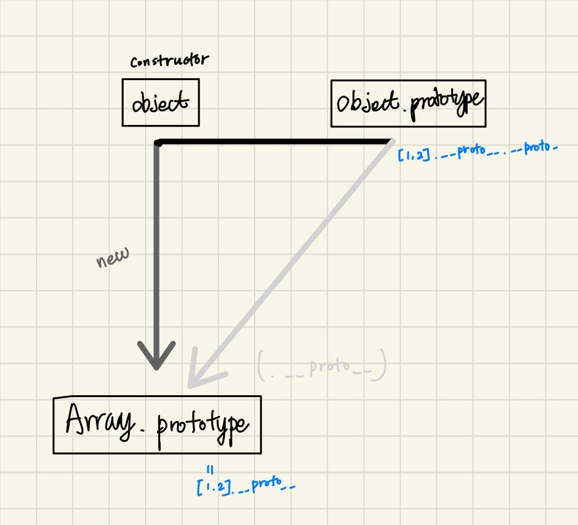
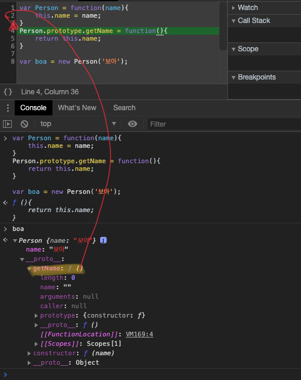
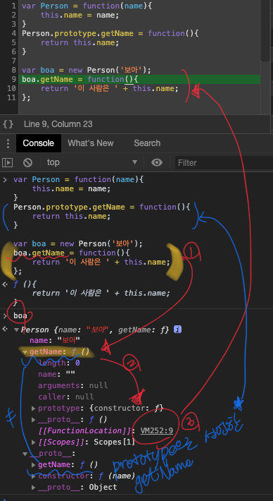
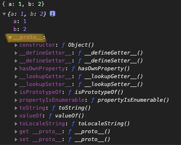
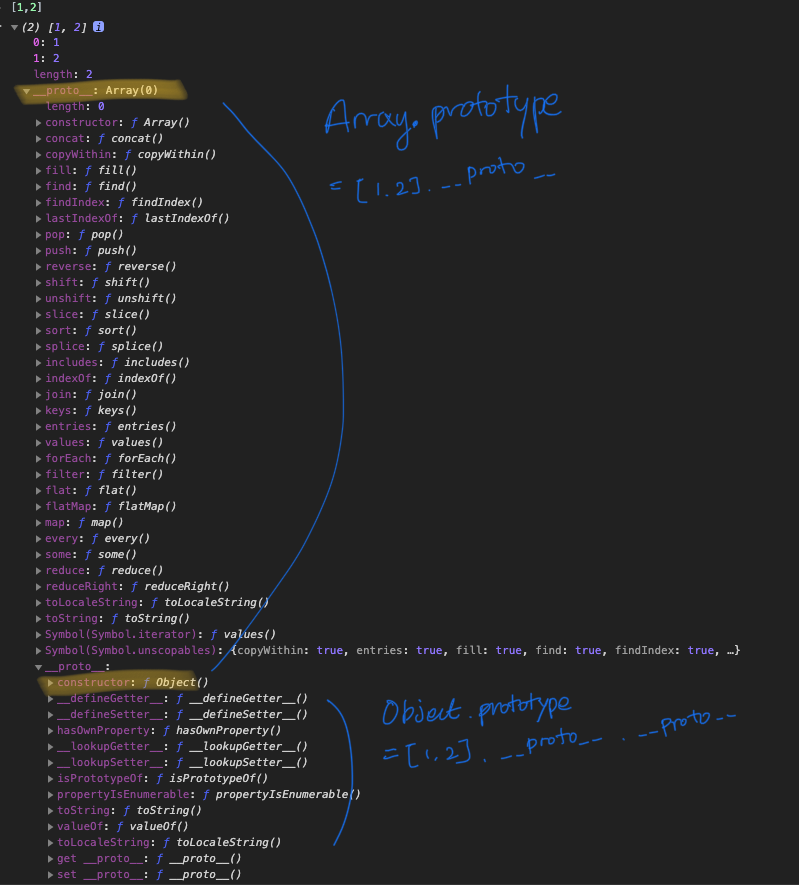
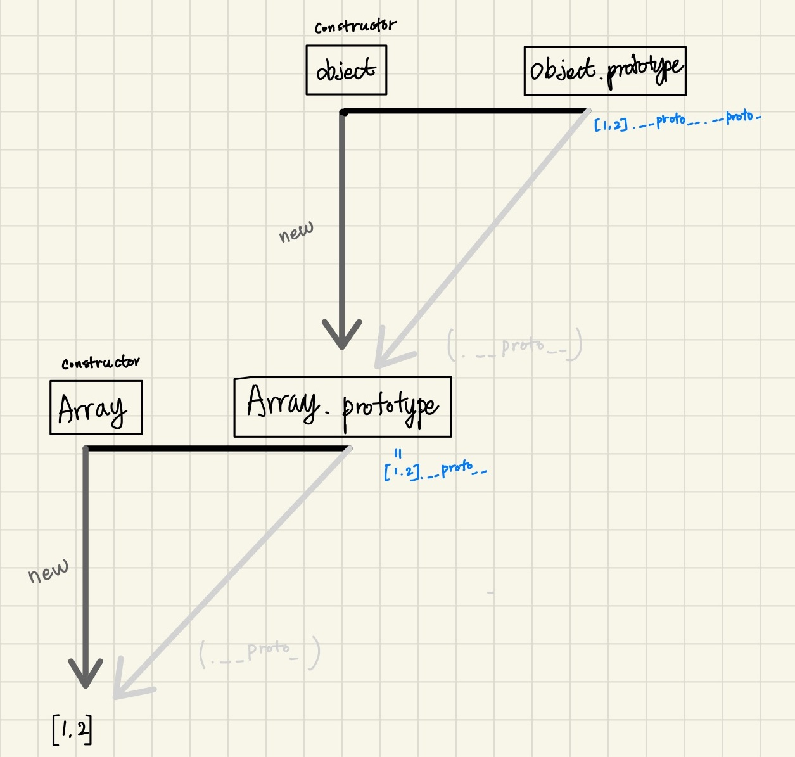
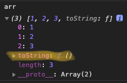
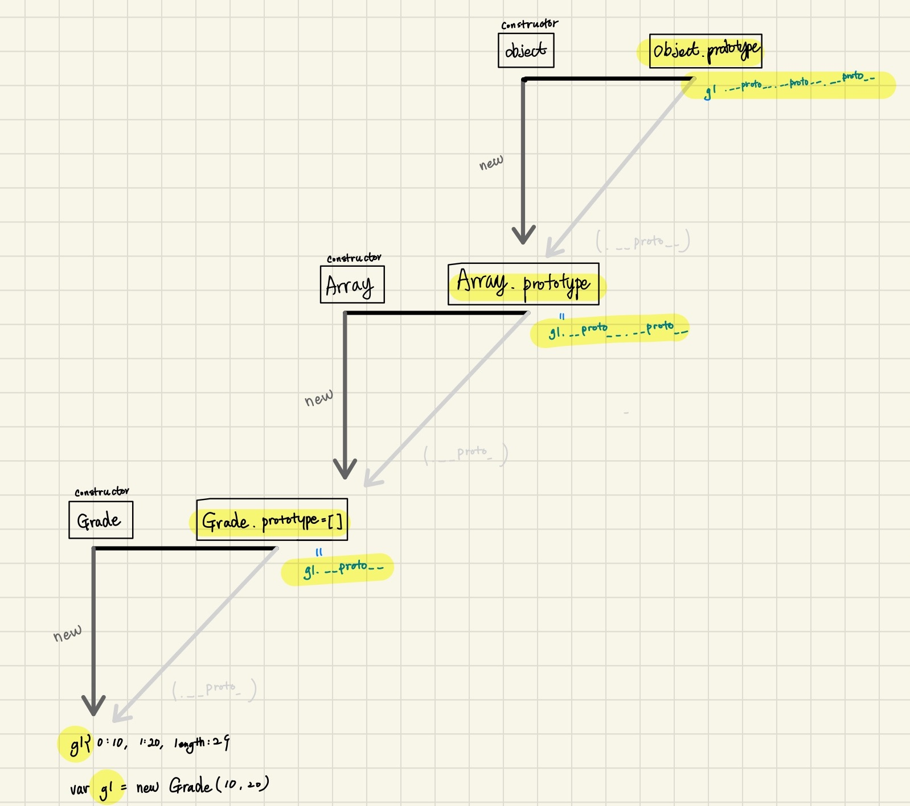

javascript언어는 prototype을 기반으로 oop를 구현하고 있다. 
(클래스 기반의 oop를 구현한 언어도 있다.)
prototype 기반의 언어가 어떻게 oop를 구현 하고 있는지 알아보도록 하자. 


```js
	1 프로토타입의 개념 이해 
		1-1 constructor, prototype, instance
		1-2 constructor 프로퍼티
	2 프로토타입 체인
		2-1 메서드 오버라이드
		2-2 프로토타입 체인
		2-3 객체 전용 메서드의 예외사항
		2-4 다중 프로토타입 체인
```

# 1 프로토타입의 개념 이해 
# 1-1 Constructor, prototype, instance

* Constructor
    - A function that initializes an object
    - similar to normal javaconstuctor
* prototype
    - Constructor의 property
    - instance의 property \_\_proto__과 메모리 공유  
    : constructor.prototype === instance.\_\_proto__
* instance
    - Constructor를 new키워드로 호출로 생성한 객체

* prototype 도식
    
    * 왼쪽 꼭짓점: Constructor(생성자 함수)
    * 오른쪽 꼭짓점: Constructor.prorotype 프로퍼티
    * new를 통해 instance 생성
    * instance.\_\_proto__

* 어떤 생성자 함수(Constructor)를 new 연산자와 함께 호출하면
    * Constructor에서 정의된 내용을 바탕으로 새로운 인스턴스(instance)가 생성됩니다.
    * 이때 instance에는 \_\_proto__라는 프포퍼티가 자동으로 부여
    * 이 프로퍼티는 Constructor의 prototype이라는 프로퍼티를 참조

* prototype 개념의 핵심: prototype 프로퍼티, \_\_proto__라는 프로퍼티
    * **prototype은 객체**
    * **이를 참조하는 \_\_proto__도 객체**
    * prototype 객체 내부에는 인스턴스가 사용할 메서드를 저장
    * 그러면 인스턴스에서도 숨겨진 프로퍼티인 \_\_proto__를 통해서 이 메서들을 접근할 수 있게 된다.

    ```js
    var Person = function(name) {
        this._name = name;
    }

    Person.prototype.getName = function(){
        debugger;
        return this._name;
    }

    //---
    typeof Person                   // function
    typeof new Person('boa');       // object
    new Person('boa');              // Person {_name: 'boa'}
    new Person('boa').__proto__     // {getName: f, constructor: f} -> constructor는 위 Person function 입니다.
    Person.prototype                // {getName: f, constructor: f} -> constructor는 위 Person function 입니다.
    //---
    
    var boa = new Person('boa');
    boa.__proto__.getName();    //undefined
    boa.getName();              //boa
    /*
        boa.__proto__에 _name 프로퍼티가 없어 식별자(this._name)를 찾을 수 없다.
        * boa.__proto__.getName();, boa.getName(); 
            - getName이 호출 돼 scope에 있는 this가 서로 다르다. 그래서 결과 값이 다르다.
            - boa.__proto__ this -> {getName: f, constructor: f}
            - boa this ->  Person {_name: 'boa'} 

    */

    Person.prototype === boa.__proto__;
    /*
        Constructor function의 prototype으로 생성한 instnace 'boa'의 property '__proto__'객체는 Consytructor function의 객체는 메모리를 공유하고 있다.

        이런 특징으로 
        instance.__proto__ property를 변경하면 Constructor.prototype도 변경이 된다.
        즉 instance.__proto__, Constructor.prototype 객체는 메모리를 공유하고 있따. 
    */

    var boa = new Person('boa');
    boa.__proto__._name = 'boa.__proto__';
    boa.__proto__.getName() =               //Boa__proto__
    /*
        * boa.__proto__.getName() 에 의해서 호출된 getName의 this는 boa.__proto__
        * 
    */

    //---
    
    var iu = new Person('iu');
    iu.getName(); // iu
    
    /*
        iu.__proto__.getName 
        = iu(.__proto__).getName
        = iu.getName
    */


    //---

    var Constructor = function(name) {
        this.name = name;
        console.log(this);
    }

    Constructor.prototype.method = function(){};
    Constructor.prototype.prototype1 = 'constructor Prototype property';

    var instance = new Constructor('INSTANCE');
    console.dir(Constructor);
    console.dir(instance);
    /*
        Constructor.prototype === instance.__proto__
    */


    //--
    var arr = [1,2];
    console.dir(arr);
    console.dir(Array);     //Array: 내장 생성자 함수

    arr.forEach(function(){});  //
    Array.isArray(arr);         //true
    arr.isArray()               //TypeError: arr.isArray is not a function


    ```

# 1-2 constructor 프로퍼티

```js
    var arr = [1,2];
    Array.prototype.constructor === Array;
    arr.__proto__.constructor === Array;
    arr.constructor === Array;

    var arr2 = new arr.constructor(3,4);
    console.log(arr2) //[3,4]
```


```js
var Person = function(name){
    this.name = name;
}

var p1 = new Person('인간1');                           //Person {name:"인간1"} true
var p1Proto = Object.getPrototypeOf(p1);

var p2 = new Person.prototype.constructor('인간2');     //Person {name:"인간2"} true
var p3 = new p1Proto.constructor('인간3');              //Person {name:"인간3"} true
var p4 = new p1.__proto__.constructor('인간4');         //Person {name:"인간4"} true
var p5 = new p1.constructor('인간5');                   //Person {name:"인간5"} true

[p1, p2, p3, p4, p5].forEach(function(p){
    console.log(p, p instanceof Person);
})

[constructor]
[instance].__proto__.constructor
[instance].constructor
Object.getPrototypeOf([instance]).constructor
[Contsructor].prototype.constructor

[Constructor]
[instance].__proto__
[instance]
Object.getPrototypeOf([instance])

```

# 2 프로토타입 체인

# 2-1 메서드 오버라이드

* 예제 
    - 아래 메서드 오버라이드 전, 후 캡쳐 참고
        ```js
        var Person = function(name){
            this.name = name;
        }
        Person.prototype.getName = function(){
            return this.name;
        }

        var boa = new Person('보아');
        boa.getName = function(){
            return '이 사람은 ' + this.name;
        };

        console.log(boa);               // Person {name: "보아", getName: ƒ}
        console.log(boa.getName());     // 이 사람은 보아

        console.log(boa.__proto__.getNam());    // undefined
        Person.prototype.name = '권보아';
        console.log(boa.__proto__);             // {name: "권보아", getName: ƒ, constructor: ƒ}
        console.log(boa.__proto__.getName());   // 이사람은 권보아
        console.log(boa.__proto__.getName.call(boa));   // this를 명시적으로 선언
        /*
            메서드가 오버라이드된 경우에는 자신으로부터 가장 가까운 메서드에만 접근
            그다음으로 가까운 __proto__의 메서드도 우회적인 방법을 통해서 접근 가능
        */ 
        ```
* 결과
    - override 하기 전
    
    
                             
    - override 후
    
    

# 2-2 프로토타입 체인
* Object의 내부 구조



* Array의 내부 구조



* Array 내부 도식화

    - [1,2]는 Array.prototype, Object.prototype내부의 메서드를 자신의 것처럼 실행 할 수 있다. 
    - .\_\_proto__는 생략 가능하다
    - 예시

        ```js
        var arr = [1,2];
        arr(.__proto__).push(3);                            //3
        arr(.__proto__)(.__proto__).hasOwnProperty(2);      //true
        ```

* 메서드 오버라이드와 프로토타입 체이닝

```js
var arr = [1,2,3];
Array.prototype.toString.call(arr);     //1,2,3
Object.prototype.toString.call(arr);    //[object Array]
arr.toString();                         //1,2,3

arr.toString = function(){      //결과 아래 캡쳐 참고 
    return this.join('_');
};
arr.toString();                         //1_2_3
```

* arr 객체에 toString function 추가시 arr객체 내부

    


# 2-3 객체 전용 메서드의 예외사항

* Object.prototyp에 추가한 메서드의 접근
    ```js
    Object.prototype.getEntries = function(){
        var res = [];
        for (var prop in this){
            if(this.hasOwnProperty(prop)){
                res.push([prop, this[prop]]);
            }
        }
        return res;
    }

    var data = [
        ['object', {a: 1, b: 2, c:3}],
        ['number', 345],
        ['string', 'abc'], 
        ['boolean', false],
        ['func', function(){}],
        ['array', [1,2,3,4]]
    ];

    data.forEach(function(d){
        console.log(d[1].getEntries());
    })

    ```
    - 어떤 데이터 타입이건 거의 무조건 프로토타입 체이닝을 통해 getEntries 메서드에 접근 


* 스태틱 메서드(객체한정메서드)
    - 객체만을 대상으로 동작하는 객체 전용메서드들은 부득이 Object.prototype이 아닌 Object에 스태틱 메서드(static method)로 부여할 수 밖에 없다.
    - 생성자 함수인 Object, 인스턴스 객체 리터럴 사이에는 this를 통한 연결이 불가능
    - 전용 메서드 처럼 '메서드명 앞의 대상이 곧 this'가 되는 방식대신  
    this의 사용을 포기하고 대상 **인스턴스를 인자로 직접 주입해야 하는 방식**으로 구현  
    : 예시 Object.freeze({prop: 42})
    - Object.prototype.consructor 하위 메서드 & Object.protptype 하위 메서드
     

# 2-4 다중 프로토타입 체인
* 새롭게 만드는 생성자 함수에 \_\_proto__를 연결해서 체인 관계를 만들수 있다.

* Grade 생성자 함수와 인스턴스
    ```js
    var Grade = function(){
        //arguments: 유사배열
        var args = Array.prototype.slice.call(arguments);
        for(var i=0; i<args.length; i++){
            this[i] = args[i];
        }
        this.length = args.length;
    }
    var g = new Grade(100, 80);

    Grade.prototype = [];   //POINT

    var g1 = new Grade(10, 20);
    g1.push(1);
    console.log(g1);    //Grade(3) [10, 20, 1]
    g1.shift()
    console.log(g1);    //Grade(3) [20, 1]

    ```
    - 도식화 
    


# 참고 
* 코어 자바스크립트 - 위키북스
* 인사이드 자바스크립트
* 자바스크립트 완벽 가이드