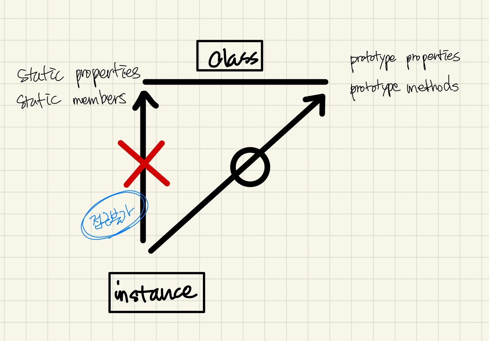

자바스크립트는 프로토타입 기반 언어라 '상속' 개념이 존재 하지 았는데
다른 언어의 class와 비슷하게 동작하게 하는 'class'문법이 ES6에 추가 됐다.


```js
	1 클래스와 인스턴스의 개념 이해
	2 자바스크립트의 클래스
	3 클래스 상속
		3-1 기본 구현
		3-2 클래스가 구체적인 데이터를 지나지 않게 하는 방법
		3-3 constructor 복구 하기 
		3-4 상위 클래스에 접근 수단 제공
	4 ES6의 클래스 및 클래스 상속

```
# 1 클래스와 인스턴스의 개념 이해
* 클래스
    - **공통 속성, 기능 정의한 추상적 개념**
    - 클래스를 바탕으로 인스턴스를 만들 때 비로소 어떤 객체가 클래스의 속성을 지닌다.
    - 어떤 인스턴스가 다양한 클래스에 속할 수는 있지만 이 클래스들은 모두 인스턴스 입장에서는 '직계존속'
    - 다중상속을 지원하는 언어이든 그렇지 않은 언어이든 결국 인스턴스를 생성할 때 호출할 수 있는 클래스는 오직 하나뿐일 수 밖에 없기 때문

* 인스턴스
    - 클래스에 속한 객체 

* static member(static method, static properties)
    - 클래스 자체에서만 동작
* prorotype method
    - 인스턴스에서 활용 가능

# 2 자바스크립트의 클래스
* 생성자 함수 Array를 new연선자와 함께 호출하면 인스턴스 생성
* Array를 일종의 클래스라고 하면, **Array의 prototype 객체 내부 요소들이 인스턴스에 '상속'**된다고 볼 수 있다. 
    - **엄밀하게 상속이 아닌 프로토타입 체이닝에 의한 참조지만 결과적으로 동일하게 동작**
* **한편 Array 내부 프로퍼티들중 prorotype 프로퍼티를 제외한 나머지 인스턴스에 상속되지 않는다.**(=== static method, static properties)

* 인스턴스에 상속되는지(인스턴스가 참조하는지) 여부에 따라 "static member"(상속불가능)와 "instance member"(상속가능)로 나뉜다.
* 이 분류는 다른 언어의 클래스 구성요소에 대한 정의를 차용한것으로 클래스 입장에서 사용대상에 따라 구분한것 
    - 하지만 **자바스크립트는 다른 언어와 달리 인스턴스에서도 직접 메서드를 정의할 수 있다.**
    - 그래서 '인스턴스 메서드'라는 명칭은 프로토타입에 정의한 메서드를 지칭하는 것인지 인스턴스에 정의한 메서드를 지칭하는것인지 혼란이 올 수 있다.
    - 따라서 **프로토타입에 정의한 메서드를 프로토타입 메서드라고 부른다.**

*  예제
    ```js
        function Person(name, age){
            this._name = name;
            this._age = age;
        }

        Person.getInformations = function(inst){    //Static emthod
            return{
                name: inst._name,
                age: inst._age
            };
        }
        Person.prototype.getName = function(){      //(prototype) method
            return this._name;
        }
        Person.prototype.getAge = function(){       //(prototype) method
            return this._age;
        }


        var yoon = new Person("happyjy", 30);
        console.log(yoon.getName());    //happyjy
        console.log(yoon.getAge());     //30

        console.log(yoon.getInformations(yoon));    //에러! yoon.getInformations is not a function
        console.log(Person.getInformations(yoon)); //{name: "happyjy", age: "30"}
    ```

* 도식화 - Array constructor function


* 도식화 - prorotype, \_\_proto__, instance


# 3 클래스 상속
## 3-1 기본 구현
```js
function Person(name, age){
    this.name = name || '홍길동';
    this.age = age || '0';
}

Person.prototype.getName = function(){
    return this.name;
}
Person.prototype.getAge = function(){
    return this.age;
}

function Employee(name, age, position){
    this.name = name || '홍길덩';
    this.age = age || 0;
    this.position = position || '미정';
};

Employee.prototype = new Person();      // 이 코드에 의해서 new Employee에 의해서 생성된 인스턴스.__proto__에 Person 인스턴가 세팅된다.
Employee.prototype.constructor = Employee;  // prototype에서 다뤘던 내용
Employee.prototype.getPosition = function(){
    return this.position;
};

var mac = new Employee('mac', 30, 'CTO');
var mac1 = new Employee('mac1', 30);
/*
    ### POINT
    # mac1에 대한 생각
        * mac1.getPosition()을하면 mac1 instance에 position property가 없다. 
        * prorotype chain으로 Person's의 instance property를 참고해서 값을 반환한다.
        * 반환값 
            : Employee {name: "mac1", age: 30, position: "미정"}
        * 이문제를 해결하기 위해서 아래 Bridge라는 function을 만든다.

*/
```
- 결과(var mac = new Employee('mac', 30, 'CTO')) 


## 3-2 클래스가 구체적인 데이터를 지나지 않게 하는 방법
* 아래 사진(extend Class)에서 1,2 참고 
## 3-3 constructor 복구 하기 
* 아래 사진(extend Class)에서 3번 참고 
## 3-4 상위 클래스에 접근 수단 제공
* 아래 사진(extend Class)에서 4번 참고 

* 상속시 Bridge역할(extendClass)하는 function 필요
    - 위 POINT내용을 확인해보자


* prototype으로 상속 구현하기

    ```js
    //* es5에서 많이 사용해서 아래와 같이 클래스 상속을 구현 
    //* 클로저를 생성해서 'Bridge'를 단한번만 사용할 수 있게 
    var extendClass = (function(){
        function Bridge(){}
        return function(Parent, Child){
            Bridge.prototype = Parent.prorotype;
            Child.prototype = new Bridge();
            Child.prototype.constructor = Child;
            Child.prototype.superClass = Parent;    //POINT2: 
        }
    })();

    function Person(name, age){
        this.name = name || '홍길동';
        this.age = age || '0';
    }

    Person.prototype.getName = function(){
        return this.name;
    }
    Person.prototype.getAge = function(){
        return this.age;
    }

    function Employee(name, age, position){
        this.superClass(name, age);     //POINT2: 하위 클래스에서 이런 호출로 상위 클래스가 설정한 프로퍼티 세팅 가능
        this.position = position || '미정'
    }

    extendClass(Person, Employee);

    Employee.prototype.getPosition = function(){
        return this.position;
    }

    ```


* 결과 


# 4 ES6의 클래스 및 클래스 상속
* class로 상속 구현하기
```js
    class Person {
        constructor (name, age) {
            this.name = name || '아무개';
            this.age = age || '0';
        }

        getName(){
            return this.name;
        }

        getAge(){
            return this.age;
        }
    }

    class Employee extends Person {
        constructor (name, age, position){
            super(name, age);
            this.position = position || '미정';
        }
        getPosition(){
            return this.position;
        }

    }
```


# 참고 
* 코어 자바스크립트