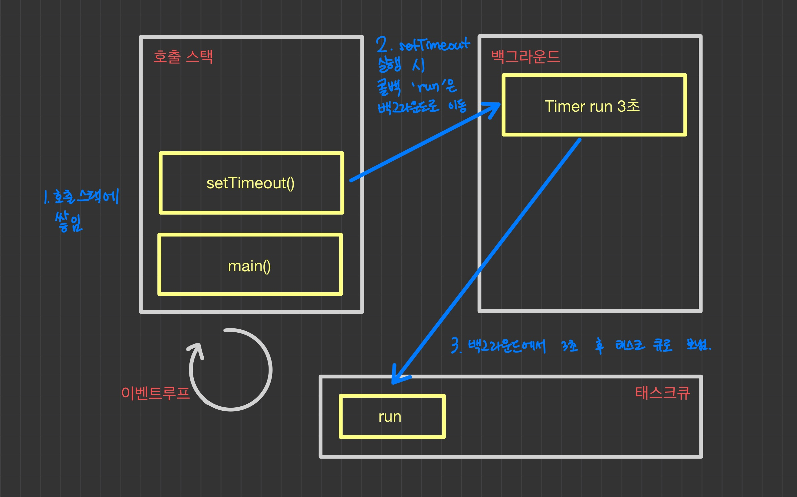
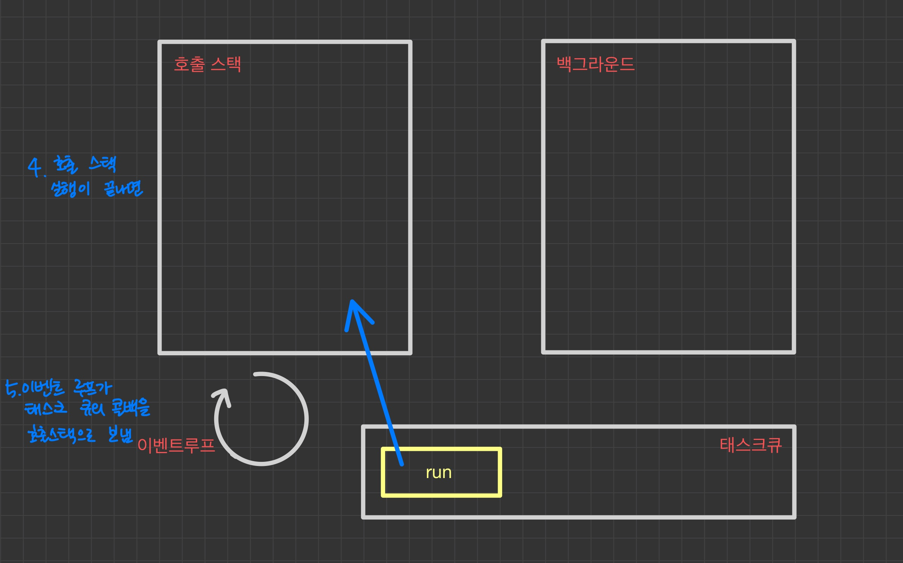
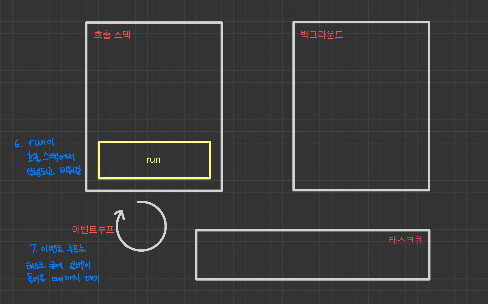

setTimeout을 통해서 비동기 처리를 하는데 호출 스택이 어떻게 되는지 궁금하다 이벤트 루프를 알게 됐고 
맨아래 참고 두번째 유브를 통해서 개념을 알고 첫번째 제로초 사이트에 알기 쉽게 도식화 된 내용을 참고하여 아래 3개를 직접 그리며 개념을 정리했다.


# 이벤트 루프 설명 시 주요 용어
    - 호출스택
    - 백그라운드
    - 테스크큐
    - 이벤트 루프

# 이벤트 루프 설명 예시
```js

console.log('Hi');

setTimeout(function(){
    console.log('CB');
}, 3000)

console.log('bye');

```
* 위 코드 결과는 Hi, bye, CB 순서로 로그가 남게 된다. 아래 설명을 참고
* 만약 setTimeout이 0초로 설정하게 된다면 로그는 어떻게 출력이 될지 아래 설명을 보면서 생각해보자 

## 이벤트 루프 예시 도식화/ 설명

* 상태 
    - console.log('Hi')가 수행되어 콘솔에 찍히고 `호출스택`에서 빠진 상태
* 설명
    1. setTimeout이 수행되어 setTimeout callback function이 `백그라운드`로 이동된 상태
    2. setTimeout callback function이 `백그라운드`로 이동
    3. 3초후에 setTimeout callbakc function이 수행 되도록 설정 되어 있기 때문에 3초 이후 `태스크 큐`로 이동



* 설명
    4. `호출 스택`실행이 끝나면 
    5. `이벤트루프`는 태스크 큐의 callback function을 `호출 스택`으로 올린다.


* 설명  
    6. run(setTimeout callback function)이 `호출 스택`에서 실행 되고 비워지게 된다.  
    7. `이벤트루프`는 `태스크 큐`에 callback function이 들어올 때까지 대기


# 추가 설명
* setTimeout 0초는 4ms 지연 시간을 갖고 있어 hi, bye, CB 순서대로 로그가 남게 된다.
* 백그라운드에서 3초를 설정했음에도 3초 후에 실행되지 않는경우 
    - 호출 스택에서 많은 일을 하게 되면 이벤트루프가 태스크 큐에 쌓이 콜백함수들을 호출스택으로 끌어 올리지 못하기 때문
* 백그라운드 사용하는 작업
    - setTimeout, setInterval
    - ajax 요청
    - event Listener  
        : 참고  http://latentflip.com/loupe/
    - File Reader
    - Javascript 기본제공 메소드 중 콜백 함수를 사용하는 메소드는 백그라운드를 사용하는 경우가 많다.

# 참고 
* 1. 제로초
* 2. JSConf
    - https://www.youtube.com/watch?v=8aGhZQkoFbQ&feature=emb_title