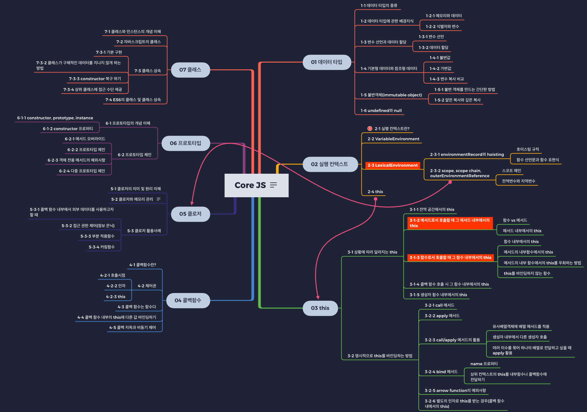

javascript Core를 정리하겠다고 마음먹고 제일 먼저 작성한 목록 입니다.
뭘 정리해 할지 한눈에 보기 편해 정리하는데 확실한 동기부여가 됐습니다.

# index
[실행컨텍스트](https://happyjy.github.io/Excute-context/)  
[this](https://happyjy.github.io/this/)  
[callback function](https://happyjy.github.io/callback/)  
[call(), apply(), bind()](https://happyjy.github.io/call(),%20apply(),%20bind()/)  
[closure](https://happyjy.github.io/closure/)  
[prototype](https://happyjy.github.io/prototype/)  
[class](https://happyjy.github.io/class/)  
[Promise chaning](http://happyjy.github.io/3_Promise%20chaning/)  
[Promise](https://happyjy.github.io/2_Promise/)  
[callback](https://happyjy.github.io/1_callback/)  
[eventLoop](https://happyjy.github.io/eventLoop/)

- 참고  
코어 자바스크립트 - 위키북스