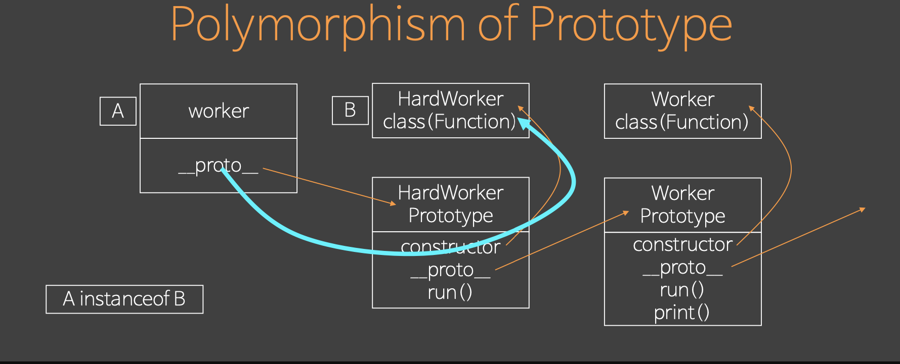
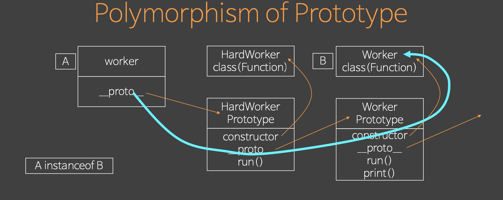
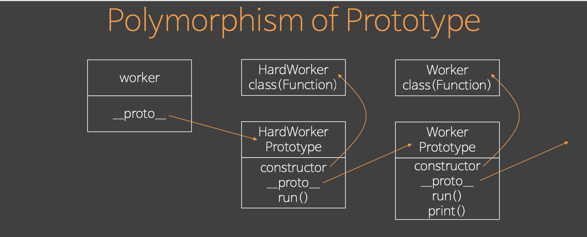
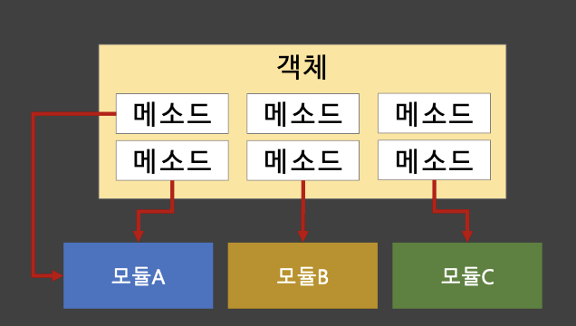
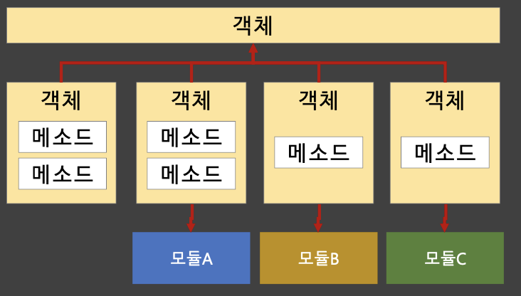
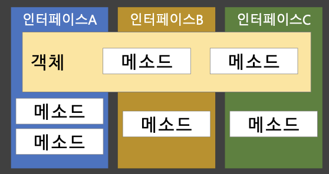

# INTRO
* 목표: 객체 지향을 자바스크립트로 해보자 
* 객체지향 이론
    - 오늘 배운 이론 남은 4개 강의에서 활용

# Value Context, Identifier Context
> value Context: 함수형 프로그래밍에서 사용  
> identifier context: 객체지향 프로그래밍에서 사용

권장 하나의 context만 사용
특별한 사항을 제외하고 

```js
const a = { a:3,b:5 };
const b = { a:3,b:5 };
console.log(a === b);   //identifier context
console.log(JSON.stringify(a) === JSON.stringify(b));   //value context
```

* 객체 지향의 기본: 메소드 인자, return value, 메소드가 만드는 무언가가 모든 객체만 사용한다임.
* 객체지향에서 사용할수 있는 value context는 생성자 인자

## value특징
1. 끝없는복사본 
    - value값은 변하지 않으면서 복사본을 계속해서 사용한다. 
2. 상태 변화에 안전?
    - 1번 특징으로 값이 변하지 않음으로 상태에 변화에 안전하다 
    - 3 + 1 연산에서 3이 4로 바뀌는게 아니라 4가 새로 생기는 것 
    - 불변하는 값을 계속 만들어서 이것도 관리한는게 힘들다 => 그래서 `함수형 프로그래밍`이 탄생
3. 연산을 기반으로 로직을 전개(수학적 프로그래밍)
    - 수학적 프로그래밍은 '확정', '간단'한 로직은 어울린다. 
    - 구현하기 어려운 도메인을 복잡한 연산으로 구현하기 어렵다.
        - 복잡한 것을 도메인을 수학적 프로그래밍으로 정교하게 구현해도 교체 하는 비중이 너무 커서 깨지기 쉽다 
    - 넷플릭스에서 어울림 동영상 스트리밍 하는 것만 연산 하면 된다.

## identifier 특징
1. 하나의원본
    - 값이 mutable
    - 상태가 일관적이지 않음
2. 상태 변화를 내부에서 책임짐 
    - 내부 상태에서 책임지는 객체를 만드는게 힘들다.
3. 메세지를 기반으로 로직을 전개
    - 우리가 배울 테마 
    - 구현사는데까지 만들고 다른 놈에게 위임 할 수 있다. 

## 정리 
* 객체 지향에서 제일 중요한것 값을 사용하지 않는것 


# Polymorphism
> Polymorphism 대체가능성 + Polymorphism 내적일관성   
> 객체 지향 프로그래밍은 Polymorphism을 지원해야 한다.

## polymorphism of Prototype

```js
    const Worker = class{ 
        run(){ console.log("working") }
        print(){ this.run(); } 
    };
    const HardWorker = class extends Worker{ 
        //overriding
        run(){ console.log("hardWorking") }
    };
    const worker = new HardWorker(); 
    
    // substitution
    console.log(worker instanceof Worker); //true -> Polymorphism의 대체가능성
    // internal identity
    worker.print();                        //hardWorking -> Polymorphism의 내적일관성
```

## Polymorphism의 대체가능성(substitution)
> 확장된 클래스는 확장할 대상 클래스를 대체할 수 있다.
* worker instanceof Worker 결과 값은 true이다. 아래 도식화 참고 
## Polymorphism의 내적일관성(internal identity)
> 태어났을때 원본 클래스를 유지하는 속성 
* worker.print() 동작시 this.run()이 호출한 곳에서 가까운 Worker class의 run funtion이 호출되는게 아니라 print를 호출한 대상 worker instance에서 가까운 run 함수를 호출하도록 하자 정한 것을 '내적일관성'이라고 한다.  

## Polymorphism의 장점 
*  확장된 객체는 원본으로 대체 가능
*  생성 시점의 타입이 내부에 일관성 있게 참조됨.

## PolymorPhism of Prototype
* javascript prototype, prototype chain을 통해서 `대체가능성`,`내적일관성`을 구현했다.
* [프로토타입체인 참고](https://happyjy.github.io/prototype/#2-2-프로토타입-체인)


## 대체가능성 설명 도식화 


    - worker instanceof Worker 설명
        - 첫번째 사진에서 HardWorker class instance인자 확인 아니기 때문에 두분째 사진처럼 Worker class instance인지 확인

## 내적일관성 설명 도식화 

    - 위코드에서 worker.print()가 'hardWorking'이 호출되는 것을 설명 할 수 있다.

## 대체가능성, 내적일관성 설명 도식화 코드로 확인
```js

worker.__proto__ === HardWorker.prototype;           //true
worker.__proto__.__proto__ === Worker.prototype;     //true

worker.__proto__.constructor === HardWorker;         //true
worker.__proto__.__proto__.constructor === Worker;   //true

HardWorker === HardWorker.prototype.constructor;     //true
Worker === Worker.prototype.constructor;             //true

``` 


# Object Essentials
* 객체의 본질이란 ? 
    > Maintenance of State(state 관리=> 데이터은닉)
    > Encapsulation of Functionality(기능의 캡슐화)


```js
const EssentialObject = class {
    // 데이터은닉(hide state): 내부의 상태를 감춤
    #name = ''
    #screen = null

    constructor(name) { this.#name = name }
    camouflage(name) { this.#screen = (Math.random() * 10).toString(16).replace('.', '') }

    // 캡슐화(encapsulation): 안에서 무슨 일이 일어나는지 노출하면 안됨
    get name(){ return this.#screen || this.#name }
}
```

## 데이터 은닉(hide State)
> 내부 상태(데이터)를 감춰야 한다.
* 객체지향에서 데이터 은닉은 필수(= 상태를 외부에 보여주지 않는다. = private) 
* 객체 지향은 메모리 참조로 움직여야 하는데 속성이 공개되는 순간 속성을 값으로 취득해서 쓰기때문에 value context가 프레임 전체에 관여 -> 객체지향은 무너진다. 


## 캡슐화(encapsulation)
> 메소드를 추상화 시켜야 한다.
* 메소드 안에서 무슨일이 일어나는지 노출하면 안된다(=밖에서는 추상화로 인식해야 한다.)
    - 예시 ATM에서 돈뽑는 것: 돈달라는 인터페이스만 노출, but 실제로 카드인증, 신용인증, 보안인증 트렌젝션 준비, 확인, 데이터 연산등이 있다. 
* 안좋은예
    - setAge() 함수가 있다고 하자. 이 함수는 캡슐화가 된게 아니다. 왜냐하면 age 필드를 날로 노출했으니까. 그렇다면 본질적으로 왜 setAge하는지 알아야 한다. **더 생각해서 setAdult setChild 메소드로 만들고 그안에 나이 조건이 있고 이 나이에 따라서 컨텐츠를 구분해야 한다. 이런식으로 더 깊이 생각해야한다.** 이렇게 직접노출하지 않고 기능의 캡슐화가 가능하다 
* 데이터 은닉: 데이터 대상/ 캡슐화: 기능 대상 
 


## Isolation of change
> 격리: 해당 변화가 일어났을때 그곳에만 변화가 일어나고 다른곳에 여파가 오지 않게 하는 것 

* 소프트웨어는 '당연하게' 요구사항이 계속 변함으로 같이 계속 변한다.
* 우리는 변화를 막을 수 없기 때문에 Isolation 하는 것이 목표다.
* 객체지향에서 '변질'을 막고 다른곳으로 퍼지지 못하게 하는것이 이것 밖에 없다.(그래서 본질로 생각한다.)


# 알려진 기본 설계 요령
## SOLID 원칙 
* SRP Single Responsibility(단일책임)
* OCP Open Closed(개방폐쇄)
* LSP Liskov Substitusion(업캐스팅 안전)
* ISP Interface Segregation(인터페이스분리
* DIP Dependency Inversion(다운캐스팅금지)

### SRP Single Responsibility(단일책임)
> 수정하는 원인이 하나가 되도록 만드는 것
* 이를 지키지 못했을때 산탄총 수술(shotgun surgery)가 필요하다 
* [수정필요](아래 srp를 준수하는 객체망이 문제를 해결 chapter link)

### OCP Open Closed(개방폐쇄)
* open: extends, implements를 할 수 있게 만드는 것 
* closed
    - 수정이 필요하면 기존 class를 만드는게 아니라 다른 extends, implemtns class를  만들어서 문제를 해결하는 것(=새로운 객체를 만들어서 해결)
    - 문제의 공통점을 인식해서 추상화에 성공해서 그 다음에도 추상화를 이어 받아서 새로운걸 해결 할 수 있는 것이다. 

### LSP Liskov Substitusion(업캐스팅 안전)
> 추상층의 정의가 너무 구체적이면 구상층 구현에서 모순이 발생
* 아래 예제1 '추상층'에서 다리로 이동한다. 라는 정의때문에 구상층 '아메바, 독수리, 고래'에서 위배된다. 그래서 예제2를 다시 확인해보자 

[예제1]
```
* 추상층 - 생물
    - 숨을 쉰다. 
    - 다리로 이동한다.
* 구상층(구현)
    - 사람, 타조: OK
    - **아메바, 독수리, 고래: NO**
```

* 아래 예제2를 보면 추상층을 두개로 나눴다. 
    - 생물 class, 다리이동 interface
[예제2]
```
* 추상층 - 생물(숨을 쉰다), 다리이동(다리로 이동한다)
    
* 구상층(구현)
    - 사람, 타조: "생물", "다리이동" -> OK
    - 아메바, 독수리, 고래: "생물" -> OK
```

### ISP Interface Segregation(인터페이스분리)
> 위 원칙 LSP가 성림하지 않았기 때문에 ISP(예제1 -> 예제2)작업이 있었다.

* ISP 필요대상


* 위침으로 해결하는 방법

    - 위임(소유): 인터페이스로 분리하지 않고 처리하는 첫번째 옵션
    - 모듈A, B, C 바라볼 객체를 만들어서 객체별로 A,B,C를 상대하도록 만들어 준다


* 인터페이스 사용 

    - 객체를 만들때 처음부터 인터페이스A,B,C 세개를 가져와서 인터페이스에 맡게 메소드를 오버라이드한다. 
    - 그래서 외부에서 볼때는 객체를 보는게 아니라, 객체가 구현한 인터페이스를 보게 된다. 

### DIP Dependency Inversion(다운캐스팅금지)
> 의존성 역전의 법칙이라고도함  
> 의존성은 언제나 부모쪽으로 흘러야 한다. 

* 다운캐스팅을 안하면 나머니 솔리드 원칙이 다 지켜지는것이기 때문에 어려운 항목이다. 
* 고차원의 모듈은 저차원의 모듈에 의존하면 안된다. **이 두 모듈 모두 추상화된것에 의존해야 한다.**
    - 고차원: extends를 더 많이 한 것(자식 쪽)
* 추상화 된 것은 구체적인 것에 의존하면 안된다. **구체적인 것이 추상화된 것에 의존해야한다.**

## 기타 
### DI(Dependency Injection, 의존성주입) 
* IoC(Inversion of control, 제어역전)의 일부, 구현체 중에 하나 

### DRY(Don't Repeat YourSelf)(중복방지)

### Hollyworld Principle(의존성 부패방지)
* 요구하지 말고 요청 또는 기다려 내가 요청할께 
* 액션이 처리할 사람이 거꾸로 연락하게 하는 패턴  
* 은닉화, 캡슐화가 지켜지지 않은 경우

### Law of demeter(최소지식)
* classA.methodA의 최대지식한계 
    - classA의 필드 객체
    - methodA가 생성한 객체
    - methodA의 인자로 넘어온 객체
* 이 법칙이 지켜지지 않으면 **열차전복(train wreck)**가 일어난다. 


# Message
> 다른객체에게의뢰하는것=다른객체에게메세지를보내는것  
> 객체지향은 Message를 통해서 문제를 해결한다. 

[수정필요]아래 SRP 링크 잡기
## SRP(SOLID중 1개: Single Responsibility(단일책임))를 준수하는 객체망이 문제를 해결
* 책임이 상세하게 분리 -> 각자의 격할만하고 다른놈에게 넘겨서 문제를 해결 마치 data structure에 linked-list처럼(이것이 객체지향이 문제를 해결하는 방법이다.)
    - 이렇게 문제를 해결하지 않고 쭉 코드를 짜면 수정하는 원인이 한가지가 아니라 여러가지 이다.  
* 설계라는것은? 
    - 어디까지 나눠야할지 말아야할지 결정하는 것이다. 
    - 변화가 많이 일어나면 더 상세하게 나눠야 한다. 
* **단일 책임 원칙을 준수하는 객체에게 책임 이상의 업무를 부여하면?**
    1. **만능 객체가 되려한다.** 
    2. **다른 객체에게 의뢰한다.**
* Message를 보낸다의 의미 
    - **다른객체에게의뢰하는것=다른객체에게메세지를보내는것**


1. `메세지`-의뢰할내용
2. `오퍼레이션` - 메세지를 수신할 객체가 제공하는 서비스 
    * 오퍼레이터
        - 메세지를 수신 하는 역할을 한다. 
        - 실제로 잘동하지 않는다. 
        - 대외적으로 공개된 채널로 내부적으로 매핑(`런타임`구성)에 따라서 하나의 메소드를 실행시칸다. 
        - 위 worker.run()을 예를 들어서 생각해보자. 
            - run()이라는 `오퍼레이터`는 Wokrer, HardWorker 둘중 어느것을 수행할지는 worker.run()을 수행할때 `런타임`이 정해져 어떤 run을 수행할지 정해진다. 이를 `동적바인딩`이라고 한다. 이렇게 javascript는 `prototype`에 의해서 동적 바인딩을 지원한다. 
3. `메소드` - 오퍼레이션이 연결될 실제 처리기

* 추상클래스, 인터페이스를 상속하게 하는 이유는? 
    - **오퍼레이션, 메소드를 분리해서 런타임에 원하는 애를 바뀌기 위해서**
    - 결국 **SRP통해서 OCP(SOLID중 1개: Open Closed(개방폐쇄))를 만들어 낸다**


# Dependency 
> 의존성은 가장 중요한 격리의 문제

* 우리가 진짜 원하는 얘기
* 격리가 되지 않는 이유?
    - **문제가 되고 있는 객체를 의존해서**
* 설계의 어려운 이유 
    - SRP(위 대chapter Message-srp)설명할때는 책임을 상세하게 나누라고 했는데 여기서는 난눈 개체가 문제가 생기면 격리가 안되서 문제라고 한다. 
    - 그래서 이 둘(SRP, Dependency)을 고민해서 설계해야 한다.  
    : 적당하게 의존성을 가지고 있어야한다.  
* 의존성 다소의 차이
    * 의존성이 많을때는 객체가 각자의 역할이 정해져있다. 
    * 의존성이 적을때는 한개의 객체가 많은 역할을 수행한다.

## 의존성의 종류 
> 두가지가 있다. 
> 1. 객체의 생명주기 전체에 걸친의존성 
> 2. 각 오퍼레이션 실행 시 임시적인 의존성 - 의존(dependency)
1. **객체의 생명주기 전체**에 걸친의존성 
    * 상속(extends)
        - **강력한 의존성으로 부모객체와 합체 된 개념으로 부모의 변화가 있으면 자식의 변화를 감수해야한다.** 
        - 그래서 상속이 안좋다고 하는 이유입니다. 
    * 연관(association)
        - 필드의 그 객체 타입을 알고 있다. 
        - **예를 들어 A클래스에 B라는 멤버를 생성해서(소유), 생성한 B멤버 클래스는 클래스A인스턴스가 만들고 없어질때까지 B멤버 클래스와 연관이 있는것이다.** 

2. 각 **오퍼레이션 실행 시** 임시적인 의존성 
    * 의존(dependency)
        * 오퍼레이션 실행시에만 수행된다. 
        * 메소드 단위로만 의존성이 생겼다 없어지고 메소드를 한번도 호출하지 않으면 의존성이 없기도하다.

### 의존성 문제를 해결하기 위해서 우리가 '지향'해야할 방법
> 상속 -> 연관 -> 의존 단계로 우리는 지향해야 한다. 
* 상속 -> 연관
    - 상속을 소유로 바꾼는 것 
* 연관 -> 의존
    - 연관도 빡시면 **의존 단계에서 연산에서 처리**하지 꼭 필드에서 참조할 객체를 잡아야 하냐에서 시작
    - 필드가 없다는건 상태가 없다는 것 -> 객체가 없다는건 함수를 쓰라는 것(이것이 `함수형프로그래밍`)
    
* 객체지향에서는 연관 -> 의존함부로 바꾸기 어렵다 왜? 
    - **객체지향에서는 '상태'를 유지하고 있기 때문** 
        - 수정 여파 규모증가
        - 수정하기 어려운 구조 생성 3. 순환 의존성
    - **그런데도 객체지향 클래스들도 함수들을 쓰려고 하는 이유가 의존성을 낮추기 위해서다** 

### 의존성이 높으면? 
1. 수정 여파 규모증가
2. 수정하기 어려운 구조 생성
3. 순환의존성 
    - A, B 둘 사이 의존성 없다. 
    - A -> C -> D 이렇게 알고 있다.
    - 그런데 여기서 D -> B를 알게 되면 A가 B를 알게 되는 경우가 생긴다.  
    : A -> C -> D -> B
    - 그래서 B를 고쳤는데 A가 문제가 생기는 이유가 된다. 

# 객체지향을 배우는 이유
> `격리구간`을 세우고 `의존성`을 관리하기 위해서  
>   - 의존성은 `변화에 대한 격리를 위해서`관리한다

* 위 쳅터 "Message-SRP", "Dependency"에서 설명

# Dependency Inversion
[수정필요] 링크 추가하기
* DIP Dependency Inversion(다운캐스팅금지)
* Polymorphism
> 어떠한 경우에도 다운캐스팅은 금지
> 폴리모피즘(추상인터페이스) 사용

```js
const Worker = class{ 
    run(){ console.log("working") }
    print(){ this.run(); } 
};
const HardWorker = class extends Worker{ 
    run(){ console.log("hardWorking") }
};

const Manager = class { 
    #workers; 
    constructor(...workers) {
        if(workers.every(w=>w instanceof Worker)) this.#workers = workers;
        else throw "invalid workers"; 
    }
    doWork(){ this.#workers.forEach(w=>w.run()) }; 
};

const manager = new Manager(new Worker(), new HardWorker()); 
manager.doWork();
```
* 아래 나오는 다음 3가지 설명으로 OCP, DIP를 통해서 객체지향을 느끼는 초석을 다지는데 좋은 설명이였다. 
    - "OCP를 위 예제 코드를 통할 설명", "DIP(의존성 역전의 법칙)", "Manager class 코드 설명" 
    
* OCP를 위 예제 코드를 통할 설명 
    * **worker 사상 검증시 Worker class기준으로 했다.** 이 의미는 HardWorker는 추상클래스로 본것이다.(폴리모피즘을 이용해서 대체가능성을 이용해서 추상클래스로 본것이다.) 하위 클래스를 인식하지 않음으로써 더 많은 하위 클래스 xxxWorker만들어도 Worker패밀리리면 다 받아준다는 의미이다. 그래서 Worker클래스를 확장해서 xxxWorker 클래스들을 많들어도 된다. 
        - 그래서 Manager class constructor에서 workers 사상검증시(instanceof 키워드를 통해서)Worker를 기준으로하고 있다.
        - Worker 클래스를 확장한 xxxWorker 클래스들을 Manager class constructor에서 검증할때 constructor를 변경할 필요가 있을까? -> NO
        - worker로 부터 더 많은 extention을 만들 수 있따 -> ***"Open extend"(확장이 열려있다)***
        - 그럼에도 불구하고 Manager class constructor를 수정할 필요가 없다 -> ***변화에 "Closed"***
    * OCP를 달성하면 자연스럽게 **의존성 역전**이 달성된다. 

* DIP(의존성 역전의 법칙)
    - Manager class constructor에서 의존성을 무엇으로 가지고 있는가? 
        - ***구상클래스(Hardworker) 가지고 있지 않고 추상클래스(Worker)로 가지고 있다.*** 
    - 그래서 Manager class에 doWork 함수에서는 run이 사용될 수 있는것인가? 
        - 추상클래스(Worker)에 run 함수가 있기 때문이다.
        - 왜냐하면 Manager class contsructor에서 Worker 클래스로 사상검증 했기 때문이다. 

* 위 코드를 보며 OCP, DIP를 설명했는데 Manager class 코드를 기준으로 다시 정리해보자
    - constructor에서 `OCP`를 표현하고 싶고 Worker class level에서 instance를 인식할 것이니까 Manager class에서는 Worker level의 메서드를 쓸것이다.(`DIP`) 라고 해석 할수 있다. (HardWorker의 함수를 사용하지 않는다.)

* OCP가 안되면 DIP가 될 수 없다.(OCP, DIP는 깊은 연관을 가지고 있다.)


# Inversion of Control
> 객체지향에서 가장 마지막으로 도달해야 할 지점   
> DIP 조차도 IOC의 재료   
> IOC에 도달하면 객체지향에 도달했다고 생각해도된다.   

* Inversion의 보다 쉬운 설명
    - 제어를 안한다는 의미가 아니라 
    - **내가 직접하지 않고 위임 하겠다 라는 의미**
    - <u>예를 들어 내가 운전을 못하지만 운전잘하는 사람의 차를 타면 밖에서 볼때 운전 잘하는 사람? 으로 보일 것이다. 오 이게 Inversion of Driving...이라고 말할 수 있겠네...😅</u>

* 제어역전의 개념과 필요성
    1. Control = flow control(흐름제어) 
    2. 광의에서흐름제어 = 프로그램실행통제 
    3. 동기흐름제어, 비동기 흐름제어 등

* 문제점
    > 동적알고리즘(Dynamic Programing)에서 iterator를 돌면서 조건이 바뀌기 때문에 흐릅제어가 어렵다. 
    1. 흐름 제어는 상태와 결합하여 진행됨
    2. 상태 통제와 흐름제어 = 알고리즘
    3. 변화에 취약하고 구현하기도 어려움
        - 제어문이 많아질수록 유지 보수가 어렵다.  

* 대안
    1. 제어를 추상화하고
        - 일반화라는 관점이 필요
        - 제어들을 모으려면 공통된 부분, 다른 부분을 filter하는 게 필요하다. (`연역적추리`)
        - 연역적 추리가 되면 원리를 뽑아내서 `귀납적 상황`을 만들어서 연역적 내용들을 모두 처리 할 수 있게 된다. 
        - 귀납적추리, 연역적추리
            - 귀납적추리(Indcution): 원리를 가지고 현상을 예측하는 것
            - 연역적추리(Deduction): 현상으로 원리를 깨닫는 것 
    2. 개별 제어의 차이점만 외부에서 주입받는다.


# 예제 소스 
```js
// POINT1
// Renderer: base element에 view가 주는 element를 집어 넣어서 그림을 그리는 녀석 
const Renderer = class {
    #view = null;
    #base = null;
    
    constructor (baseElement) {
        this.#base = baseElement;
    }
    set view (v) {
        if(v instanceof View) this.#view = v;
        else throw `invalid view: ${v}`;
    }
    render (data) {
        const base = this.#base;
        const view = this.#view;

        if(!base || !view) throw 'no base or no view';
        let target = base.firstElementChild;
        //POINT2
        //base안 element를 제거한다. 
        do base.removeChild(target);
        while (target = target.nextElementSibling);
        //POINT3
        //view.getElement은 render function에 의해서 받은 data에 합당한 el을 반환 
        //아래 renderer.view에 상속받아 구현함.
        base.appendChild(view.getElement(data));
        view.initAni();     //애니메이션 초기화 
        view.startAni();    //애니메이션 시작해
    }
}

const View = class {
    getElement (data) { throw `override!` };
    initAni () { throw 'override!' };
    startAni () { throw 'override!' };
}

//특정뷰를 받아서 그리는 역할 
const renderer = new Renderer(document.body)
//POINT4
//* new class extends View
//  :익명클래스처럼 view를 상속받는 class를 하나 만들고 인스턴스를 만드는 코드 
renderer.view = new class extends View {
    #el
    //POINT5
    //data에 의해서 받은 데이터로 dom을 생성해 본인(View를 상속받은 class)필드 '#el'에 집어 넣고 반환 
    getElement (data) {
        this.#el = document.createElement('div');
        this.#el.innerHTML = `<h2>${data.title}</h2><p>${data.description}</p>`;
        this.#el.style.cssText = `width:100%;background:${data.background}`
        return this.#el;
    }
    initAni () {
        const style = this.#el.style;
        style.marginLeft = '100%';  //화면 밖 오른족으로 쭉 밀어버린다.
        style.transition = 'all 0.3s';  //0.3이후에 오라고 transition 검 
    }
    startAni () {
        //한프레임 건너뛰고 람다에서 style에 margin 0을 넣는건 마진 100%에서 왼쪽으로 쫚들어온다.
        requestAnimationFrame(() => this.#el.style.marginLeft = 0);
    }

    
}

renderer.render(
    { title:"title test", 
    description:"contents.......", 
    background:"#ffffaa"});
```

## 핵심1: Renderer, View Class 설명
* 이 레시피가 개별 뷰마다 만들어지지 않고 render에만 집중되어 있다. 
* 이 레시피가 바로 제어문!
    * 어떤 제어냐? 
        - 내용을 지우고 새로운 객체를 만들어서 내 자신을 만들어서 애니메이션을 처리 할꺼야 라는 레시피가 render안에 있다. 
        (== 제어문이 이 안에 있다라는 의미)
* 그럼 이제 모든 뷰를 만들어 낼때 제어는 Renderer class의 render가 하고 제어에 해당하는 각각 부속물을 공급하는 역할을 view객체를 공급해주면 된다. 
* 그러면 앞으로 모든 뷰를 등장시킬때 render작업을 두번다시 할까? 
    - 안한다!    
* render에 data에 맞는 view를 그린다라는 제어부분이 render에 집중되어 있고 개별뷰(set view)에는 없어진다. 개별뷰(set view)에 있는 제어문은 render쪽에 모여 있다. 
* view가 가져야 할 제어를 render쪽으로 역전시켜서 한군데에만 있는 제어를 사용하고 이 제어에 부속(Veiw)으로써가 개별 공급해야할 내용들만 공급해준다는 의미
* **제어의 역전**이 일어나고 있다. 
: 내가 view를 여러번 만들다 보니 계속 반복되는 내용을 render에다가 몰아 넣고 view는 필요한 부품만 render에 몰아 넣으면 될것 같다.라고 판단해 만든것이 Render class에 set view, render와 같다.
* **제어의 역전이 일어나니 "의존성 역전"(추상클래스를 받으니까)이 일어나고 "OCP"도 자동** 


## 핵심2: renderer.view객체 (View를 상속받은 instance 객체)
* 뷰에대한 애니메이션 초기화와 애니메이션 동작은 각각 view에 대한 클래스에서 책임지고 있다. 
    - 전체적인 흐름은 Renderer class의 render가 한다. 
* 제어 역전에 들어가는 부속들은 일부 부속들(renderer.view가 가지고 있는 instance의 getElement, initAni, startAni)거기에 대한 일부 재료들만 제공만하고 실제 제어 부분은 빠지게 된다. 제어를다 중앙(Render class에 render)
* 그래서 우리가 애니메이션 절차에 대해서 수정하고 싶으면 Render class의 render만 수정하면 된다. 

## 핵심3: 제어역전 코드(Renderer class의 render) & 제어역전에 대한 설명
* Render class의 render쪽에 제어가 몰려 있고 공급되는 View들은 일부만 공급하게 된다 
* 제어부분이 마음에 아니들면 renderer에서만 계속 고치면된다. 다른 애들은 '제어'에 대한 책임이 해제된다. 그래서 제어에 대한 부속(getElement, initAni, startAni)에만 관심을 갖게 되고 실제 제어는 renderer class의 render가 가져간다. 
* 스프링 프레임워크도 "제어의역전"을 사용하고 있다. 큰 프레임워크를 사용할때 사용하는 객체들은 controller들을 모은다. 그리고 web application이 움직이는건 '제어의역전'프레임워크가 해주는것이다. 
    - 제어의 역전의 의미
    : 누군가 router태워서 필요한 컨트롤에 로딩해서 컨트롤에서 모델받아서 매칭되어 있는 뷰를 뿌려주는 이 과정 

* 프레임워크, 라이브러리 차이 
    - 프레임워크: 제어 역전이 있다.(IOC가 되어야 프레임워크가되는것이다)
    - 라이브러리: 제어에 대한 책임 없음

* IOC가 되어야 프레임워크는 받는 뷰를 요구한다.
    - 나의 lifeCycle, 나의 미리 상속되어 있는 메소드들 일부만 구현에서 나에게 주기만하면 이를 제어해줄게이게 IOC 프레임워크이다. 
* 안드로이드 앱을 만들때 activity를 만들어야 하고 이 activity가 할수 있는 건 os에서 지정해놓은 메소드들만 구현한것이고 언제태어나고, 언제 만들어지고, 언제 앱이 뜨는지는 OS가 한다  


# 제어역전 실제 구현

* `전략패턴 & 템플릿 메소드 패턴` < `컴포지트 패턴` < `비지터 패턴` 
    - 오늘쪽으로 갈수록 넓은 범위의 제어 역전을 실현함
    - 가장 소극전인 제어역전을 구현하고 있는 패턴은?   
    : `전략패턴 & 템플릿 메소드 패턴` 
        - 전략패턴: 소유를 통한 제어의 역전 
        - 템플릿메소드패턴: 상속을 통한 제어의 역전
    - 위 예제 Renderer class는 `비지터 패턴`이다.

## 추상팩토리 메소드 패턴
* `비지터패턴`(위 예제 Renderer class)은 이미 만들어진 객체의 행위를 제어역전에 참여시킬 수 있지만 참여 할 객체 자체(View class)를 생성할 수 없음. 참여할 객체를 상황에 맞게 생성하고 행위까지 위임하기 위해 `추상팩토리 메소드 패턴`을 사용함.
* 예를 들어 
내가 피벗 테이블을 만들때 중간에 그래프, 플러그인이 끼워져 있으면 이것을 중간에 만들면서 셀을 만들고 싶다. 이미 주어져 있는 객체를 메소드 호출해서 만드는게 아니라 중간에 만들면서 끼워 넣고 싶다. 이렇게 만드려면 만들어주는 팩토리가 필요 
* 그래서 `추상팩토리 메소드 패턴`은 `비지터 패턴`과 결함한다. 
    - 만드는것만 제공하는게 아니라 만들어진 메소드도 호출 가능하다 
    - 그래서 `제어역전`을 구현하게 되면 `추상팩토리 메소드 패턴`을 사용 가능하게 되는 것이다. 


# 마무리 
* 이번에 등장한 모든 디자인패턴들은 모두 `제어역전패턴`과 관련된 패턴이다.
* 객체지향에서 `제어역전`을 궁극적으로 목표로 삼는 이유는 많은 버그를 제어문이 가지고 있어 제어를 한군데에서 하기 위함이다. 
* 앞으로 이어지는 4개의 강의는 샘플앱을 만들고 점진적으로 발전시켜가면서 제어역전, SOLID 역전이 지켜지는지 refactoring하면서 기능을 붙여나갈 예정 