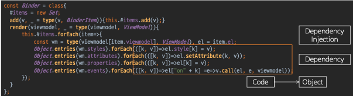
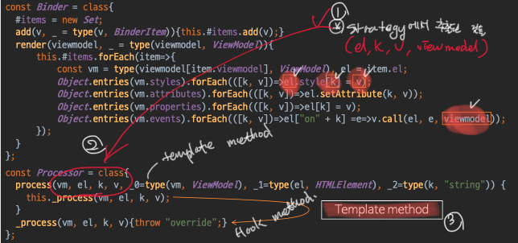
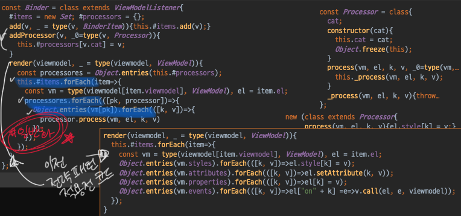
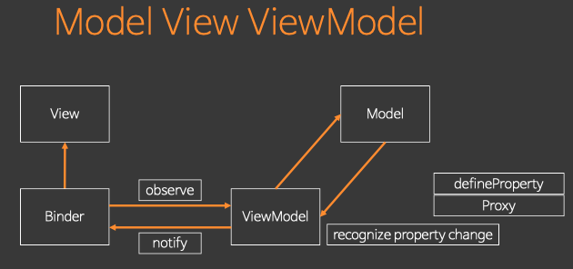

**과제 - 강의 들으면 [보완]이라고 한 것들 찾아서 스터디해서 채워 넣기**

# 목표 
* 전략적 패턴 적용
    - 기존 Binder 클래스가 코드로 확정 되어 있다. 이 부분을 전략적으로 빼내는 방법을 살펴본다. 
    
* call -> Observation
    - Binder, ViewModel 통신을 이전 강의 까지 call로 해결해쓴는데 이번에 Observation으로 해결을 설명합니다.  
    그래서 결과적으로 모델이 변하면 binder가 자동으로 view를변하게 해준는게 목표이다.   
        * [전 강의 observe -> call로 대체](https://happyjy.github.io/객체지향%20자바스크립트_2/#observe---call로-대체)  


* 배울 keyword 
    - Strategy Pattern, Dependency Injection, 
    - Observer Pattern
    - Template method Pattern
    - Composite Pattern


# 1. Strategy Pattern(Binder Class에 적용)
* 참고: [제로초 전략패턴](https://www.zerocho.com/category/JavaScript/post/580f17ef77023c0015ee9688)

## 적용 준비
우리는 5가지 단계를 통해서 `전략패턴`과, 전략패턴이 적용되기 위해 필수 조건인 `알고리즘의 일반화`를 배울것이다. 

1. Binder Class에서 Structure, strategy부분을 나눈다. 
2. strategy의 공통점을 찾는다. 
3. 찾은 strategy가 어떻게 상태와 관계를 맞는지 확인
    * 상태: 이전강의에서 최종코드 Binder class render method에 있는 코드 vm.styles, vm.attrivutes, vm.properties, vm.events
    * 공통된 Strategy: k, v, el, viewmodel
4. 1,2,3에 도출된 형을 만들고 (Strategy, composite, template method pattern 적용)
5. 만든 형을 가지고 알고리즘을 만들것 입니다. (알고리즘 일반화)

```
* Strategy pattern
    - Composite pattern: Binder class에서 Stratege 부분을 뽑아내는 
    - Composition하는 과정에서 아래 개념 
        * dependency, dependency injection 
        * Template method pattern
* 알고리즘의 일반화 
    - Strtegy Pattern을 통해서 Binder Class를 수정한다(addProcess method추가, render method수정)
```

## Strategy Pattern 정의
* 어떤 문제를 해결하기 위한 지식적인 부분, 도메인, 알고리즘을 교체하면서 문제를 해결할 수 있다. 

## Binder class에 Strategy Pattern 적용 준비
> `Binder class`의 `Strategy`부분을 외제화 시켜`Processor class`인스턴스 위임을 받아서 처리하기 위한 과정을 설명할 것입니다.
> Binder class는 Structure&control, Strategy부분으로 나뉘어 있다. 아래를 확인해보자 

### Binder class의 구조부분 확인
 

### Binder class의 전략부분 확인
* 전략부분: 특정 도메인(알고리즘,지식)을 해결하기 위한 전략적인 부분 


* Binder class 전략 부분 code를 Object로 변경해야한다.
    - code를 Obejct로 변경하는 작업을 Composition이라고하며 바로아래 설명이 시작합니다.


## Composition에 대해서 
> * Binder에서 strategy(algorithm, knowlege, domain) code를 뽑아내 Object로 변경으로 인터페이를 정의해 주입 받는 부분에서 사용할 수 있도록 변경하는 작업 
> * Depency Injection & Composition 관계
>   - Composition작업으로 Binder class는 dependency가 생기고 외부에서 Strategy부분을 주입 받으면서 Depency Injection이 일어난다. 

* 객체 지향에서는 composition을 사용해서 해결한다. composition이란 **code를 object로 바꾸는 작업입니다.**
* compositoin작업으로 code를 object로 수정하는 이유는? 
    - code를 고치면 의존하고 있는 부분을 테스트를 다시 해야 합니다.
    - 그래서 **code를 안바꾸고서 object로 바꾸고 싶다.**
* 전략을 도출하는데 성공했으면 code에서 `strategy부분`이 `structure`와 어떻게 관계를 맺는지 잘 확인해보고 그리고나서 code부분을 object로 변경합니다.
* 하지만 임의의 객체로 변경하면 변경하려는 code와 `일반화 관계`를 맺을 수 없다. 그래서 **우리는 객체를 도출할떄 interface나 class로 type으로 노출**해야 한다.
<u>왜냐하면 type을 정해야지만 code가 어떤식의 객체인지를 알아야 변경했을때 적용할 수 있기 때문이다.</u>
        
### Dependency가 생기는 이유 
* code를 Object로 변경했기때문 
* code대신에 type을 정의해서 객체를 받아 들이면 기존코드에는 의존이 없었는데 객체를 알아야 Binder를 진행할 수 있다.  
그래서 code를 외부객체 composition으로 바꿀 것이다. 그러면 외부에서 공급되는 객체를 알아야 Binder가 작동할 수 있다.(그래서 Strategy 부분에 대해서 의존성이 생긴다 )
* 객체지향에서 Dependency가 생기는 이유가 뭘까? 
    - 위임했기때문이 아니다! **Strategy를 외부 객체에 의해서 해결하고 싶다. <u>이렇게 하고 싶은 이유는 변화가 있을때 마다 code를 변경해야 하기 때문이다.**</u> 그래서 code를 object로 바꿔주면 바꿔준 object에 대해서 의존성이 생기는 것 입니다. 이렇게 Binder는 Binder strategy와 의존관계가 생성이 됩니다.

### DI(Dependency Injection)
* 의존성이 생겼을때 내부에서 의존성이 있는 sub Type을 만들어 내는 경우가 있고 공급받는 경우가 있는데 내부에서 만들면 다시 하드코딩을 해야하기 때문에 **외부에서 공급**받는 것을 말한다.(그래야 내부에는 type에 대한 의존만 있고 특정 객체에대한 의존성을 없앨 수 있다.) 

### 정리
> Binder의 Strategy 부분을 Composite pattern으로 변경의 결론 
* **Composition(코드를 객체로 빼내는 순간)을 하면 `Dependency`,`Dependency Injection`이 생긴다.**
* `Dependency`가 생기는 이유는 코드를 객체로 변경했기 때문 
    - 객체에 대한 의존성을 내부에서 생성해버리면 dependency만 생긴다. 이러면 다시 코드를 건드려야 해서 외부에서 공급(`Dependency Injection`)받아야지면 객체를 뺀이유가 생긴다.  

# Binder 클래스 리팩토링
## Binder Class에 Composition 적용 과정
 
1. 연역적 추리(다양한 현상으로 부터 원리가 되는 추상화를 도출)를 통해서 strategy로 부터 공통점을 이끌어낸다. 
    - 연역적 추리를 통해 도출한 결과물: viewmodel, el, k, v
2. 도출한 결과물을 통해서 Processor Class 생성
3. 생선한 Processort Class는 Template Method Pattenr을 가지고 있다.

### Template method Pattern(Processor Class)
> * 자신이 해야할일을 하고 Hook method에 위임을 통해서 나머지 일을 처리한다.   
> * 외부에서 Processor클래스 _process를 바로 호출하면 throw걸린다.  
    - 그래서 **Proccessor 클래스를 확장(상속)한 클래스에 _process를 재정의(overriding)한 곳에서 처리**하도록 의도해야 한다. 
* 부모와 자식사이에 Composition 일어난다. 
    - 전략을 위임 했는데 외부에서 주입 받아 위임한것이 아니라 상속 받은 객체에게 위임했다. 
    - 그래서 우리가 DI를 두가지 방향으로 위임할 수 있다. 
        1. 외부에서 주입
        2. 자식에서 주입 
* process method
    - 외부에서는 process가 template method다. 
    - 내부에서는 process가 처리할때는 내부에서 선언한 메소드(_process)에 의존되어 있다. 
* _process method
    -  Hook mehtod라고 한다.
* [보완]객체지향 책에서 템플릿 메소드 부분 정리해서 추가하기 


## STEP1 Binder class에서 Processor class 정리
> Binder class에서 strategy pattern, composition pattern을 통해서 Processor class를 생성하고  
> Processor에 여러 전략을 사용하기 위해서 Template Method pattern을 적용  
> 아래에서 Template Method pattern을 적용하기 위해서 Processor Class를 상속한것을 설명합니다.

* Binder class의 Strategy부분은 Processor class 인스턴스 위임을 받아서 처리하려고한다. 
* Binder class는 composition적용으로 Processor class를 소유를 통해서(Processor class를 Dependency Injection)을 통해서 해결하려고 있고 이를 처리해주는 
* Processor class에서는 process마다 다양한 처리 방법을 Template Method방법을 통해서 해결  
client code에 binder.addProcessor함수로 추가하는 intance(hook method) 참고 


## Processor Class를 상속 받은 Hook Method 
 
* 전략이 어떤 structure와 관련이 되어 있는지 내용이 부족하다.
    * 그래서 Processort에서 받을만한 힌트는 vm의 key String값(viewmodel에 정의)으로 충분하다.
* Processor를 상속받은 클래스에 _process를 override해서 더 이상 throw를 던지지 않고 el.style에 k값의 키에 v를 세팅 
    - Binder class render는 view를 실제로 수정할때 사용되는 코드
    - 여기서 k, v는 viewmodel에서 받은 key, value값이다. 
* 예를 들어 첫번째 el.style가 있는 코드는 cat(=category)는 Styles로 정의했다.
* 익명상속된 클래스의 장점  
: 만든 인스턴스를 한번만 만들어 한번만 사용하게해 다시 사용할 수 없게 한다. 
* 우리는 이렇게 el에 style, property, attribute, event를 설정할 수 있는 전략 4개를 만들었다. 
    - 4개 전략 이외에 예를들어 lazy loader, scroll injector등의 기능을 넣을 수 있게 됐다.  
* 이렇게 Processor를 상속받아 만은 인스턴스는 각기 다른 객체이지만 하나 의 Processor type으로 인식하게 된다.  


### 객체 망을 구성하는 3요소
* 객체향은 객체망에 의해서 문제를 해결
* 어떤 객체가 다른 객체를 '필드'수준, '메소드'수준, '자식'수준으로 안다. 


## STEP2 Binder class 변경 
> Binder에서 strategy 부분을 공급 받기 위해서 만든 Process class를 생성/ 상속 받은 클래스 인스턴스까지 만들어 봤으니 외부에서 Strategy를 주입 받기에 주입받는 Binder를 수정해보자 

 
* 변수 #processors 설명
    - set으로 안만들고 Array로 만든 이유 
    - 한개의 category당 한개의 값만 갖기 위해서(제일 마지막에 들어 온것만 덮어 쓴다)
* 아래 코드 설명
    - 아래 주석 설명1, 설명2 참고 
    - processors의 순환문의 pk: Processor의 catetory(cat)   
    
* [보완]: 아래 설명을 따로 빼서 적어 놓기 
```js
    //# 설명1: 자바스크립트는 single thread machine이기 때문에 render method가 돌때 갑자기 addProcessor가 동작할 수 없다.
    const processors = Object.entries(this.#processors);
    this.#item.forEach(item => {
        const vm = type(viewmodel[item.viewmodel], ViewModel);
        const el = item.el;
        //# 설명2
        /*
            # processor value 
            : Binder Class addProcessor에 의해서 생성된 #processors value
                {
                    styles: {category: "styles"}, 
                    attribute: {category:"attribtues"},
                    properties: {category:"properties"},
                    events: {category: "events"}
                }

            # vm value: ViewModel instance
            : Binder Class render에 의해서 받은 value
                : videModel Instacne에 아래 key값이 있다.
                : 그래서 vm[pk]가 성립 가능
                instance.styles
                instance.attribute
                instance.properties
                instance.events                
            
            # processor.process()
            : processor 인스턴스는 Process class를 상속받아서 생성

        */
        processors.forEach(([pk, processor]) => {
            Object.entries(vm[pk]).forEach(([k,v])=>{
                processor.process(vm, el, k, v);    //interface에 교환하는 작업 
            });
        });
    });
```

### 알고리즘의 일반화 
* 구조부분을 남기고 Strategy에 해당하는 code를 object를 type으로 빼냈다. 
* 그리고 빼낸 Object를 DI를 한다. 
* 그리고 받은 Object기준으로 알고리즘을 바꾸는것을 말한다.
* **알고리즘의 일반화가 어렵기때문에 전략패턴을 사용하기 어렵다**
    - 안정화 시키려면 Process class에 기능이 적은게 좋다. 
    - 그래야 Procssor를 의존하고 있는 Binder도 코드가 안 변하니까. 
    - 그래서 Binder코드를 짜기 어렵다. 
    - 이렇게 안정화 되어 있는 코드는 **약속하고 있는 protocol 내용이 적다.** 
    - 적은데도 똑같은 알고리즘을 작성하는 것이 어렵다. 
    - **그분이 processors를 forEach 돌리는 부분이다.**

 ## binder에 addProcessort 추가
 > Binder class가 전략 패턴으로 바뀜으로 addProcessor를 추가해 전략을 추가하는 로직이 추가 됐다.
 
  

 * Binder가 Processor를 Dependency한다. 
    - Processor가 변경되면 Binder가 변경된다.
    - 의존성은 한방향으로만 되어야한다. 
* Dependency가 생기면 Dependency Injection이 생긴다. 
    - code를 Object로 type으로 빼내면 Dependency가 생기고 Dependency Injection이 생긴다.  


# 2. Observation Pattern
 
* 전 강의에서 binder대신에 call을 사용했다. 이번 시간에는 Observer Pattern을 적용할 것입니다. 
* 구현 메커니즘  
위 사진에서 Binder, ViewModel 클래스 사이에 observe, notify를 구현으로 ViewModel이 변경됐을때 따로 Binder에게 알려 변경하지 않고 자동으로 변경되는 것으로 구현합니다.
    - observe: Binder가 ViewModel을 감시한다고 설정하고 
    - notify: ViewModel이 변하면 Binder에게 알려주는 형식이다. 
* recognize property change
    - 어떻게 인메모리객체가 변할때 알려줄 수 있을까?  
    자바스크립트에서는 "defineProperty, Proxy"이 두가지를 지원해줍니다. 
* defineProperty & Proxy  
우리는 defineProperty의 3번째 인자 descriptor에 setter, getter의 속성을 이용해서 구현합니다.
    - defineProperty: 
        * [defineProperty mdn](https://developer.mozilla.org/en-US/docs/Web/JavaScript/Reference/Global_Objects/Object/defineProperty)
        * [defineProperties mdn](https://developer.mozilla.org/en-US/docs/Web/JavaScript/Reference/Global_Objects/Object/defineProperties)
    - Proxy: ex6 부터 적용, babel로 변환이 안됨

    
## ViewModelListener class 
* mouseevent에서 eventListener를 등록할 때 함수로 등록합니다. 하지만 지금은 객체의 특정한 함수를 호출해 observing 시킨다. 
* 아리 클래스는 Binder, ViewModel Class에 상속되어 사용됩니다.(즉 Binder, ViewModel Class에 viewmodelUpdated 함수를 재정의 해서 Observation pattern을 구현합니다.)  
```js
    const ViewModelListener = class {
        viewmodelUpdated(updated) { throw 'override'; }
    }
```

## ViewModel Class에 Observer Pattern 적용 
아래 POINT1, 2, 3, 4, 4.1, 4.2 주석이 있으며 코드 아래 설명이 있습니다. 

``` js
/*
    # Class List
        * ViewModelValue
        * ViewModelListener
        * ViewModel
*/
const ViewModelValue = class {
    category; k; v;
    constructor(subKey, category, k, v) {        
        this.category = category; 
        this.k = k; 
        this.v = v; 
        Object.freeze(this)
    }
}

const ViewModelListener = class {
    viewmodelUpdated(updated){ throw 'override'; }
}

const ViewModel = class extends ViewModelListener {
    static get = data => new ViewModel(data);
    static #subjects = new Set;
    static #inited = false;
    static notify(vm) {
        this.#subjects.add(vm);
        if (this.#inited) return
        this.#inited = true;
        const f = () => {
            this.#subjects.forEach(vm => {
                if (vm.#isUpdated.size) {
                    vm.notify();
                    vm.#isUpdated.clear();
                }
            })
            requestAnimationFrame(f);
        }
        requestAnimationFrame(f);
    }
    static descriptor = (vm, category, k, v) => ({
        enumerable: true,
        get: () => v,
        set(newV) {
            v = newV;
            //POINT4.2 defineProperties set정의
            vm.#isUpdated.add(new ViewModelValue(category, k, v))
        }
    })

    static define = (vm, category, obj) => (
        //POINT4.1 reducing 
        Object.defineProperties(obj,
            Object.entries(obj).reduce((r, [k, v]) => (r[k] = ViewModel.descriptor(vm, category, k, v), r), {})
        )
    )

    subKey = '', parent = null;
    styles = {}, attributes = {}, properties = {}, events = {};
    //POINT1: #isUpdated, #listeners
    #isUpdated = new Set, #listeners = new Set;

    constructor(data, _ = type(data, 'object')) {
        super();
        //POTIN4: 중복을 없앴다.
        Object.entries(data).forEach(([k, v]) => {
            if ('styles,attributes,properties'.includes(k)) {
                if (!v || typeof v != 'object') throw `invalid object k: ${k}, v:${v}`
                this[k] = ViewModel.define(this, k, v);
            } else {
                Object.defineProperty(this, k, ViewModel.descriptor(this, '', k, v))
                if (v instanceof ViewModel) {
                    v.parent = this;
                    v.subKey = k;
                    v.addListener(this);
                }
            }
        })
        //
        ViewModel.notify(this);
        Object.seal(this);
    }

    viewmodelUpdated(updated){ updated.forEach(v => this.#isUpdated.add(v));}
    //POINT2: addListener, removeListener method
    addListener(v, _ = type(v, ViewModelListener)){ this.#listeners.add(v);}
    removeListener(v, _ = type(v, ViewModelListener)){ this.#listeners.delete(v);}
    //POINT3: notify method
    notify(){ this.#listeners.forEach(v => v.viewmodelUpdated(this.#isUpdated));}
}

```
* [보완] 숫자 앞에 설명 PREFIX 붙이기
* 1.subject이기때문에 listener를 거느리고 있어야 notification을 할 수 있다. 
    * 변수 #listener에 listener를 받아서 notification될때 #listener에 nofication을 때려준다!
* 2.addListener, removeListener method
    * 변수 #listener에 추가, 제거해주는 method
* 3.notify method
    * true, false가 아니라 Set type을 보내주는 이유 
        - update가 여러번 일어 날 수 있기 때문에 
* 4.중복을 없앴다
    * [보완] 전 강의 Binder Code 수정
    * 참고: [전 강의 Binder Code](https://happyjy.github.io/%EA%B0%9D%EC%B2%B4%EC%A7%80%ED%96%A5%20%EC%9E%90%EB%B0%94%EC%8A%A4%ED%81%AC%EB%A6%BD%ED%8A%B8_2/#binder)
    * "".inclues.(k)
        - 문자열의 indexof는 자바스크립트에서 특별하게 빠르다. (object에서 key를 찾는 것보다)
    * defineProperty를 할것이다 왜냐하면 setter를 감시하기 위해서 
* 4.1.reducing
    * [reduce mdn](https://developer.mozilla.org/en-US/docs/Web/JavaScript/Reference/Global_Objects/Array/reduce)
    * reducing 설명
        - reduce두번째 인자는 accumulaotr 초기값을 설정
        - reduce함수에는 하나의 인자 callback function이 들어와야 합니다. 
        - callback function의 인자 설명
            * 첫번째 인자: callback's return values(reduce의 두번째 인자로 초기화 가능)
            * 두번재 인자: Current Value(배열의 요소)
            * 세번째 인자: Current Index
            * 네번째 인자: Source Array
        - 배열 두번째 순회 설명  
            * 그럼 다음 2번째 배열 인자를 순회 했을때 callback의 첫번째 인자 "accumulator"는 reduce 첫번째 요소를 순회 했을때 accumulator의 return 값 callbcak function 의 첫번째 인자(accumulator)가 된다. 
        - 결국 위 코드에서는 r객체가 반환 되겠습니다. 
            * 반된 값은 아래와 같습니다. 

            ```js
            //Object.entries(obj)가 아래와 같은 값을 가질때 반환 값 입니다.
            //ViewModel의 descriptor method를 참고하면 이해가 될 것입니다.
            [["width", "50%"], ["background", "#ffa"], ["cursor", "pointer"]] 

            {
                width: {enumerable: true, get f, set: f ...}
                background: {enumerable: true, get f, set: f ...}
                cursor: {enumerable: true, get f, set: f ...}
            }
            ```
    * reduce의 두번째 인자는 초기화 데이터 타입으로, return시 이 type으로 반환된다. 
        - 현재 {} 으로 초기화
    * Object.entries(obj)는 2차원 배열을 반환
        ```js
            [["width", "50%"], ["background", "#ffa"], ["cursor", "pointer"]] 
        ```
* POINT4.2 defineProperties set정의
    - vm(ViewModel instance)에 #isUpdated(Set type)에 뭔가를 추가해주고 싶다. 
    - 뭔가란?
        * ViewModelValue의 instance!!! 코드 참고 
        ```js
            vm.#isUpdated.add(new ViewModelValue(vm.subKey, category, k, v))
        ```
    - 이렇게 set에 설정을 하게 되면 이것을 끄집어 낼때 예를 들어 style에 background가 빨간색으로 바뀌었네 라고 알수 있습니다. 
    - 옵저버패턴에서 subject... 지옥이네 🐶빡세네 

## 핵심
* POINT4.2 defineProperties set정의에 아래 코드와 같이 ViewModeValue instance를 넘겨주고 notification되면 set에 담겨있는 것을 호출하는 메커니즘 이해가 중요합니다. 
    - 호출은 viewModel에 notify method가있고 이 method는 this.#listeners Set 변수 값으로 담겨 있는 것을 viewmodelUpldated로 보내 호출한다. 
    - [보완] 코드를 보고 ViewModel Class에 변수 #listener가 어떤 값이 세팅되는지 확인하자.
 ```js
    new ViewModelValue(vm.subKey, category, k, v))
 ```

# 3. Composite(ViewModel class 수정)
> 내가 내 문제를 동일한 문제임에도 불구하고 내가 해결하지 않고 위임을 계속 반복해서 그것들을 취함하는 행동들을 말합니다. 
> 이 부분은 ViewModel class와 관련 있습니다. 
* 대중 계층에 대한 고민이 상항 있다. 
    - 예를 들어 폴더안에 파일 폴더안에 파일
    - 다중노드가 전개되어 있는 트리를 얼마나 빠르게 화면에 뿌릴 수 있는지 중요!
* 동적탐색, 트리탐색으로 풀 수 있는데
    - 속도는 동적탐색이 빠른데 정형화된 알고리즘으로 가면 트리 탐색이 쉽다.  

* 우리에게 Composite 문제가 필요한가? 
    - 우리가 만든 ViewModel 안에 ViewModel이 있었다.(wrapper, title, contents)
    - 이렇게 viewModel안에 있는 ViewModel이 변화가 일어났을때 자기의 변화는 자기가 구독하고 있는에게는 간다. 
    - 그런데 우리는 구독을 ViewModel에게 걸까? 아니 이 ViewModel을 소유하고 있는 ViewModel에게 건다(sub ViewModel에게 구독을 걸지 않는다.)
    - 그 이유는 binder는 통 VeiwModel을 알아야지 아이템이 맵핑되어 있는 전체 ViewModel을 매핑 할 수 있기 때문입니다. 그래서 다 감싸고 있는 ViewModel에 구독을 한다. (sub ViewModel에 구독을 하지 않습니다.)
    - 그러면 우리는 전제 다 감싸고 잇는 ViewModel뿐이 아니라 sub ViewModel에게도 Listener에게 알려야 합니다. sub ViewModel안에 또 sub ViewModel이 있다면 이것도 Lsitener에게 알려 줍니다. 모든걸 다 알려줘야 합니다.    
    - 이런 문제를 동적탐색, 트리탐색으로 풀지 않고 객체지향에서는 `동적위임`으로 해결한다!!!


* Binder Class가 변경된 부분 주석으로 걸어 놓은 POINT1, 2, 3, 4, 5, 5.1 내용 확인

``` js
/*
    #index class
    * ViewModelValue
    * ViewModelListener
    * ViewModel
*/
const ViewModelValue = class {
    //POINT3: subKey
    subKey; category; k; v;
    constructor(subKey, category, k, v) {
        this.subKey = subKey; 
        this.category = category; 
        this.k = k; 
        this.v = v; 
        Object.freeze(this)
    }
}

const ViewModelListener = class {
    viewmodelUpdated(updated){ throw 'override'; }
}

const ViewModel = class extends ViewModelListener {
    static get = data => new ViewModel(data);
    static #subjects = new Set;
    static #inited = false;
    //POINT5.1 notify: observer에게 통보할 subjects들이 모인 곳
    // vm.notify는 결국 v.viewmodelUpdated를 통해서 binder의 viewmodelupdated를 통해서 el을 변경한다 !!!
    static notify(vm) {
        this.#subjects.add(vm);
        if (this.#inited) return
        this.#inited = true;
        const f = () => {
            this.#subjects.forEach(vm => {
                if (vm.#isUpdated.size) {   //업데이트 여부 확인 
                    vm.notify();            //vm이 가지고 있는 Listener들에게 notify 
                    vm.#isUpdated.clear();  //notify한 것은 제거 해준다. 
                }
            })
            requestAnimationFrame(f);
        }
        requestAnimationFrame(f);
    }
    static descriptor = (vm, category, k, v) => ({
        enumerable: true,
        get: () => v,
        set(newV) {
            v = newV;
            //POINT4 vm.subKey 추가: 자식이자 자신입을 알려주기 위해서 
            vm.#isUpdated.add(new ViewModelValue(vm.subKey, category, k, v))
        }
    })

    static define = (vm, category, obj) => (
        Object.defineProperties(obj,
            Object.entries(obj).reduce((r, [k, v]) => (r[k] = ViewModel.descriptor(vm, category, k, v), r), {})
        )
    )

    subKey = '', parent = null;
    styles = {}, attributes = {}, properties = {}, events = {};
    #isUpdated = new Set, #listeners = new Set;

    constructor(data, _ = type(data, 'object')) {
        super();
        Object.entries(data).forEach(([k, v]) => {
            if ('styles,attributes,properties'.includes(k)) {
                if (!v || typeof v != 'object') throw `invalid object k: ${k}, v:${v}`
                this[k] = ViewModel.define(this, k, v);
            } else {
                //POINT1: el의 wrapper, title, contents
                Object.defineProperty(this, k, ViewModel.descriptor(this, '', k, v))
                if (v instanceof ViewModel) {
                    //부모자식 개념이 생겼다. 
                    v.parent = this;      //부모
                    v.subKey = k;         //subKey가 누구 소속일때 할당(부모를 알게 된다), 없는건 root
                    v.addListener(this);  //자식의 Listener가 되는 코드(자식이 변화 했을때 변화를 알아차려 나의 일부의 변화로 포함 시킬 수 있다. )
                }
                //
            }
        })
        //POINT5: ViewModel.notify
        ViewModel.notify(this); //ViewModel이 새로 만들어졌을때 변경됐다고 알려준다.(ViewModel기준으로 ViewModel이 바뀌면 한번만)
        Object.seal(this);
    }

    //POINT2: viewmodelUpdated
    viewmodelUpdated(updated){ updated.forEach(v => this.#isUpdated.add(v));}
    addListener(v, _ = type(v, ViewModelListener)){ this.#listeners.add(v);}
    removeListener(v, _ = type(v, ViewModelListener)){ this.#listeners.delete(v);}
    notify(){ this.#listeners.forEach(v => v.viewmodelUpdated(this.#isUpdated));}
}

```  
> 중요: Observer pattenr은 보통 Composite 같이 일어나는데 concept은 이해가 되지만 코드와 연관 지어서 고민해볼 필요가 있습니다.
* POINT1 el의 wrapper, title, contents가 들어오는 케이스
    - 이것의 변화도 위로 보고 해야한다.( ViewModel의 옵저버가 되야 한다.) 그래야 얘를 수신 할 수 있다. 
    - subject일 경우 그의 자식인 viewModel에게는 옵저버가 되어야 한다.(변화를 수신해야 변화를 외부에 통보할 수 있다.)  
    - subject이면서 동시에 viewModel에 옵저버이기도 합니다. 그래서 내가 viewModel이 아니면 전파가 끝남
* [보완] - 분석
    - ViewModel Class의 notify부분 분석 필요(subject의 기능이 들었다.)
        * this.#subjects가 어떤 값이 있을지 확인해보자.
    - ViewModel Class Constructor의 ViewModel.notify에서 v에 따라서 VeiwModel의 viewmodelUpdated, binder의 viewModelUpdated가 호출 된다. 어떤 경우인지 확인필요(확인하면서 concept정리)


# 4. Observer(Binder Class 수정)
* Binder가 실제로 ViewModel을 구독역할(Observer)을한다. 
* Binder Class가 변경된 부분 주석으로 걸어 놓은 POINT1, 2 내용 확인
```js
    const Binder = class extends ViewModelListener {
        #items = new Set;
        #processors = {};

        //POINT2: 공포의 Listener를 구현
        viewmodelUpdated(updated) {
            const items = {};
            this.#items.forEach(({ vmName, el }) => {
                items[vmName] = [type(rootViewModel[vmName], ViewModel), el];
            });
            updated.forEach(({ subKey, category, k, v }) => {
                if (!items[subKey]) return;
                const [vm, el] = items[subKey], processor = this.#processors[category];
                if (!el || !processor) return;
                processor.process(vm, el, k, v);
            })
        }

        add(v, _ = type(v, BinderItem)) { this.#items.add(v); }
        addProcessor(v, _ = type(v, Processor)) { this.#processors[v.category] = v; }
        render(viewmodel, _ = type(viewmodel, ViewModel)) {
            const processores = Object.entries(this.#processors)
            this.#items.forEach(({ vmName,el }) => {
                const vm = type(viewmodel[vmName], ViewModel);
                processores.forEach(([pk, processor]) => {
                    Object.entries(vm[pk]).forEach(([k, v]) => {
                        processor.process(vm, el, k, v)
                    })
                })
            })
        }
        //POINT1: 특정 ViewModel에 listener에 등록되고 말고를 결정한다. 
        watch(viewmodel, _ = type(viewmodel, ViewModel)) {
            viewmodel.addListener(this);
            this.render(viewmodel);
        }
        unwatch(viewmodel, _ = type(viewmodel, ViewModel)) {
            viewmodel.removeListener(this);
        }

    }
```
* [보완] - 분석
    - viewmodelUpdated method breakpoint걸어 확인해보기


# 5. Client
```js
const Scanner = class {
    scan(el, _ = type(el, HTMLElement)) {
        const binder = new Binder();
        this.checkItem(binder, el);
        const stack = [el.firstElementChild];
        let target;
        while (target = stack.pop()) {
            this.checkItem(binder, target);
            if (target.firstElementChild) stack.push(target.firstElementChild);
            if (target.nextElementSibling) stack.push(target.nextElementSibling);
        }
        return binder;
    }
    checkItem(binder, el) {
        const vmName = el.getAttribute('data-viewmodel');
        if (vmName) binder.add(new BinderItem(el, vmName));
    }
}

const scanner = new Scanner();
const binder = scanner.scan(document.querySelector('#target'));
binder.addProcessor(new class extends Processor {
    _process(vm, el, k, v) { el.style[k] = v; }
}('styles'))
binder.addProcessor(new class extends Processor {
    _process(vm, el, k, v) { el.setAttribute(k, v); }
}('attributes'))
binder.addProcessor(new class extends Processor {
    _process(vm, el, k, v) { el[k] = v; }
}('properties'))
binder.addProcessor(new class extends Processor {
    _process(vm, el, k, v) { el[`on${k}`] = e => v.call(el, e, vm); }
}('events'))

const getRandom = () => parseInt(Math.random() * 150) + 100
const wrapper = ViewModel.get({
    styles: {
        width: '50%',
        background: '#ffa',
        cursor: 'pointer'
    },
    events: {
        click(e, vm) {
            vm.parent.isStop = true
        }
    }
})
const title = ViewModel.get({
    properties: {
        innerHTML: 'Title'
    }
})
const contents = ViewModel.get({
    properties: {
        innerHTML: 'Contents'
    }
})
const rootViewModel = ViewModel.get({
    isStop: false,
    changeContents() {
        this.wrapper.styles.background = `rgb(${getRandom()},${getRandom()},${getRandom()})`
        this.contents.properties.innerHTML = Math.random().toString(16).replace('.', '')
    },
    wrapper,
    title,
    contents
})
binder.watch(rootViewModel)
const f = () => {
    rootViewModel.changeContents()
    if (!rootViewModel.isStop) requestAnimationFrame(f)
}
requestAnimationFrame(f)
```


# 6. 전체코드
```html

<!DOCTYPE html>
<html lang="en">

<head>
    <meta charset="UTF-8">
    <title>MVVM</title>
</head>

<body>
    <section id="target" data-viewmodel="wrapper">
        <h2 data-viewmodel="title"></h2>
        <section data-viewmodel="contents"></section>
    </section>
    <script>
        const type = (target, type) => {
            if (typeof type == "string") {
                if (typeof target != type) throw `invalid type ${target} : ${type}`;
            } else if (!(target instanceof type)) {
                throw `invalid type ${target} : ${type}`;
            }
            return target;
        }

        const ViewModelListener = class {
            viewmodelUpdated(updated) {
                throw 'override';
            }
        }

        const ViewModel = class extends ViewModelListener {
            static get = data => new ViewModel(data);
            static #subjects = new Set;
            static #inited = false;
            static notify(vm) {
                this.#subjects.add(vm);
                if (this.#inited) return
                this.#inited = true;
                const f = () => {
                    this.#subjects.forEach(vm => {
                        if (vm.#isUpdated.size) {
                            vm.notify();
                            vm.#isUpdated.clear();
                        }
                    })
                    requestAnimationFrame(f);
                }
                requestAnimationFrame(f);
            }
            static descriptor = (vm, category, k, v) => ({
                enumerable: true,
                get: () => v,
                set(newV) {
                    v = newV;
                    vm.#isUpdated.add(new ViewModelValue(vm.subKey, category, k, v))
                }
            })

            static define = (vm, category, obj) => (
                Object.defineProperties(
                    obj,
                    Object.entries(obj)
                    .reduce((r, [k, v]) => (r[k] = ViewModel.descriptor(vm, category, k, v), r), {})
                )
            )

            subKey = ''; parent = null;
            styles = {}; attributes = {}; properties = {}; events = {};
            #isUpdated = new Set; #listeners = new Set;

            constructor(data, _ = type(data, 'object')) {
                super();
                Object.entries(data).forEach(([k, v]) => {
                    if ('styles,attributes,properties'.includes(k)) {
                        if (!v || typeof v != 'object') throw `invalid object k: ${k}, v:${v}`
                        this[k] = ViewModel.define(this, k, v);
                    } else {
                        Object.defineProperty(this, k, ViewModel.descriptor(this, '', k, v))
                        if (v instanceof ViewModel) {
                            v.parent = this;
                            v.subKey = k;
                            v.addListener(this);
                        }
                    }
                })
                ViewModel.notify(this);
                Object.seal(this);
            }

            viewmodelUpdated(updated) {
                updated.forEach(v => this.#isUpdated.add(v));
            }
            addListener(v, _ = type(v, ViewModelListener)) {
                this.#listeners.add(v);
            }
            removeListener(v, _ = type(v, ViewModelListener)) {
                this.#listeners.delete(v);
            }
            notify() {
                this.#listeners.forEach(v => v.viewmodelUpdated(this.#isUpdated));
            }
        }

        const ViewModelValue = class {
            subKey; category; k; v;
            constructor(subKey, category, k, v) {
                this.subKey = subKey; 
                this.category = category; 
                this.k = k; 
                this.v = v; 
                Object.freeze(this)
            }
        }

        const BinderItem = class {
            el;
            vmName;
            constructor(el, vmName, _0 = type(el, HTMLElement), _1 = type(vmName, 'string')) {
                this.el = el;
                this.vmName = vmName;
                Object.freeze(this);
            }
        }

        const Binder = class extends ViewModelListener {
            #items = new Set;
            #processors = {};
            viewmodelUpdated(updated) {
                const items = {};
                this.#items.forEach(({ vmName, el }) => {
                    items[vmName] = [type(rootViewModel[vmName], ViewModel), el];
                });
                updated.forEach(({ subKey, category, k, v }) => {
                    if (!items[subKey]) return;
                    const [vm, el] = items[subKey], processor = this.#processors[category];
                    if (!el || !processor) return;
                    processor.process(vm, el, k, v);
                })
            }

            add(v, _ = type(v, BinderItem)) { this.#items.add(v); }
            addProcessor(v, _ = type(v, Processor)) { this.#processors[v.category] = v; }
            render(viewmodel, _ = type(viewmodel, ViewModel)) {
                const processores = Object.entries(this.#processors)
                this.#items.forEach(({ vmName,el }) => {
                    const vm = type(viewmodel[vmName], ViewModel);
                    processores.forEach(([pk, processor]) => {
                        Object.entries(vm[pk]).forEach(([k, v]) => {
                            processor.process(vm, el, k, v)
                        })
                    })
                })
            }
            watch(viewmodel, _ = type(viewmodel, ViewModel)) {
                viewmodel.addListener(this);
                this.render(viewmodel);
            }
            unwatch(viewmodel, _ = type(viewmodel, ViewModel)) {
                viewmodel.removeListener(this);
            }
        }

        const Processor = class {
            category;
            constructor(category) {
                this.category = category;
                Object.freeze(this);
            }
            process(vm, el, k, v, _0 = type(vm, ViewModel),
                                    _1 = type(el, HTMLElement),
                                    _2 = type(k, "string")) {
                this._process(vm, el, k, v);
            }
            _process(vm, el, k, v) { throw 'override'; }
        }

        const Scanner = class {
            scan(el, _ = type(el, HTMLElement)) {
                const binder = new Binder();
                this.checkItem(binder, el);
                const stack = [el.firstElementChild];
                let target;
                while (target = stack.pop()) {
                    this.checkItem(binder, target);
                    if (target.firstElementChild) stack.push(target.firstElementChild);
                    if (target.nextElementSibling) stack.push(target.nextElementSibling);
                }
                return binder;
            }
            checkItem(binder, el) {
                const vmName = el.getAttribute('data-viewmodel');
                if (vmName) binder.add(new BinderItem(el, vmName));
            }
        }

        const scanner = new Scanner();
        const binder = scanner.scan(document.querySelector('#target'));
        binder.addProcessor(new class extends Processor {
            _process(vm, el, k, v) { el.style[k] = v; }
        }('styles'))
        binder.addProcessor(new class extends Processor {
            _process(vm, el, k, v) { el.setAttribute(k, v); }
        }('attributes'))
        binder.addProcessor(new class extends Processor {
            _process(vm, el, k, v) { el[k] = v; }
        }('properties'))
        binder.addProcessor(new class extends Processor {
            _process(vm, el, k, v) { el[`on${k}`] = e => v.call(el, e, vm); }
        }('events'))

        const getRandom = () => parseInt(Math.random() * 150) + 100
        const wrapper = ViewModel.get({
            styles: {
                width: '50%',
                background: '#ffa',
                cursor: 'pointer'
            },
            events: {
                click(e, vm) {
                    vm.parent.isStop = true
                }
            }
        })
        const title = ViewModel.get({
            properties: {
                innerHTML: 'Title'
            }
        })
        const contents = ViewModel.get({
            properties: {
                innerHTML: 'Contents'
            }
        })
        const rootViewModel = ViewModel.get({
            isStop: false,
            changeContents() {
                this.wrapper.styles.background = `rgb(${getRandom()},${getRandom()},${getRandom()})`
                this.contents.properties.innerHTML = Math.random().toString(16).replace('.', '')
            },
            wrapper,
            title,
            contents
        })
        binder.watch(rootViewModel)
        const f = () => {
            rootViewModel.changeContents()
            if (!rootViewModel.isStop) requestAnimationFrame(f)
        }
        requestAnimationFrame(f)
    </script>
</body>

</html>
```
