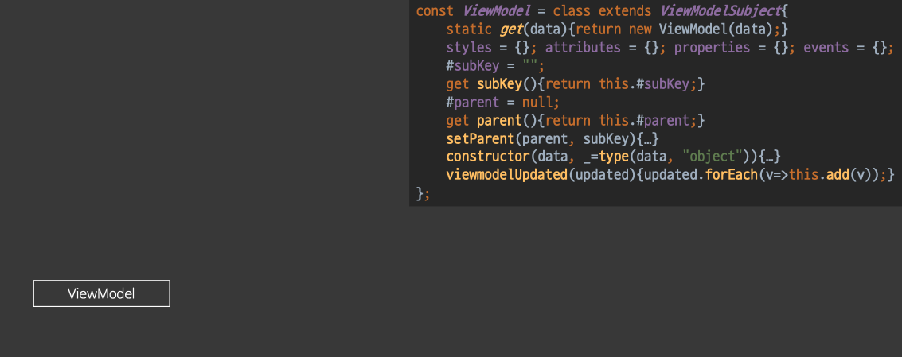

# 목표 
객체지향 프로그램이란 처음에 이루고자하는 목표에서부터 덩어리진 것을 차근차근 분리하고 깍아내는 과정 
어떻게 깍을지 기준정하는 방법은? "역할"
덩어리진 코드를 클래스로 나누려고 할때 "역할, 기준"이 필요하다. 객체지향에서 "역할, 기준"은 역할, 책임 모델이라고 하는 것입니다.

"역할, 책임"은 비슷해보이지만 동전의 양면을 가지고 있다. 
책임을 가지고 있다는건? 그 책임에 대한 권한도 가지고 있다.
권한이 있다는건? 권한에 대한 책임이 있다.
그래서 역할을 정의하려면 어떤 권한을 주입 받고, 그 권한으로 부터 무슨 일을 수행하는 권한을 양도 받기위해서는 어떤 책임까지 가져야 하는지 한번에 정의해야 한다. 

# 1. ISP
> SOLID 원칙 중 하나 
> Interface Segregation
> 인터페이스 분리하는 원칙(이 원칙으로 덩어리진 코드들을 나눌 수 있다.)


* 한 코드에 여러개가 들어가 있으면 이것들을 인터페이스별로 잘라서 분리 할 수 있다. 
    - 여기서 인터페이스는 역할을 얘기합니다.(실제 물리적인 인터페이스를 말하는 것이 아님)
* 객체지향에서 코드 분리할때 가장 기본적인 방법이다. 
* ViewModel을 이 법칙을 적용해보려고 한다. 
 

## 1.1 옵저버 서브젝트 파일 리팩토링 하기
* pdf4, 5, 6
```js
#isUpdated = new Set; #listeners = new Set;
addListener(v, _=type(v, ViewModelListener)){ 
    this.#listeners.add(v);
}
removeListener(v, _=type(v, ViewModelListener)){
    this.#listeners.delete(v); 
}
notify(){ 
    this.#listeners.forEach(v=>v.viewmodelUpdated(this.#isUpdated));
}

static #subjects = new Set; 
static #inited = false; 
static notify(vm){
    this.#subjects.add(vm); 
    if(this.#inited) return; 
    this.#inited = true; 
    const f =_=>{
        this.#subjects.forEach(vm=>{ 
            if(vm.#isUpdated.size){
                vm.notify();
                vm.#isUpdated.clear(); 
            }
        });
        requestAnimationFrame(f);
    };
    requestAnimationFrame(f);
}
```
    - 뷰모델에는 어울리지 않다고 보인다 
    - 옵저버패턴에 서브젝트 역할 -> 분리하자!
        * 메소드 코드를 분리할때 변수도 같이 이동해야한다.
        * 메소드 설계시 의존하고 있는 필드를 역할별로 필드를 같이 쓰지 않게 잘 설계해야 한다.  

* SOLID 원칙을 보며 고민...

    - SOLID원칙 보고 어떻게 뷰모델에서 옵저버 서브젝트 파일을 빼낼까 고민 중...
    - 상속모델을 사용할 것이다 우측 하단과 비슷한 모델을 사용
    - 서브젝트모델 === 인터페이스A/   
    뷰모델 === 객체 === 서브젝트모델을 상속받은 모델

```js
    //설명1
    const ViewModelSubject = class extends ViewModelListener{ 
        #info = new Set; #listeners = new Set;
        //설명2 add, clear
        add(v, _=type(v, ViewModelValue)){this.#info.add(v);} 
        clear(){this.#info.clear();}
        addListener(v, _=type(v, ViewModelListener)){ 
            this.#listeners.add(v); 
            //설명3
            ViewModelSubject.watch(this);
        }
        removeListener(v, _=type(v, ViewModelListener)){
            this.#listeners.delete(v);
            //설명4
            if(!this.#listeners.size) ViewModelSubject.unwatch(this); 
        }
        notify(){
            this.#listeners.forEach(v=>v.viewmodelUpdated(this.#info));
        }
    };
```
* pdf8, 9
```js
const ViewModelSubject = class extends ViewModelListener{ 
    #info = new Set; #listeners = new Set;
    add(v, _=type(v, ViewModelValue)){this.#info.add(v);} 
    clear(){this.#info.clear();}
    addListener(v, _=type(v, ViewModelListener)){ 
        this.#listeners.add(v); 
        ViewModelSubject.watch(this);
    }
    removeListener(v, _=type(v, ViewModelListener)){
        this.#listeners.delete(v);
        if(!this.#listeners.size) ViewModelSubject.unwatch(this); 
    }
    notify(){this.#listeners.forEach(v=>v.viewmodelUpdated(this.#info));}
};
```
- 설명1 상속
    - 3강에서 ViewModel은 ViewModelListener을 상속는데 여기서 ViewModelSubject에 ViewModelListener을 상속 받는 이유는 뭘까? 
        - Javascript는 다중 상속이 안돼서 어쩔 수 없이 ViewModelSubject가 ViewModelListener을 상속받고 ViewModel이 ViewModelSubject를 상속받는다 
    ```
    3장 ViewModel ->                     ViewModelListener
    4장 ViewModel -> ViewModelSubject -> ViewModelListener
    ```
- 설명2 add, clear추가 
    - `#isUpdated -> #info
    - `#info는 부모에 있는 private 속성이다. 자식이 못건드리기 때문에 부모에 속성 #info private 속성을 제거, 추가할때는 부모쪽에서 서비스를 내려줘야한다. 그래서 내가 ViewModel #info를 변경하고 싶을때는 부모쪽 메소드에서 ViewModel Value를 직접 넘겨 ViewModel를 직접 넘겨서 ViewModel Value를 부모인 서브젝트가 직접 추가하도록 위임해서 동작하게 해야한다. clear도 부모에게 직접 요청해서 추가해야 한다.
- 설명3 watch
    - 이전에는 addListener를 하고 ViewModel이 생성되는 시점에 바로 전체 서브젝트 리스트에 등록했다. 
    - 지금은 Listener가 들어온순간 서브젝트를 watch로 보낼 것이다.
    뷰모델 생성했다고 바로 requestAnimationFrame 넣어서 감시할 필요가 없다. 
    Listener가 하나라도 생겼을때 감시하면 된다!(뷰모델을 감사하는 사람이 없어 변화를 추적할 필요가 없다.)
- 설명4 unwatch
    - 뮤보델은 구독하는 listener가 없을때 unwatch를 하자!


## 1.2 notify 리팩토링
* pdf10
```js
static #subjects = new Set; 
static #inited = false; 
static notify(vm){
    this.#subjects.add(vm);
    if(this.#inited) return;
    this.#inited = true; 
    const f =_=>{
        this.#subjects.forEach(vm=>{ 
            if(vm.#isUpdated.size){
                vm.notify();
                vm.#isUpdated.clear(); 
            }
        });
        requestAnimationFrame(f);
    };
    requestAnimationFrame(f); 
}
```
requestAnimationFrame에 의해서 subject돌면서 뷰모델에 notify해준다. 


* pdf11-12
```js

const ViewModelSubject = class extends ViewModelListener{ 

    //... 위 코드 참고

    static #subjects = new Set; static #inited = false; 
    static notify(){
        const f =_=>{ 
            this.#subjects.forEach(v=>{
                if(v.#info.size){ 
                    v.notify();
                    v.clear(); 
                }
            });
            //설명1
            if(this.#inited) requestAnimationFrame(f); 
        };
        requestAnimationFrame(f); 
    }

    //설명2
    static watch(vm, _=type(vm, ViewModelListener)){
        this.#subjects.add(vm); //set에 add해도 변화 x
        if(!this.#inited){
            this.#inited = true;
            this.notify(); 
        }
    }

    //설명3
    static unwatch(vm, _=type(vm, ViewModelListener)){
        this.#subjects.delete(vm);
        if(!this.#subjects.size) this.#inited = false; 
    }
}    
```
- notify가 무조건 돈다. 
- 설명1 flag를 통한 Animation 제어
    - requsetAnimationFrame를 동작 여부를 결정하는 flag "#inited"를 사용하고 있다. 
- 설명2, 설명3 flag를 통한 Animation 제어
    - 리스너가 없는 뷰모델을 여러개 만들어도 requestAnimationFrame은 돌지 않는다. 뷰모델에 리스너를 등록해야지 그 뷰모델을 감시하기 시작하고 리스너를 다 빼서 하나도 없다면 requestAnimation도 멈추게 된다. 
    - 기존 notify함수에 this.#subjects.add(vm); 코드로 subject를 관리했는데 이렇게 하면 외부에서는 notify에 #subject에 add한다는 사실을 모른다. 그래서 외부에서 알 수 있도록 watch, unwatch함수 #subject.add, #subject.delete를 통해서 관리해주고 있다. 

- 추가 정보: 플래그변수, 싱글스레드, 멀티스레드 
    - Javascript는 싱글스레드이기 때문에 플래그 변수로 제어하기 쉽다. 다른 언어는 멀시스레드이기 때문에 플래그 제어가 안된다. 
    - 플래그 기만에 효율적인 알고리즘짜는것을 계속해서 연습해야 한다. 
    - 멀티 스레드에서 작업할때는 플래그 기만이 아니라 멀티스레드에서 안정성을 확보하고 효율성을 확보하는 패턴을 배워야한다.

- 추가 정보: static method
    - notify static private method로 설정해야하는데 Javascript에는 static method를 지원하지 않아서 공개적으로 되어 있다. 
    - watch, unwatch도 외부에 공개 되어야 하지만 public은 아니다. 내부 Framework안에서 돌기 때문에 


# 2. 섬세한 권한 조정
> 위 ISP방법을 통해서 ViewModel이 가벼워 졌는데 이제는 섬세한 권한 조정을 하려고 한다. 

* 권한 조정이 필요한 이유 
    * 권한제어자가 기본적으로 제공되는 언어 java, 코틀린 private, internal, public 
    * Java의 기본 권한 private, Javascript 기본권한 public
    * 그래서 생기는 문제는 getter, setter외부에 노출이 되면 코드 조작이 가능해서 문제가 생긴다. 

* 아래 코드에 설명할 부분을 주석으로 6가지를 표시 했으며 아래 설명이 있습니다.
```js
const ViewModel = class extends ViewModelSubject{
    static get(data){return new ViewModel(data);}
    styles = {}; attributes = {}; properties = {}; events = {}; 
    
    //설명1 readonly
    #subKey = "";
    get subKey(){return this.#subKey;}
    #parent = null;
    get parent(){return this.#parent;}
    
    //설명2 [설명6과 관련]Transaction 연산
    setParent(parent, subKey){
        this.#parent = type(parent, ViewModel);
        this.#subKey = subKey;
        this.addListener(parent);
    }
    
    constructor(data, _=type(data, "object")){ 
        super();
        Object.entries(data).forEach(([cat, obj])=>{ 
            if("styles,attributes,properties".includes(cat)) {
                if (!obj || typeof obj != "object") throw `invalid object cat:${cat}, obj:${obj}`; 
                this[cat] = Object.defineProperties({}, Object.entries(obj).reduce((r, [k, v])=>{
                    r[k] = { 
                        enumerable:true, get:_=>v, set:newV=>{
                        v = newV;
                        //설명3 update할 객체 세팅 방법 변경
                        this.add(new ViewModelValue(this.#subKey, cat, k, v)); }
                    };
                    return r; 
                }, {}));
            }else{
                Object.defineProperties(this, { 
                    [cat]: {
                        enumerable: true,
                        get: _ => obj,
                        set: newV => {
                            obj = newV;
                            //설명3 update할 객체 세팅 방법 변경
                            this.add(new ViewModelValue(this.#subKey, "root", cat, obj)); 
                        }
                    } 
                });
                //설명6 [설명2와 관련]트렌젝션으로 setParent로 한번에 처리
                if(obj instanceof ViewModel) obj.setParent(this, cat); 
            }
        });
        //설명4 ViewModel.notify(this); 제거
        //ViewModel.notify(this);
        Object.seal(this); 
    }
    //설명5 viewModel
    viewmodelUpdated(updated){updated.forEach(v=>this.add(v));}
}
```

* 설명1 readonly
    - 외부 공개, 쓰기는 private(public getter, private setter pattern)

* 설명2 Transaction 연산
    - 자바스크립트는 트렌젝션을 따로 지원하지 않기 때문에 함수를 통해서 트렌젝션 연산이라는 것을 알려줘야 한다. 
        - Transaction이란? 코드가 한번에 일어나야 하는 구간이다.   
        그런데 그 구간에서 하나하나 일어나야 하는건지 덩어리로 한번에 일어나는지 아닌지 구별하는 방법이 없다. 그런데 자바스크립트에서는 덩어리로 한번에 일어나게 하는 방법은 "함수"를 통해서 한번에 일어나야 할 코드들을 표시할 수 있다. 
    - 이렇게 setParent 함수로 만든 다른이유는? 
        - 코드로 가져 올때 코드가 아닌 함수로 가지고 오기때문에 '전달인자'를 넘겨줘서 문제 없이 세팅할수 있다. 
        - 함수가 아닌 코드로 클래스에서 있을경우 함수에서 인자로 넘겨주는 변수들이 '지역변수, 클로저'에 설정되어 있기 때문에 문제가 될수있기 때문에   
    - 내부 함수는 "_"를 붙이자.    
    - 이 코드는 parent를 세팅할때 있어야 하는 코드(기존에는 constructor안 dfineProperty하는 로직에 있었던 코드다.)
    - 코드에서 꼭 표현해야 할 것! -> "Transaction"이다    
* 설명3 update할 객체 세팅 방법 변경 
    - 기존에는 뷰모델 #isUpdated에 직접 Set객체에 add통해 설정했지만 현재는 ViewModelSubject 클래스로 이동해 상속받았기 때문에 부모에게 호출하고 있다.(this.add(...))
    ```js
    //기존
        vm.#isUpdated.add(new ViewModelValue(vm.subKey, category, k, v));
    ```
* 설명4 ViewModel.notify(this); 제거
    - 기존에는 뷰모델이 직접 자신에게 notify를 등록했는데 지금은 하지 않는다. 왜? 
        - 생성시점에 등록 안할거고 addListener할때 lazy하게 등록할 것이기 때문!
        - addListener에 lazy하는것도 뷰모델 서브젝트가 알아서 할 것이다. 

* 설명5 ViewModelListener Class viewmodelUpdated 함수 오버라이딩
    - ViewModelListener Class viewmodelUpdated 함수를 ViewModelSubject에서 오버라이딩 하지 않았다.
    그래서 ViewModel에서 오버라이딩 하지 않으면 throw된다.
    - 이번 강의 ViewModel 상속 관계도  
    : ViewModel -> ViewModelSubject -> ViewModelListener
    - 추가적으로 설명3과 같이 this.#isUpdated.add(v) -> this.add(v)로 코드가 변경됐다.

* 설명6 트렌젝션으로 setParent로 한번에 처리
    - 기존에는 아래와 같은 코드를 setPraent 함수로 한번에 처리 했습니다.
    v.parent = this; v.subKey = k;, v.addListener(this); 

* 추가 설명
    - 그래서 부모 자식간, 필드 접근 권한, 트렌젝션에 의해 계층 권한이 생기는 경우 직접 변수에 접근한는 이유는 다양하다. 
    - 권한관계라는건 발생하는건 여러가지 인데 물론 직짜 권한때문에 일어나느 경우가 많지만 트렌젝션때문에 일어나는 경우도 비일비재 하다.
    - 코드를 함수로 빼기위해서 코드를 한번 더 정리하기 때문에 코드 부분이 깔금하게 될 수 있다. 
    - 코드가 길다 싶으면 외부함수, 스태틱함수로 변경하는건 좋은 연습니다.  


# 3. Visitor Pattern

* Scanner? 
    - 특정 el 하위를 검색해서 viewmodel대상인 여부를 확인해서 BinderItem을 만들어서 binder에게 넘겨준다. 

## 리팩토링 전 Scanner 소스 설명

```js
const Scanner = class{
    scan(el, _ = type(el, HTMLElement)){
        const binder = new Binder;
        this.checkItem(binder, el);
        
        //설명2 Visitor 패턴 적용 대상
        const stack = [el.firstElementChild]; 
        let target;
        while(target = stack.pop()){
            this.checkItem(binder, target);
            if(target.firstElementChild) stack.push(target.firstElementChild); 
            if(target.nextElementSibling) stack.push(target.nextElementSibling);
        }
        //설명2-end

        return binder;
    }
    checkItem(binder, el){
        //설명1 스캐너 역할
        const vm = el.getAttribute("data-viewmodel"); 
        if(vm) binder.add(new BinderItem(el, vm));
    } 
};

```

* 설명1 스캐너의 역할
    - Binder의 Scanner가 아니라 Scanner Class로 빠진이유. (스캐너를 빼낸 이유) 
    - vuejs el속성들을 쓰고 싶다면 이곳에서 조작 후 아이템에 꽂아 주면 된다. 

* 설명2 Visitor 패턴 
    - dom을 파싱 하는 부분은 Scanner, Binder class역할이라고 보기에 어렵다. 그래서 Visitor 패턴을 사용한다. 
    - Visitor 패턴 등장 인물2개/ care taker(원본데이터, 보살핌을 받는애) - Visitor 패턴 
    - Visitor에게 caretaker를 주면 Visitor가 돌아준다? 

* binder? 
    - 그림을 그릴 대상을 binderItem으로 가지고 있다가 viewmodel에 꽂아 주면 viewmodel에 맞게 그림을 그려주는 역할을 하고 있다. 


## 리팩토링 후 Scanner 소스 설명
```js
const Visitor = class {
    //설명1
    visit(action, target, _0=type(action, "function")) {
        throw "override" 
    }
};

const DomVisitor = class extends Visitor{
    //설명2 Generic
    visit(action, target, _0=type(action, "function"), _1=type(target, HTMLElement)) {
        const stack = [];
        let curr = target.firstElementChild; 
        do {
            action(curr);
            if (curr.firstElementChild) stack.push(curr.firstElementChild); 
            if (curr.nextElementSibling) stack.push(curr.nextElementSibling);
        } while (curr = stack.pop()); 
    }
};

const Scanner = class {
    #visitor
    constructor (visitor, _ = type(visitor, DomVisitor)) {
        this.#visitor = visitor;
    }
    scan (target, _ = type9target, HTMLElement) {
        const binder = new Binder
        const f = el => {
            const vm = el.getAttribute('data-viewmodel')
            if (vm) binder.add(new BinderItem(el, vm))
        }
        f(target)
        this.#visitor.visit(f, target)
        return binder;
    }
}

```

* 설명1 추상인터페이스
    - 추상인터페이스에서 target이 어떤 타입(HTMLElement, JSON 등등)인지 알 필요가 없습니다. 
    - 오버라이드를 하지 않으면 죽기때문에! 즉 오버라이드할때 target의 타입을 지정해줘야 한다. 

* 설명2 Generic
    - 자식에서 구체적인 타입을 알게 되는 것을 Generic이라고 한다. 
    - Generic은 원래 class옆에 표시하는건데 자바스크립트에서는 Generic이 있지 않기 때문에 이렇게 표시해준다. 
    - 언어가 어떤 기능을 지원하는것보단 그 개념을 어떻게 적용하는지가 중요하다. 

# 4. 추상계층 불일치
* Scanner 클래스 리팩토링! 추상계층을 일치시켜주는 작업을 한다.  
* 연역적인 케이스를 가지고 연역적으로 원리를(추상적으로) 도출한뒤(귀납적) 다시 연역적으로 다시 도출  
    - 귀납적: 원리 -> 현상 예측/ 연역적: 현상 -> 원리 도출


1. Scanner 클래스 constructor에 Domvisitor객체를 주입
    * 왜 Domvisitor를 바로 만들지 않고 Visitor 클래스를 만들어서 상속 받아서 구현했나? 
    * 순수한 메모리 객체? Dom에 의존적이 네이티브 객체? 
    
    * 계층이 2, 1개 로 나뉘어 있다. 
        - Visitor, Domvisotor (순수한 메모리객체, Dom에 의존적인 네이티브 객체)
        - Scanner
        
    * 한쪽이 추상계층으로 했다면 다른 한쪽도 추상계층으로 맞춰줘야 한다.  
    
       


2. 리팩토링 전후의 Scanner Class 비교


3. Scanner 클래스 scan에 Element 지식 설명
    * 이것도 추상계층으로 나눈다 
    * 리펙토링을 하면 Scanner 클래스는 인메모리 객체만 남게 된다. (네이티브 객체가 하나도 없다)
        - 기존에 Scanner는 dom베이스 객체가 있었는데 없애 버린것이다. 
    * Scanner를 추상화 시켜 dom 객체가 없다면 DomScanner는 Scanner를 상속받아 scan 함수를 오버라이딩 한다.  
        - DomScanner 클래스에 생성자 함수 DomVisitor를 받는다. 그리고 super로 Scanner 클래스에 전달하는데 Scanner 클래스는 Visitor 클래스를 받는다. 
            - 자식은 부모를 대체 가능하기 때문에 문제 없다. 
    * Scanner scan 함수에 받는 인자 값 타입이 없었는데 DomScanner scan에 타입을 설정함(제너릭 기능)으로 구상화 했다.


4. Scanner, Visitor, DomScanner, DomVisitor 클래스 설명(하늘색선 있는 ppt)
    > 아래 두 계층을 나눈 설명은 이게 바로 추상레이어를 일치 시켜준 것이다. 
    * Scanner, Visitor: Dom에 대한 네이티브 객체가 없고 인메모리 객체만 있는 추상 계층이 생기고 
    * DomScanner, DomVisitor: 더러운 Dom관련 처리를 해주는 구상클래스 세계
    
    * 마틴파울러 아저씨는 기능, 도메인 적인 기능을 나눠서 서로 협력하게 만들어야 한다고 얘기 하셨다. 
        - 기능: 변하지 않는 부분
        - 도메인: 변하는 부분 
            - 그래야 나중에 도메인이 바뀌었을때 그 부분만 교체 가능하다고 얘기 하셨다. 
            - 그래서 여기서 Scanner, Visitor는 "기능"적인 부분
                DomScanner, DomVisitor은 "도메인(Dom)"을 처리하는 부분이 된다. 
        - 그런데 도메인은 상황에 따라 바뀔 수 있다. 어떤경우에는 비즈니스 부분을 보호하고 네이티브에 이것이 스프링, my-sql? 이되던 문제 없이 동작할거야 라고 하면 도메인 쪽이 기능이 되는 것이다. 즉 변한는 부분과 변하지 않는 부분을 구분하라는 것이다. 
        
    * 결과적으로 "변화율"을 고려해서 레이어를 나눈것이다. 
        - 변화율때문에 코드를 나눠서 정복한것이있다 그건? 코드를 고치지 않고 코드를 추가함으로 수정할 수 있다.
            - 예를 들어 Dom이 아닌 Canvas를 다룰 때 코드를 고치지 않고 CanvasScanner, CanvasVisitor를 만들면 됩니다.
            따라서 기존 코드의 변화가 없고 회귀 테스트가 필요없다. 
            - 여기에 "추상레이어"의 장점은 코드를 수정하는게 아니라 코드를 추가함으로 요구사항, 문제가 생겼을때 해결할 수 있다.  여기서는 요구사항에 따라서 어떠한 Scanner, Visitor를 만들어 추가 할 수 있다. 
            - 이게 바로 "설계"에 목메다는 이유입니다!!!
            
    * 추상화 계층을 분리함으로써 "OCP" 를 지키고 있다. 다른말고 OCP를 지키려면 추상화 클래스가 필수다! 
        - O: OPEN, C: CLOSE - 확장에는 열려있고 수정에는 닫혀있다!
        - SOLID 법칙은 사실 법칙이 아니라 객체지향설계를 잘하면 얻어질 수 있는 결과물이다. 
    
    * 추상화계층을 만듬으로 "OCP"말고 다른 장점 
        - 추상화계층 클래스(Scanner, Visitor 클래스)는 initialize할때 로딩하고 구상클래스틑 원할때 동적 로딩하면 된다. 
          즉 코드의 늦은 초기화, 클래스 초기화를 유도할 수 있다.   
            -> 이게 "의존성 역전의 법칙(DIP)"이다...


5. 구상 visitor를 구상 Scanner에게 줘서 scaner type 변수에 넘기다.


# 5. 설계 종합
* UML diagram은 스팩이 너무 넓기 때문에 아래 캡쳐한것처럼 클래스 관계도를 그려서 설명합니다.




1. ViewModel 
> subject관련된건 ViewModelSubject로 이사갔어요.  
> Dom에 의존적인 클래스 없다. 모두 인메모리 객체를 가지고 있다.  

2. ViewModelSubject 
* 이때 최적화를 했다.  
* 좋은코드가 나오는 이유는 인간머리의 복잡성을 정복할 정도 쪼개져 있기때문,,, 그런데 쪼개는게 힘들어 왜? 아무렇게나 쪼개면 일관성이 없기 때문에 어떻게 쪼갤지 모르는게 문제야.
* 객체 지향은 역할에 따라서 쪼개는것이다 !

3. ViewModelListener
* [대기]

4. ViewModelValue
* 아래와 같이 ViewModelValue은  다음 세개 클래스에 의존 되어 있다. -> ViewModel, ViewModelSubject, ViewModelListener Class
* 선이 많이 몰리면 수정하기 어려운 객체 
    ```
    ViewModel -> ViewModelSubject -> ViewModelListener
    ViewModelValue -> ViewModel
    ViewModelValue -> ViewModelSubject
    ViewModelValue -> ViewModelListener
    ```

* 이래서 Dom과 관련되 lib, fw에서는 제일 먼저 자기 이벤트를 정복해서 네이티브 이벤트를 보여주지 않으려고 한다.  
    - 왜냐하면 네이티브이벤트에 돔과 과련된 이벤트를 짜면 감당이 안되기 때문이다.   
    - 이벤트는 옵저버 모델에서 무조건 이렇게 무겁게 된다.  
    - 옵저버 모델의 약점이다. ㅠ  

* 하지만 설계잘했다. ! 왜? 
    - 단방향 의존성이기 때문이다. 양향도 없고 순회해서 다시 돌아오는 경우도 없다!
    - 연관은 자연스럽다! 왜? 코드를 객체로 뺏고 그 객체를 빼기전 코드와 연관 지었기 때문에 의존성이 자동으로 생긴다. 하지만 의존성이 발생하는게 나쁜게 아니라 의존성을 단방향으로 유지하는게 중요한 것입니다. 		
    
* 클래스 관계도를 그리고 코드를 수정할일이 생겼을때 무거운 코드 클래스인지 확인해자.


5. Scanner, DomScanner  
* DomScanner에 DomVisitor를 넣어줬긴 했지만
    - DomScanner가 DomVisitor에 의존적이다 물어보면?... 애매해 하지만 간접적으로 알고 있다. 
    - DomScanner는 DomVisitor를 생성자 함수에서 받고 있다.  

    ```
    DomScanner -> Scanner -> Visitor <- DomVisitor
    ```

6. Binder
> 결국 Scanner는 Binder를 만들어 낸다. 
* Binder의 주요 기능은? 
    - add를 통해서 items를 set으로 가지고 있다 
    - viewModelUpdate Listener를 구현해서 Listener로 부터 업데이트 된것을 render에 반영할 수 있고 
    - addProcessor로 rendering에 필요한 것들을 processor 로 가지고 
    - 특정 뷰모델은 watch, unwatch, 직접 render할 수 있다.  
    ```
    DomScanner -> Scanner -> Visitor <- DomVisitor
                  Scanner -> Binder
    ```


7. Binder의 의존성을 확인해보자 
    - 모두 단방향이다. Binder는 Scanner쪽을 모르고 ViewModelValue에서 Binder를 의존하지 않기 때문에 모두 단방향이다. 
    - 나가는 선이 많은(Binder) 같이 변화, 깨지기 쉬운 클래스  
        반대로 들어오는 선이이 많은 클래스(ViewModelValue)는 무거운 클래스 
    ```
    Binder -> ViewModel
    Binder -> ViewModelValue
    Binder -> ViewModelListener
    ```

8. BinderItem
* element, viewmodel을 알고 있다. 
* element가 들어가 있어서 문제가 된다. 
* Binder -> BinderItem


9. Processor
* element, viewModel을 받아서 처리해주는 클래스 
* Binder -> Processor


10. ConcreateProcessor
* Processsor는 method만 가지고 있는 것 구상 Processor가 실제적으로 Dom 지식을 가지고 있다. 
* ConcreateProcessor -> Processor


11. ConcreateProcessor, DomScanner, DomVisitor 클래스
* 실제 Dom 정보를 가지고 있는 클래스는? 그리고 클라이언트에서 작성해야할 클래스는? 	
    - <u>위 클래스를 제외 하고 인메모리 객체를 가지고 있다.</u>

# 6.종합설명
* MVVM이 좋은점? 
    - ConcreateProcessor, DomScanner, DomVisitor 클래스를 교체하면 안드로이드, IOS에서 사용할 수 있다. 
    
* 옵저버 패턴을 적용해서 ViewModel 클래스 주변으로 "ViewModelSubject, ViewModelListener, ViewModelValue" 다음과 같은 클래스들이 생겨났다. 
    - 그림, 설명한것처럼 비용이 싸지 않습니다. 그래서 Binder에서 render를 call하는 경우도 있습니다. 
		
* 코드를 깍아나갈때 중요한 점 
	- 추상화 레벨을 맞춰야 한다. 
	    * Binder, Scanner, Visitor이 세개 클래스는 dom 네이티브 객체를 가지고 있지 않는다. 
	    * 이것을 맞추기 위해서 DomScanner, DomVisitor가 탄생한 것   

* 코드를 짤때 궁극적으로 강사님이 원하는건? 
	- dom, node, db가 됐던 특정한 네이티브 지식이 나오면 코드를 분리하자 그리고 그 위에 네이티브 지식을 모르는 것들끼리 통신을 하게 하자 ! 그러면 녹색 클래스를(Dom 네이티브지식을 가진 클래스) 제외하고 재활용 할 수 있다.  
        * Binder, Scaner, Visitor 클래스가 어떻게 되어 있는지 확인해보자 

* 다음 시간에는 중요한 패턴 2가지를 배울 것 입니다. 
	- 추상팩토리메소드 패턴 
	- 커맨드 패턴 
	
	
	
# 7.작업 클래스
```js
    const ViewModelListener = class {}
    const ViewModelSubject = class extends ViewModelListener {}
    const ViewModel = class extends ViewModelSubject {}
    const ViewModelValue = class {}

    const BinderItem = class {}
    const Binder = class extends ViewModelListener {}

    const Processor = class {}
    
    const Scanner = class {}
    const DomScanner = class extends Scanner {}

    const Visitor = class {}
    const DomVisitor = class extends Visitor {}

    const scanner = new DomScanner(new DomVisitor);
    
    binder.addProcessor(new class extends Processor {})
    binder.addProcessor(new class extends Processor {})
    binder.addProcessor(new class extends Processor {})
    binder.addProcessor(new class extends Processor {})

```

# 8.작업 코드
```html
    <!DOCTYPE html>
    <html lang="en">

    <head>
        <meta charset="UTF-8">
        <title>MVVM 4회</title>
    </head>

    <body>
        <section id="target" data-viewmodel="wrapper">
            <h2 data-viewmodel="title"></h2>
            <section data-viewmodel="contents"></section>
        </section>
        <script>
            const type = (target, type) => {
                if (typeof type == "string") {
                    if (typeof target != type) throw `invalid type ${target} : ${type}`
                } else if (!(target instanceof type)) {
                    throw `invalid type ${target} : ${type}`
                }
                return target;
            }

            const ViewModelListener = class {
                viewmodelUpdated(updated) {
                    throw 'override';
                }
            }

            const ViewModelSubject = class extends ViewModelListener {
                static# subjects = new Set;
                static# inited = false;
                static notify() {
                    const f = () => {
                        this.#subjects.forEach(v => {
                            if (v.#info.size) {
                                v.notify();
                                v.clear();
                            }
                        })
                        if (this.#inited) requestAnimationFrame(f);
                    }
                    requestAnimationFrame(f)
                }
                static watch(vm, _ = type(vm, ViewModelListener)) {
                    this.#subjects.add(vm);
                    if (!this.#inited) {
                        this.#inited = true;
                        this.notify();
                    }
                }
                static unwatch(vm, _ = type(vm, ViewModelListener)) {
                    this.#subjects.delete(vm);
                    if (!this.#subjects.size) this.#inited = false;
                }#
                info = new Set; #listeners = new Set;
                add(v, _ = type(v, ViewModelValue)) {
                    this.#info.add(v);
                }
                clear() {
                    this.#info.clear();
                }
                addListener(v, _ = type(v, ViewModelListener)) {
                    this.#listeners.add(v);
                    ViewModelSubject.watch(this);
                }
                removeListener(v, _ = type(v, ViewModelListener)) {
                    this.#listeners.delete(v);
                    if (!this.#listeners.size) ViewModelSubject.unwatch(this);
                }
                notify() {
                    this.#listeners.forEach(v => v.viewmodelUpdated(this.#info))
                }
            }


            const ViewModel = class extends ViewModelSubject {
                static get(data) {
                    return new ViewModel(data);
                }
                styles = {};
                attributes = {};
                properties = {};
                events = {};
                #subKey = '';
                #parent = null;
                
                get subKey() {
                    return this.#subKey;
                } 
                // read only
                get parent() {
                    return this.#parent;
                }
                setParent(parent, subKey) {
                    this.#parent = type(parent, ViewModel);
                    this.#subKey = subKey;
                    this.addListener(parent);
                }

                static descriptor = (vm, category, k, v) => ({
                    enumerable: true,
                    get: () => v,
                    set(newV) {
                        v = newV;
                        vm.add(new ViewModelValue(vm.subKey, category, k, v));
                    }
                })
                static define = (vm, category, obj) => (
                    Object.defineProperties(
                        obj,
                        Object.entries(obj)
                        .reduce((r, [k, v]) => (r[k] = ViewModel.descriptor(vm, category, k, v), r), {});
                    )
                )
                constructor(data, _ = type(data, 'object')) {
                    super();
                    Object.entries(data).forEach(([k, v]) => {
                        if ('styles,attributes,properties'.includes(k)) {
                            if (!v || typeof v != 'object') throw `invalid object k: ${k}, v:${v}`;
                            this[k] = ViewModel.define(this, k, v);
                        } else {
                            Object.defineProperty(this, k, ViewModel.descriptor(this, '', k, v))
                            if (v instanceof ViewModel) {
                                v.setParent(this, k);
                            }
                        }
                    })
                    Object.seal(this);
                }
                viewmodelUpdated(updated) {
                    updated.forEach(v => this.add(v));
                }
            }

            const ViewModelValue = class {
                subKey;
                category;
                k;
                v;
                constructor(subKey, category, k, v) {
                    Object.assign(this, {
                        subKey,
                        category,
                        k,
                        v
                    })
                    Object.freeze(this);
                }
            }

            const BinderItem = class {
                el;
                vmName;
                constructor(el, vmName, _0 = type(el, HTMLElement), _1 = type(vmName, 'string')) {
                    this.el = el;
                    this.vmName = vmName;
                    Object.freeze(this);
                }
            }

            const Binder = class extends ViewModelListener {
                #items = new Set;
                #processors = {};
                add(v, _ = type(v, BinderItem)) {
                    this.#items.add(v);
                }
                addProcessor(v, _ = type(v, Processor)) {
                    this.#processors[v.category] = v;
                }
                render(viewmodel, _ = type(viewmodel, ViewModel)) {
                    const processores = Object.entries(this.#processors);
                    this.#items.forEach(({vmName,el}) => {
                        const vm = type(viewmodel[vmName], ViewModel);
                        processores.forEach(([pk, processor]) => {
                            Object.entries(vm[pk]).forEach(([k, v]) => {
                                processor.process(vm, el, k, v);
                            })
                        })
                    })
                }

                watch(viewmodel, _ = type(viewmodel, ViewModel)) {
                    viewmodel.addListener(this);
                    this.render(viewmodel);
                }

                unwatch(viewmodel, _ = type(viewmodel, ViewModel)) {
                    viewmodel.removeListener(this);
                }

                viewmodelUpdated(updated) {
                    const items = {};
                    this.#items.forEach(({vmName,el}) => {
                        items[vmName] = [type(rootViewModel[vmName], ViewModel), el];
                    })
                    updated.forEach(({subKey,category,k,v}) => {
                        if (!items[subKey]) return;
                        const [vm, el] = items[subKey], processor = this.#processors[category];
                        if (!el || !processor) return;
                        processor.process(vm, el, k, v);
                    })
                }
            }

            const Processor = class {
                category;
                constructor(category) {
                    this.category = category;
                    Object.freeze(this);
                }
                process(vm, el, k, v, _0 = type(vm, ViewModel),
                                        _1 = type(el, HTMLElement),
                                        _2 = type(k, "string")) {
                    this._process(vm, el, k, v)
                }
                _process(vm, el, k, v) {
                    throw 'override';
                }
            }

            const Scanner = class {
                #visitor
                
                constructor(visitor, _ = type(visitor, Visitor)) {
                    this.#visitor = visitor;
                }
                visit(f, target) {
                    this.#visitor.visit(f, target);
                }
                scan(target) {
                    throw `override`;
                }
            }

            const DomScanner = class extends Scanner {
                constructor(visitor, _ = type(visitor, DomVisitor)) {
                    super(visitor);
                }
                scan(target, _ = type(target, HTMLElement)) {
                    const binder = new Binder;
                    const f = el => {
                        const vm = el.getAttribute('data-viewmodel');
                        if (vm) binder.add(new BinderItem(el, vm));
                    }
                    f(target);
                    this.visit(f, target);
                    return binder;
                }
            }

            const Visitor = class {
                visit(action, target, _ = type(action, 'function')) {
                    throw 'override';
                }
            }
            const DomVisitor = class extends Visitor {
                visit(action, target, _0 = type(action, 'function'), _1 = type(target, HTMLElement)) {
                    const stack = [];
                    let curr = target.firstElementChild;
                    do {
                        action(curr);
                        if (curr.firstElementChild) stack.push(curr.firstElementChild);
                        if (curr.nextElementSibling) stack.push(curr.nextElementSibling);
                    } while (curr = stack.pop())
                }
            }

            const scanner = new DomScanner(new DomVisitor);
            const binder = scanner.scan(document.querySelector('#target'))
            binder.addProcessor(new class extends Processor {
                _process(vm, el, k, v) { el.style[k] = v; }
            }('styles'))
            binder.addProcessor(new class extends Processor {
                _process(vm, el, k, v) { el.setAttribute(k, v); }
            }('attributes'))
            binder.addProcessor(new class extends Processor {
                _process(vm, el, k, v) { el[k] = v; }
            }('properties'))
            binder.addProcessor(new class extends Processor {
                _process(vm, el, k, v) { el[`on${k}`] = e => v.call(el, e, vm); }
            }('events'))

            const getRandom = () => parseInt(Math.random() * 150) + 100;
            const wrapper = ViewModel.get({
                styles: {
                    width: '50%',
                    background: '#ffa',
                    cursor: 'pointer'
                },
                events: {
                    click(e, vm) {
                        vm.parent.isStop = true
                    }
                }
            })
            const title = ViewModel.get({
                properties: {
                    innerHTML: 'Title'
                }
            })
            const contents = ViewModel.get({
                properties: {
                    innerHTML: 'Contents'
                }
            })
            const rootViewModel = ViewModel.get({
                isStop: false,
                changeContents() {
                    this.wrapper.styles.background = `rgb(${getRandom()},${getRandom()},${getRandom()})`
                    this.contents.properties.innerHTML = Math.random().toString(16).replace('.', '')
                },
                wrapper,
                title,
                contents
            })
            
            binder.watch(rootViewModel)
            const f = () => {
                rootViewModel.changeContents()
                if (!rootViewModel.isStop) requestAnimationFrame(f)
            }
            requestAnimationFrame(f)
        </script>
    </body>

    </html>
```

태그: [대기]