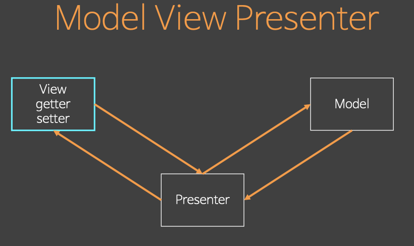

# 목표 
객체지향을 가지고 이것 저것 만들어 볼 예정인데 그중 `MVVM`을 을 만들어 본다. 그리고 다음시간에는 이것을 가지고 서비스를 만들어 볼 예정입니다. 

# MVVM
* Model, View, ViewModel의 약자 
* MS의 pwf에 적용 되어 있는 아키텍쳐(ms가 원조)
* 핵심적인 내용 몇가지 차용 간단한 모델 만들고 객체지향으로 만들어 볼예정


# MVC
* Model View Controller
* 두가지가 있다. 

## MVC 첫번째 

 

### Back-end에서의 MVC
* Model을 Controller가 가져와 View가 소비할 수 있는 데이터를 가공해서 View한테 준다. 
* Controller는 Model도 알고 있고 View도 알고 있다
* Controller가 Model 의해서 받은 데이터를 적절히 가지고 가공해서 뒤로 넘겨 주면 주는 그 받은 데이터를 가지고 화면을 그립니다. 

### Front-end에서의 MVC
* View는 User의 interaction 받아들어 Model을 갱신한다.
    - View는 User의 interaction 받아드리고 그에 따라서 Model을 갱신한다.
    - View는 어떤 Model을 갱신 시켜야 되는지 Model에대한 의존성을 알고 있다.

* 그런데 View가 Model과 의존성이 있는데 문제가 있다?! 
    - Model과 View가 바뀌는 원인은 다름
        * Model은 비즈니스가 변경이 바뀌었을때 달라지고 
        * View는 웹에서 User 인터랙션이 변경이 되었을 때 바뀐다.
    - **클라이언트에서는 Model과 View가 바뀌는 원인은 다른데 서로 의존성이 있다는 것이 문제다**
    
### 결론
* MVC는 주로 백엔드에서 서버에서 사용
    - 대표적으로 스프링
    - 이유
        * **Model을 Controller에 넘기고 데이터를 가공해서 주는 View를 만들고 response로 던져버리면 끝난다.** 그 다음에 View가 Model을 참고해서 변경시키는 그런 과정이 없기 때문이다.
        * **서버에서는 View와 Model을 연결짓는 의존성이 없다**. Model -> Controller -> View 이렇게 단방향으로 처리하기 때문에 서버에서는 MVC 패턴이 괜찮다.

* 클라이언트에서는 MVC 패턴을 사용하기 어렵다 
    - **View에서 인터랙션이 일어나면 Model을 바꾸는 경우가 있어 너무 밀접한 관계를 가지고 있어 이것이 문제다.** 
* 클라이언트 쪽에서는 MVC 패턴을 잘 사용하지 않는데 MVC 패턴을 사용한 백본은 망했다

## MVC 두번째 

* 제왕적 MVC Model
* 이 구조에서는 View가 Model의 의존구조가 없어졌지만, **Controller의 의존이 더 강해졌다.** 
    - View, Model의 변화를 모두 처리해줘야 한다. -> Container의 유지 보수가 너무 힘들다 
* 그래서 점차 사용하지 않는 추세이다.


# MVP

> 4세대 language에서사용(비쥬얼 베이지, 파워 빌더, MFC, 안드로이드)   

* visual basic으로 예를 들면 editor에 버튼 끌어다 놓으면 버튼을 제어 할 수 있는 property가 이미 있다. view에 interface를 노출하는게 아니라 프로그래밍으로서의 인터페이스로서 getter, setter를 노출하고 있다. (하나의 컴포넌트에 설정을 할 수 있는 getter, setter가 있다. )

* presenter 역할
    * **presenter는 view에 getter, setter로 접근한다.** 
        - view는 Model에 대한 지식이 하나도 없다 
        - 원래 DOM 객체, native 객체로 보이는게 아니라 getter, setter를 가지고 있는 인터페이스로 보이게 된다. 
    * mvc처럼 Model을 던져 view를 제어하는게 아님.

* 사용하는 이유
    - **View에대한 Model의 의존성 완전히 제거**로 첫번째 MVC패턴에서 보여준 View, Model의 관계를 끊어 버린다.
    - Presenter, Model만 개발하면 된다.

* MVC를 탈피하기 위해서 MVP를 많이 사용한다. 
    - **View가 rednering 재량권을 다 잃어 버리고, Presenter가 getter, setter통해서 통제하는 방법으로 바꿔 주면된다.** 
    - **하지만 View단에 getter, setter를 다 만들어줘야 한다.** (= view가 무거워진다.) 

* 단점
    - View에 getter, setter를 만들어줘야하는 부담이 있다.
    - 가볍게 어플리케이션을 만들기 부담

* 결론 
    - FW에서 MVP를 지원했을때 사용한다. 


# MVVM


* 핵심
    - `Binder`, `ViewModel`  
    - **Binder를 통해서 ViewModel은 View에대한 의존성을 없앴다.**
    - ViewModel은 순수객체로 이루어져있다.

* **MVVM이 View를 변경하는 방법**
    1. ViewModel의 순수한 객체를 갱신으로 View를 바꾼다.
    2. Binder에게 그려달라고 요청  
    3. Binder는 연결되어 있는 ViewModel을 해석해서 관련된 View를 갱신

* `ViewModel`
    - view다! 하지만 진짜 그림을 그리는 view가 아니라 **인메모리 객체로써의 순수한 data view(view를 대신하는 객체**)이다. 
    - view를 대신하는 순수한 데이터 구조체 그래서 Model에서도 ViewModel을 갱신 할 수 있다. 그래서 node에서도 ViewModel 변경으로 View를 변경할 수 있다. 

* View
    - view는 viewModel이 변경되면 이에 맞게 View를 조작하면 된다. 

* `Binder`
    - Binder는 observe에 의해서 ViewModel의 속성을 모두 알고 있고 변하면 View에게 알려준다. 
    - 양방향 바인딩은 view, binder에 observe를 적용해서 구현한다.
        * ember, angular는 양방향 바인딩
        * 안드로이드의 양방향 data binding은 양방향 바인딩을 걸수도 안걸수도 있다.

## observe -> call로 대체 
* MVVM의 핵심인 observe를 구현하기 어렵기 때문에 ViewModel이 변경되면 변경되었다고 Bidner에게 call 해서 따로 알려주는 방식으로 변경한다.
*  수동으로 알려주는call의 장점 
    : observe는 자동으로 viewModel변경을 감지해서 10번 변경이 일어나면 View에게 전달해주는 반면에 수동으로 call하는 방식은 10번 변경이 일어나도 한번 변경이 일어났다고 알려주는 장점도 있다. 


# TypeCheck
구현에 들어가 먼저 Type을 Check를 알아봅시다. 

**Javascript는 compile언어가 아니기 때문에 runtime에 throw하지 않으면 무조건 오류가 전파됩니다. 그래서 좋은 전략은 throw로 멈추면 된다.**

* ==, ===차이 
    - === 은 두개의 작동이 들어 있다. type일치 검사를하고 ==검사를 한다. 

* react에서도 typeCheck를 이런방식으로 하고 있다.

```js
const type = (target, type) => { 
    if(typeof type == "string"){
        if(typeof target != type) throw `invaild type ${target} : ${type}`;
    } else if(!(target instanceof type)) throw `invaild type ${target} : ${type}`;    
    return target;
};

type(12, "number");                 // 12
type("abc", "string");              // "abc"
type([1,2,3], Array);               // [1,2,3]
type({}, Object)                    // {}
type(new Set, Set);                 // Set(0) {}
type(document.body, HTMLElement);   //<body>...</body>
```

## typeCheck 사용방법 
* 인자가 순차적으로 해석된다.
    - es6에서 첫번째 인자값이 그 이후에 오는 인자값에서 알수 있습니다. 

```js
const test = (arr, _ = type(arr, Array)) => {
    console.log(arr)
}

test([1, 2, 3]) //(3) [1, 2, 3]
test(123)       //Uncaught invaild type 123 : function Array() { [native code] }


const test2 = (a, b, c, _0 = type(a, "string"), _1 = type(b, "number"), _2 = type(c, "boolean"))=> { 
    console.log(a, b, c);
};

test2("abc", 123, true);        //abc 123 true
```

# View hook & bind
bind에 View를 그냥 연결 시켜줄 수 없다.  
그래서 View에는 어떤 ViewModel과 연결 시켜줄 Hook해주는 과정이 필요하다.


* hook
    - 위 View(template)이 하나의 ViewModel과 연결이 된다. 
그래서 각 el은 어떤 ViewModel의 어떤 키와 매칭 될것인지 지정하는 해야 한다. 
그 방법을 template의 dataset을 사용해서 hook 해줄 수 있다. 

* el에 있는 data-viewmodel property value와 viewModel과 bind
    - data-viewmodel property의 value "wrapper", "title", "contents"은 나중에 bind에 의해서 ViewModel 속성에 매칭 될 것이다. 

* bind가 하는 일 
    - **view에 있는 스캔하면서 data-viewmodel을 hook해서 ViewModel과 연결해서 나중에 viewModel은 view에 반영해주게 된다.** 

* dataset
     - html5 spec에 따르면 dataset 속성은 w3chtml5 validator를 통과하게 되어 있다. 왜냐하면 custom 속성을 마음대로 분리할 수 있는 속성이기 때문이다. 
     - angular에서 사용하는 template에서 사용하는 custom 속성들은 validation을 돌리면 다 깨진다. 

  
# Role Design
* MVVM에서의 핵심은 `Binder`에 있다. 

* Binder, View, ViewModel의 관계
    - Binder가 View를 scan해서   
        특정 ViewModel에 넘기고   
        ViewModel이 변하면   
        Binder는 변한 ViewModel을 가지고 sacan했던 View에 그린다.   
        (ViewModel은 View를 모르기 때문에 Binder에게 시킨다.)

## binding의 두가지 방법
* template의 tag를 scan하는 방법: angular, vueJs
* **template에 자기 ViewModel을 연결해서 만드는 방법: react** 
    - react는 state, property를 이용해서 자기 view를 자기가 소유(view를 scan하지 않는다.)
* 장단점 
    - angular에서는 ViewModel, view를 나눠서 관리하기 쉽다. 
    - **react는 state, view가 동시에 들어 있다. (component방식)**

## Scanner

- **Scanner 존재의 역할**
    1. Binder가 HTMLElement의 dataSet property를 Scan한다.  
    2. Scanner로 부터 Binder를 알게 된다.   
    3. 결국 Binder는 HTMLElement를 모르게 된다.   
- **Scanner를 만드는 이유** 
    * **우리는 객체마다 바뀌는 이유를 하나로 만들어야 한다. (SRP 원칙-Single Responsibility(단일책임))**
    * 원인에 따른 변화율이다 
        * 코드를 바꾸는 이유가 같은가 다른가? 
            - **Binder는 ViewModel을 이용해서 view를 그릴때**
            - **Scanner는 HTMLElement를 해석(Scan)하는데 방법이 바뀔때** 
    * 그래서 Binder에서 Scaner를 빼내서 관리한다. 

* BinderItem

    - Binder안에 각 el에 해당하는 BinderItem을 만들어서 넣어주게 되어 있다.
    - 위 예시에서 wrapper, title, contents의 hook이 items가 되고 이것을 BinderItem에 끼워준다.

* 결론 
    - ViewModel, Binder, BinderItem, Scanner를 만들것이다 
    - 완성하면 HTMLElement로부터 hook을 생성한 통해서 생성한 BinderItem을 만들어 내고 
    - 만들어낸 BinderItem을 소유한 Binder가 만들어진다. 
    - ViewModel을 만들어서 Binder에게 던져서 그려줘! 하면 Binder가 Scanner를 이용해서 그려줄 것이다. 
    - 그러면 결국에는 ViewModel을 갱신해서 Binder에게 그려달라고 하면 view가 변하는 것을 볼 수 있다.

# 구현  
> ViewModel, Binder, Scanner, client 이 네가지를 구현해볼 것입니다. 

## ViewModel
* 순수한 인메모리 객체이기 때문에 구현하기 가장 쉽다.
* 목적
    - ViewModel이 View의 dom객체를 표현
* 특징
    - ViewModel을 만듬으로서 단위테스트를 짜기 편해짐
        - 이유는 dom을 직접가지고와서 표현할 필요가 없기때문이다 
        - *viewModel만 테스트하면되고 만약 잘못되면 binder(그림그리는 복잡한 로직)가 잘못된 것* 
            * **이 의미는 IOC가 성립된다는 것을확인 할 수 있다.** 

* MVVM Pattern 도식화  
    
    

```js
const ViewModel = class{
    //POINT1
    static #private = Symbol(); // Static private field
    static get(data){
        return new ViewModel(this.#private, data); 
    }
    //POINT2
    styles = {}; attributes = {}; properties = {}; events = {}; 
    constructor(checker, data){
        //POINT1
        if(checker != ViewModel.#private) throw "use ViewModel.get()!"; 
        //POINT3
        Object.entries(data).forEach(([k, v])=>{
            switch(k){
                case"styles": this.styles = v; break;
                case"attributes": this.attributes = v; break;
                case"properties":  this.properties = v; break;
                case"events": this.events = v; break;
                default: this[k] = v;
            }
        });
        Object.seal(this); 
    }
};
```
* POINT1
    * private constructor 첫번째 param
        - 외부에서는 constructor에 첫번째 parameter에 ViewModel.#private 인자를 넘길 수 없다.  
        -> **오직 내부에서만 ViewModel 인스턴스를 생성할 수 있다.**
        - 외부에서 생성을 하는것을 막는다. 오직 static get을 통해서만 인스턴스를 만들고 싶다.  
        
        - "#" 문법
            * [참고: Class field declarations proposal](https://poiemaweb.com/es6-class#5-class-field-declarations-proposal)
            * 최신 브라우저(Chrome 72 이상) 또는 최신 Node.js(버전 12 이상)에서 정상 동작
            * Javascript의 새로운속성 private 속성은 "#" 으로 시작 
            * 외부, 내부에서 대괄호 구문으로 접근안되고, dot notaion으로만 접근가능
            * 클래스 내부에서 밖에 쓸 수 없다. 
    * this는 viewModel을 가르킨다. 
* POINT2
    - dom 객체를 대신하는 인메모리객체이기 때문에 dom에 있는 정보를 뽑아 냈다. 
* POINT3
    - constructor에서 받은 data를 ViewModel instance에 POINT2에서 선언한 속성에 세팅한다.
* POINT4
    - 더 이상 this객체에 key를 추가하지 못하고 writable일때 변경만 가능하다
    - [seal mdn 참고](https://developer.mozilla.org/en-US/docs/Web/JavaScript/Reference/Global_Objects/Object/seal)
    - [freeze mdn 참고](https://developer.mozilla.org/en-US/docs/Web/JavaScript/Reference/Global_Objects/Object/freeze)

## BinderItem && Binder
* Binder는 native View를 있다. 그래서 ViewModel이 Binder에게 viewModel객체를 넘겨 view를 변경한다.
* BinderItem class 생성시 설정되는 것은?  
-> 참고: 실제 코드에서 선언되 html 코드 
    - navtive element 
    - view에서 hook된 key값(data-viewmodel property value)

### BinderItem
* html을 하나하나 item으로 인식하기 위해서 element의 hook되어 있는 key로
* Binder가 scan할때 알수 있는건 "문자열, wrapper, title, content" 뿐이다.  
Binder가 어떤 viewModel과 결함해서 그릴지 모르기때문에 나중에 lazy Binding를 하기 위함이다.  
그래서 hook해서 key만 가지고 있고 실제로 그림그릴때 ViewModel속성과 매칭(Binding)하기 위해서 key만 가지고 있는 것이다. 
 
* MVVM Pattern 도식화   


```js
const BinderItem = class{
    el; viewmodel;
    
    //POINT
    constructor(el, viewmodel, _0=type(el, HTMLElement), _1=type(viewmodel, "string")){
        this.el = el;
        this.viewmodel = viewmodel;
        Object.freeze(this);
    } 
};

//POINT1
new BinderItem(section, "wrapper"); 
new BinderItem(h2, "title");
new BinderItem(section2, "contents");
```

```html
<section id="target" data-viewmodel="wrapper">
  <h2 data-viewmodel="title"></h2>
  <section data-viewmodel="contents"></section>
</section>
```

* POINT
    - constructor param
        * el: view의 elements
        * viewmodel: hook의 key값(data-viewmodel의 value)
        * _0, _1: el, viewmodel이 어떤 type인지 확인 할 수 있다. 
    - freeze로 BinderItem은 변할 수 없도록 한다. 
* POINT1
    - 실제로 BinderItem은 **Scanner class의 checkItem에서** BinderItme을 설정한다.  
      (new BinderItem(el, vm)코드 호출)
    - new BinderItem으로 선언된 3개는 아래 html 코드와 관련된 내용이다. 
    


### Binder
* 객체지향은 identifier context를 지향한다. (메모리 기반으로 데이터를 구분)
    - 객체 container는 언제나 "set"이다. (영상이 잘안들림...)

* MVVM Pattern 도식화   

```js
const Binder = class{
    //POINT1
    #items = new Set;
    add (v, _ = type(v, BinderItem)) {this.#items.add(v);} 
    //POINT2
    render (viewmodel, _ = type(viewmodel, ViewModel)){
        this.#items.forEach(item=>{
            const vm = type(viewmodel[item.viewmodel], ViewModel), 
            el = item.el; 
            Object.entries(vm.styles).forEach(([k, v])=>el.style[k] = v); 
            Object.entries(vm.attributes).forEach(([k, v])=>el.setAttribute
            (k, v)); 
            Object.entries(vm.properties).forEach(([k, v])=>el[k] = 
            v); 
            Object.entries(vm.events).forEach( ([k, v])=>el["on" + k] 
            = e =>v.call(el, e, viewmodel) );
        }); 
    }
};
```
* POINT1(add)
    - Scanner class의 checkItem에서 호출을 통해서 설정된다.
    - add를 통해서 #items는 BinderItem 인스턴스를 가지고 있겠다.
    - "#item"은 add를 통해서만 설정가능하다.

* POINT2(render)
    - 실제로 el을 render하는 과정이 있다.
    - client에서 호출한다.
    - render객체를 받고 있다.
    - forEach 
        * "#items"을 순회하니까 Binderitems 인스턴스가 하나씩 순회하겠다.
        * item.viewmodel은 hook의 key값이므로 viewmodel객체에서 유무를 확인한다. 
        * item.el은 natvie element를 가지고 있다.
        * **e => v.call(el, e, viewmodel)) 의미**
            - event객체 설정시 call을 통해서 this를 el객체로 element, e는 event 객체, viewmodel을 넘긴다.
            - this가 설정되는 element이기 때문에 event객체로 e.target으로 확인하지 않아도 된다. 

        * [Object.entries mdn](https://developer.mozilla.org/en-US/docs/Web/JavaScript/Reference/Global_Objects/Object/entries)
    - <u>el = tiem.el</u> 코드에 분기문이 없이 validation 가능한 이유.
        * this.#items, viewmodel은 각각 BinderItem, Binder class에서 type체크를 하고 있기 때문에 

## Scanner
* 역할
    - Scanner가 HTMLElement Dom을 읽어와 Dom에 hook과 관련된 property(여기에선 data-datamodel)를 읽어온다.
    - 읽어온 hook 하나에 BinderItem을 만들어 Binder에 넣어준다.

* dom 순회하는 코드를 만든다! 

* MVVM Pattern 도식화  


    ```js
    const Scanner = class{
        scan(el, _ = type(el, HTMLElement)){
            //POINT1
            const binder = new Binder; 
            //POINT3
            this.checkItem(binder, el);

            //POINT2 - dom 순회
            const stack = [el.firstElementChild];         
            let target;
            while(target = stack.pop()){
                //POINT3
                this.checkItem(binder, target);
                if(target.firstElementChild) stack.push(target.firstElementChild); 
                if(target.nextElementSibling) stack.push(target.nextElementSibling);
            }
            //POINT1
            return binder;
        }
        //POINT3
        checkItem(binder, el){
            const vm = el.getAttribute("data-viewmodel"); 
            if(vm) binder.add(new BinderItem(el, vm));
        } 
    };
    ```
* POINT1
    - **Binder를 만들어서 binder를 반환합니다.**
 
* ***POINT2: dom순회***
    - 재귀적으로 돌기 싫으면 stack Loop를 사용하게 된다 
        - 재귀적으로 함수를 반복적으로 호출해서 문제를 해결하면 stack이 계속 쌓이기 때문에 "stack over flow"가 걸리게 된다. 
        - 재귀적인 문제를 해결하기위해서는 배열로 stack 역할을 하게 별도의 메모리 공간에 만들고 file을 돌면서 처리하면 됩니다. 
            * stack.pop(): 동적 게입법(동적으로 배열에 있는 것을 빼가면서 처리) 
            * stack.push 코드 두개를 보면 firstElementChild, nextElementSibling을 통해서 dom을 순회하기 때문에 stack에는 모든 dom 객체들이 쌓일 것이다.
* POINT3
    - **Scanner를 분리하게된 이유코드** 
        * el.getAttribute("data-viewmodel");
        * 이 코드가 binder와 무관하다.
        * 이 코드를 바꿔주면 html의 spec을 바꿔 줄 수 있다(hook 할 html property)

## client
* MVVM Pattern 도식화   


    ```js
    //POINT1
    const viewmodel = ViewModel.get({
        wrapper: ViewModel.get({
            styles: { width: '50%', background: '#ffa', cursor: 'pointer'}
        }),
        title: ViewModel.get({
            properties: { innerHTML: 'Title' }
        }),
        contents: ViewModel.get({
            properties: { innerHTML: 'Contents' }
        })
    });

    const scanner = new Scanner;
    //POINT2
    const binder = scanner.scan(document.querySelector("#target"));
    //POINT3
    binder.render(viewmodel);
    ```

* POINT1
    - render할대 필요한 viewmodel 객체 생성
    - ViewModel.get 함수를 보면 ViewModel 인스턴스를 반환한다.
* POINT2
    - "#target dom을 순회해서 binder 인스턴스를 반환한다.
    - binder는 dom을 순회하면서 각dom에 BinderItem "#item" private variable에 세팅한다.(Set 객체)
* POINT3
    - render를 한다.

## client개선
- 배경 색을 계속 바꾸도록 변경하고 반뀌는 곳을 클릭하면 배경 바뀌는것이 멈춘다.

    ```js
    const scanner = new Scanner();
    const binder = scanner.scan(document.querySelector('#target'));

    const getRandom = () => parseInt(Math.random() * 150) + 100
    const viewmodel = ViewModel.get({
        isStop: false,
        //POINT1
        changeContents () {
            this.wrapper.styles.background = `rgb(${getRandom()},${getRandom()},${getRandom()})`;
            this.contents.properties.innerHTML = Math.random().toString(16).replace('.', '');
            binder.render(viewmodel);
        },
        wrapper: ViewModel.get({
            styles: { width: '50%', background: '#fff', cursor: 'pointer' },
            events: { click(e, vm) { vm.isStop = true } }
        }),
        title: ViewModel.get({
            properties: { innerHTML: 'Title' }
        }),
        contents: ViewModel.get({
            properties: { innerHTML: 'Contents' }
        })
    })

    const f = () => {
        //POINT1
        viewmodel.changeContents();
        binder.render(viewmodel);
        if (!viewmodel.isStop) requestAnimationFrame(f);
    }

    requestAnimationFrame(f);
    ```

* POINT1
    - viewmodel을 바궈 render하게 되면 binder가 viewmodel객체를 가지고 rendering 한다.


# 최종 코드 
- client코드는 개선된 코드를 사용(background색이 계속 변함)
```html
<!DOCTYPE html>
<html lang="en">
<head>
    <meta charset="UTF-8">
    <meta name="viewport" content="width=device-width, initial-scale=1.0">
    <title>Document</title>
</head>
<body>
    <section id="target" data-viewmodel="wrapper">
        <h2 data-viewmodel="title"></h2>
        <section data-viewmodel="contents"></section>
    </section>
    <script>
        const type = (target, type) => { 
            if(typeof type == "string"){
                if(typeof target != type) throw `invaild type ${target} : ${type}`;
            } else if(!(target instanceof type)) throw `invaild type ${target} : ${type}`;    
            return target;
        };


        const ViewModel = class{
            //POINT1
            static #private = Symbol(); // Static private field
            static get(data){
                return new ViewModel(this.#private, data); 
            }
            //POINT2
            styles = {}; attributes = {}; properties = {}; events = {}; 
            constructor(checker, data){
                //POINT1
                if(checker != ViewModel.#private) throw "use ViewModel.get()!"; 
                //POINT3
                Object.entries(data).forEach(([k, v])=>{
                    switch(k){
                        case"styles": this.styles = v; break;
                        case"attributes": this.attributes = v; break;
                        case"properties":  this.properties = v; break;
                        case"events": this.events = v; break;
                        default: this[k] = v;
                    }
                });
                Object.seal(this); 
            }
        };

        const BinderItem = class{
            el; viewmodel;
            //POINT
            constructor(el, viewmodel, _0=type(el, HTMLElement), _1=type(viewmodel, "string")){
                this.el = el;
                this.viewmodel = viewmodel;
                Object.freeze(this);
            } 
        };

        const Binder = class{
            //POINT1
            #items = new Set;
            add (v, _ = type(v, BinderItem)) {this.#items.add(v);} 
            //POINT2
            render (viewmodel, _ = type(viewmodel, ViewModel)){
                this.#items.forEach(item=>{
                    const vm = type(viewmodel[item.viewmodel], ViewModel), 
                    el = item.el; 
                    Object.entries(vm.styles).forEach(([k, v])=>el.style[k] = v); 
                    Object.entries(vm.attributes).forEach(([k, v])=>el.setAttribute
                    (k, v)); 
                    Object.entries(vm.properties).forEach(([k, v])=>el[k] = 
                    v); 
                    Object.entries(vm.events).forEach( ([k, v])=>el["on" + k] 
                    = e =>v.call(el, e, viewmodel) );
                }); 
            }
        };

        const Scanner = class{
            scan(el, _ = type(el, HTMLElement)){
                //POINT1
                const binder = new Binder; 
                //POINT3
                this.checkItem(binder, el);

                //POINT2 - dom 순회
                const stack = [el.firstElementChild];         
                let target;
                while(target = stack.pop()){
                    //POINT3
                    this.checkItem(binder, target);
                    if(target.firstElementChild) stack.push(target.firstElementChild); 
                    if(target.nextElementSibling) stack.push(target.nextElementSibling);
                }
                //POINT1
                return binder;
            }
            //POINT3
            checkItem(binder, el){
                const vm = el.getAttribute("data-viewmodel"); 
                if(vm) binder.add(new BinderItem(el, vm));
            } 
        };


        const scanner = new Scanner();
        const binder = scanner.scan(document.querySelector('#target'));

        const getRandom = () => parseInt(Math.random() * 150) + 100
        const viewmodel = ViewModel.get({
            isStop: false,
            //POINT1
            changeContents () {
                this.wrapper.styles.background = `rgb(${getRandom()},${getRandom()},${getRandom()})`;
                this.contents.properties.innerHTML = Math.random().toString(16).replace('.', '');
                //binder.render(viewmodel); 없어도됨 -> 아래 f 함수에서 해주고 있다. 
            },
            wrapper: ViewModel.get({
                styles: { width: '50%', background: '#fff', cursor: 'pointer' },
                events: { click(e, vm) { vm.isStop = true } }
            }),
            title: ViewModel.get({
                properties: { innerHTML: 'Title' }
            }),
            contents: ViewModel.get({
                properties: { innerHTML: 'Contents' }
            })
        })

        const f = () => {
            //POINT1
            viewmodel.changeContents();
            binder.render(viewmodel);
            if (!viewmodel.isStop) requestAnimationFrame(f);
        }

        requestAnimationFrame(f);
    </script>
</body>
</html>
```
* 크롬에서 그림그리는데 역량을 많이 쓰고 있다. binder.render는 거의 부하에 영향이 가지 않는다 
    * binder.render는 viewmodel을 loop돌면서 걸린애들만 dom조작이 일어난다. 


# 결론
## 결론1 - MVVM을 쓰는이유
* **제어의 역전으로 view제어를 Binder에 모두 작성했다.**
    - view를 Control하는 Code(view의 style, attribute, event 등)는 없다. 
    - Binder.render에서 viewmodel을 가지고 view를 update 한다. 
    - view를 조작하는 코드를 없앨수 있다. 
* 단위테스트를 viewmodel만 검사하면된다. 
* view를 조작하는 오류를 줄일 수 있다. 

## 결론2 - MVVM으로 해결한 문제 
* MVVM을 구축하는 과정 보다 **MVVM 프레임워크자체의 객체 구조를 이해하는 것이 객체를 관리하는 것에 도움이 됨**
* Model이 바뀔 때 마다 View가 영향을 받는 의존성 문제
* View 마다 View를 그리는 로직들을 다 MVC에서 하나하나 만들어야 하는 문제
* 어떻게해야 View마다 View를 그리는 로직을 다 없앨까?
    * **제어 역전을 통해서(Binder에게 위임)**
    * **View를 직접적으로 알지 못하게 하는 모델을 만듬**

## 결론3 - 의존성에 문제가 있다. 
* 위 scanner내용에서 SRP내용 참고  
* [scanner](https://happyjy.github.io/%EA%B0%9D%EC%B2%B4%EC%A7%80%ED%96%A5%20%EC%9E%90%EB%B0%94%EC%8A%A4%ED%81%AC%EB%A6%BD%ED%8A%B8_2/#scanner)